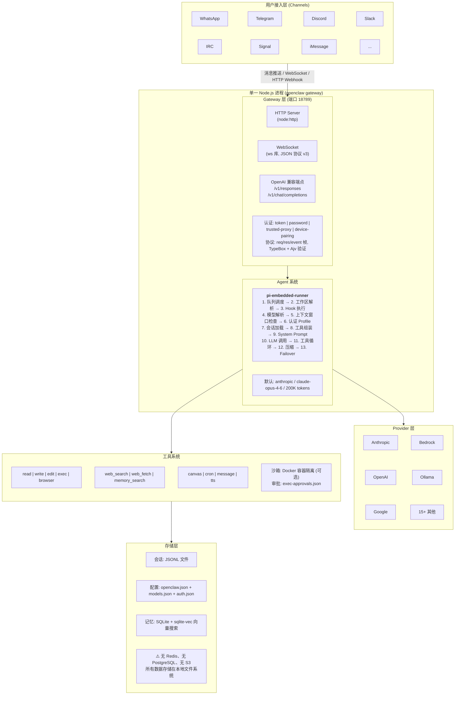
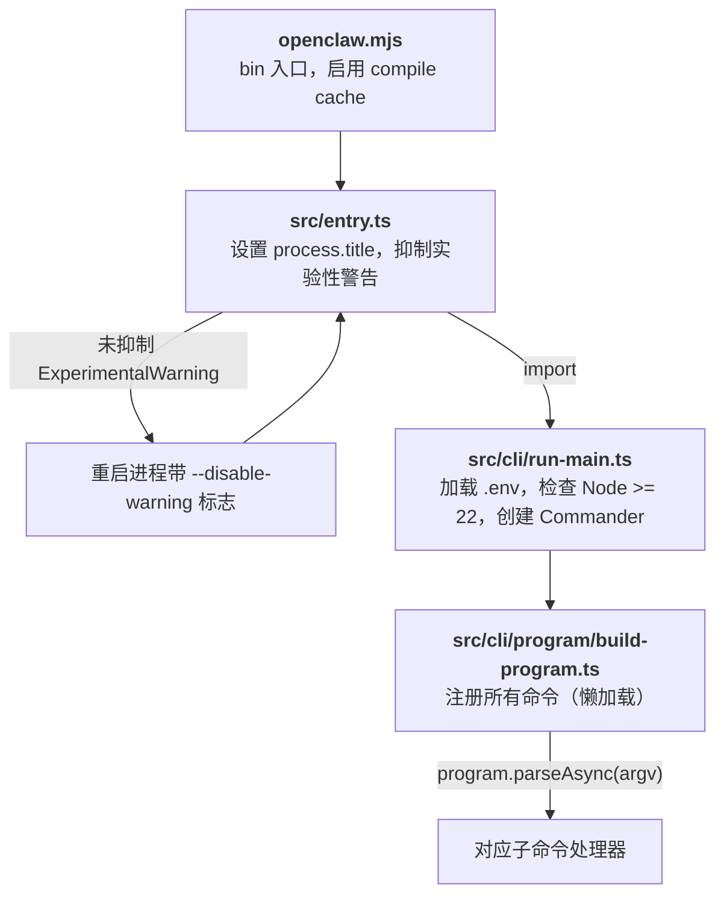
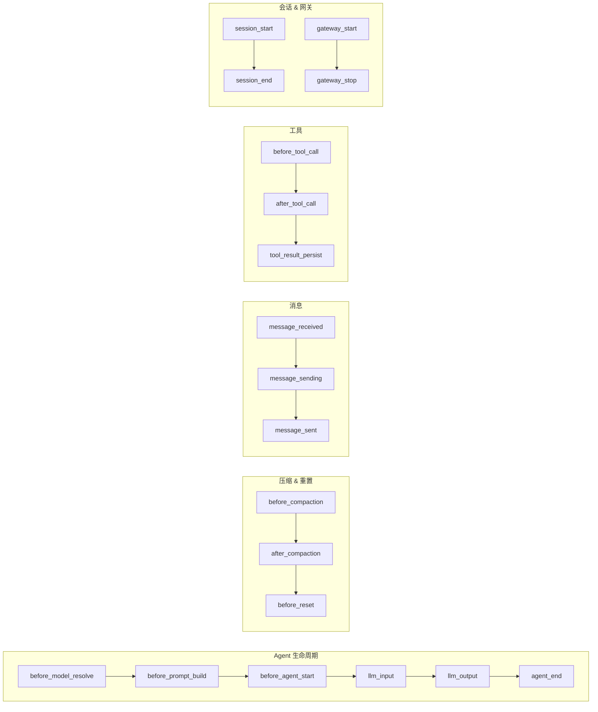

> 本文档基于 OpenClaw 源代码 (v2026.2.18) 逐文件分析编写，所有结论均有源码路径佐证。

## 系统概述

OpenClaw 是一个多渠道 AI 智能体网关平台。核心定位是：**自托管的 AI 编码 Agent 平台，通过统一网关将完整的 Agent 能力（代码执行、文件操作、浏览器控制）连接到 30+ 即时通讯渠道**。

**关键技术选型：**

| 项目 | 选型 | 说明 |
|------|------|------|
| 运行时 | Node.js >= 22.12.0 | 使用实验性 `node:sqlite` 模块 |
| 语言 | TypeScript (ESM) | `"type": "module"` |
| 包管理 | pnpm 10.23.0 | Monorepo 工作区 |
| HTTP 框架 | **Node.js 原生 `http`/`https`** | **不是 Express**（Express 仅用于 OpenAI 兼容端点） |
| WebSocket | `ws` 库 (`noServer` 模式) | 附着在原生 HTTP 服务器上 |
| CLI 框架 | commander | `openclaw` 命令行入口 |
| 构建工具 | tsdown (包装 rolldown) | 8 个入口点分别打包 |
| 格式化/Lint | oxfmt + oxlint | 不用 Prettier/ESLint |
| 测试 | Vitest v4 + V8 覆盖率 | 70% 覆盖率阈值 |

## 整体架构



## 启动流程

源码路径: `openclaw.mjs` → `src/entry.ts` → `src/cli/run-main.ts` → `src/cli/program/build-program.ts`



**命令注册采用懒加载模式**：只有匹配到的命令模块才会被 `import()`，保证启动速度。

核心 CLI 命令: `setup`, `onboard`, `configure`, `config`, `doctor`, `dashboard`, `agent`, `memory`, `browser`

子 CLI 命令: `gateway`, `models`, `sandbox`, `cron`, `plugins`, `channels`, `tui`, `hooks`, `security`, ...

## Gateway 详解

Gateway 本质上是 Agent 系统的 **IO 层**——它本身不做任何"智能"的事情，只负责消息的进和出：

- **输入**：从各种来源（WebSocket、HTTP、Telegram Webhook、Discord Bot...）收消息，统一格式后交给 Agent
- **输出**：把 Agent 的结果推回对应的来源

认证、协议、路由这些都是 IO 层的职责。没有 Gateway，Agent 照样能跑（`openclaw agent --local` 就是直接调用 Agent，跳过 Gateway）。但没有 Gateway，就只能在本地终端里用，接不上任何远程渠道。

### HTTP 与 WebSocket

Gateway 在同一个端口（默认 18789）上提供两种通信方式：

**HTTP**（源码: `src/gateway/server-http.ts`）— 一问一答，请求完连接就断：

- OpenAI 兼容 API（`POST /v1/responses`、`POST /v1/chat/completions`）
- 渠道 Webhook 回调（Slack、Telegram 等推送消息过来，回个 200 就行）
- Control UI 静态文件
- 路由采用顺序匹配链，每个 handler 返回 `true`（已处理）或 `false`（跳过），不是 Express 中间件模式

**WebSocket**（源码: `src/gateway/server-runtime-state.ts`、`src/gateway/protocol/`）— 连接一直保持，双方随时互发消息：

- 使用 `ws` 库的 `noServer` 模式，附着在 HTTP 服务器上
- 承载 93+ 个 RPC 方法（`chat.send`、`agent`、`config.get`、`sessions.list` 等）
- 服务端可以主动推送事件（Agent 执行进度、心跳、在线状态等）
- 适合 CLI、Web UI 这种需要实时看到 Agent 执行过程的客户端
- WebSocket 上跑的是自定义的 JSON RPC 协议（Protocol v3），使用 TypeBox 定义 Schema、Ajv 运行时校验，只有三种帧：
  - **req** — 客户端发起请求：`{ type: "req", id, method, params? }`
  - **res** — 服务端返回结果：`{ type: "res", id, ok, payload?, error? }`
  - **event** — 服务端主动推送：`{ type: "event", event, payload? }`
- 连接建立时有握手流程：服务端先发 challenge（含 nonce），客户端回复认证信息和协议版本，验证通过后回复 `hello-ok`

### 认证机制

源码: `src/gateway/auth.ts`

Gateway 支持四种认证模式，适应不同部署场景：

| 模式 | 场景 | 说明 |
|------|------|------|
| `token` | 最常用 | 共享密钥，通过 `OPENCLAW_GATEWAY_TOKEN` 环境变量设置 |
| `password` | 个人部署 | 密码认证 |
| `trusted-proxy` | 反向代理后 | 信任代理传递的用户身份 Header |
| `none` | 本地开发 | 无认证 |

额外机制：
- **本地绕过** — 来自 `127.0.0.1` / `::1` 的请求自动信任，无需凭证
- **设备配对** — 移动端使用 Ed25519 密钥对 + 签名 + nonce 防重放
- **速率限制** — Per-IP 限流，防暴力破解
- 密钥比较使用 `safeEqualSecret()` 常量时间比较，防时序攻击

## Agent 系统

OpenClaw 的 Agent 不是简单的聊天机器人，而是能**自主完成编码任务**的智能体。这个能力的核心是**工具循环**机制，由 `pi-embedded-runner` 模块编排实现，底层依赖 `@mariozechner/pi-*` 系列库。

### 工具循环（Tool Loop）

工具循环是 OpenClaw 能够自主完成任务的关键机制。它不是"用户问一句、LLM 答一句"的简单对话，而是一个自动化的执行循环：

```
用户: "帮我修复 login.ts 里的 bug"
        ↓
   ┌──────────────────────────────────────────┐
   │            工具循环 (自动执行)              │
   │                                          │
   │  LLM 思考 → 调用 read("login.ts")        │
   │       ↓                                  │
   │  拿到文件内容 → LLM 分析 bug              │
   │       ↓                                  │
   │  LLM 调用 exec("npm test") 确认问题       │
   │       ↓                                  │
   │  拿到测试结果 → LLM 决定修复方案           │
   │       ↓                                  │
   │  LLM 调用 edit("login.ts", ...) 修改代码  │
   │       ↓                                  │
   │  LLM 调用 exec("npm test") 验证修复       │
   │       ↓                                  │
   │  测试通过 → LLM 决定任务完成               │
   └──────────────────────────────────────────┘
        ↓
   返回: "已修复 login.ts 中的 bug，问题是..."
```

**每一轮**：LLM 输出一个工具调用 → runner 执行工具 → 将结果反馈给 LLM → LLM 决定下一步。这个循环**由 LLM 自主驱动**，直到 LLM 认为任务完成（不再调用工具，直接输出文本回复）。

工具循环的底层实现来自 `@mariozechner/pi-coding-agent` 的 `createAgentSession()`，`pi-embedded-runner` 通过 `subscribeEmbeddedPiSession()` 订阅每一轮的工具调用结果，用于实时推送状态和收集最终输出。

### pi-embedded-runner：Agent 编排器

源码: `src/agents/pi-embedded-runner/`

工具循环只是 Agent 执行的核心步骤。在它之前需要大量准备，之后需要处理各种异常。`pi-embedded-runner` 就是负责编排这一切的模块，核心函数为 `runEmbeddedPiAgent()`。

完整流程分三个阶段：

**阶段一：准备**（`run.ts`）

1. **排队** — 同一 session 的请求串行执行，避免并发写入会话文件
2. **解析工作区** — 确定 Agent 的工作目录
3. **解析模型** — 从配置中找到要用的 LLM（如 `anthropic/claude-opus-4-6`）
4. **检查上下文窗口** — 模型的上下文窗口太小则拒绝执行
5. **解析认证** — 找到对应的 API key，支持多 key 轮换

**阶段二：执行**（`run/attempt.ts`）

6. **加载会话** — 打开 JSONL 会话文件，恢复历史对话
7. **组装工具** — 把 read、write、edit、exec、browser 等工具注册给 LLM
8. **构建 System Prompt** — 注入身份、技能、记忆、工作区信息
9. **调用 LLM + 工具循环** — 发送用户消息，进入工具循环，直到 LLM 完成任务

**阶段三：异常处理**（贯穿 `run.ts` 和 `run/attempt.ts`）

- **上下文溢出** — 对话太长时自动压缩（用 LLM 摘要旧对话，最多重试 3 次）
- **API key 失败** — 遇到 401/429 自动切换到下一个可用 key
- **模型不可用** — 切换到配置的备选模型
- **Thinking 不支持** — 自动降级推理级别（high → medium → low → off）

#### 模块结构

| 文件 | 职责 |
|------|------|
| `run.ts` (~840 行) | 主入口：阶段一（准备）+ 阶段三（异常处理和重试） |
| `run/attempt.ts` (~930 行) | 阶段二（单次执行）：会话 → 工具 → prompt → LLM → 工具循环 |
| `runs.ts` (~141 行) | 追踪进行中的 run：支持中途插入消息、中止执行、查询状态 |
| `compact.ts` (~631 行) | 上下文压缩：用 LLM 摘要旧对话 / 截断大体积工具结果 |
| `model.ts` (~237 行) | 模型解析：从 ModelRegistry 查找模型配置 |
| `auth-profiles.ts` | API key 管理：多 key 轮换、失败冷却、用户锁定 |
| `system-prompt.ts` (~93 行) | System Prompt 构建：拼接身份、技能、记忆等上下文 |

### 核心依赖库

`pi-embedded-runner` 的能力建立在三个核心库之上（源码: [github.com/badlogic/pi-mono](https://github.com/badlogic/pi-mono)）：

| 库 | 职责 |
|-----|------|
| `@mariozechner/pi-ai` | LLM API 抽象层，流式调用，工具循环的底层引擎 |
| `@mariozechner/pi-coding-agent` | 会话管理、模型注册、编码工具（read/write/edit/exec） |
| `@mariozechner/pi-agent-core` | Agent 工具定义接口 |

简单说：**pi 提供了大脑（LLM 调用）和手脚（编码工具）**，`pi-embedded-runner` 负责编排整个执行过程（准备环境、驱动循环、处理异常），OpenClaw 则把这一切接入 30+ 即时通讯渠道。

### Agent 配置

源码: `src/config/types.agents.ts`

Agent 在 `openclaw.json` 的 `agents.list` 数组中定义：

```typescript
type AgentConfig = {
  id: string;                  // 唯一标识符
  default?: boolean;           // 是否默认 Agent
  name?: string;
  workspace?: string;          // 工作目录
  agentDir?: string;           // Agent 数据目录
  model?: string | {           // 模型配置
    primary?: string;          //   "provider/model" 格式
    fallbacks?: string[];      //   备选模型列表
  };
  skills?: string[];           // 技能白名单
  sandbox?: SandboxConfig;     // 沙箱配置
  tools?: ToolsConfig;         // 工具配置
  identity?: { name, emoji };  // 显示身份
  subagents?: SubagentConfig;  // 子 Agent 配置
};
```

## Provider 系统

### 支持的 API 协议

源码: `src/config/types.models.ts`

```typescript
type ModelApi =
  | "openai-completions"
  | "openai-responses"
  | "anthropic-messages"
  | "google-generative-ai"
  | "github-copilot"
  | "bedrock-converse-stream"
  | "ollama";
```

### 支持的 Provider 列表

源码: `src/agents/models-config.providers.ts`

| Provider | Base URL | API 类型 |
|----------|----------|----------|
| **Anthropic** | (内置) | `anthropic-messages` |
| **OpenAI** | (内置) | `openai-completions` / `openai-responses` |
| **OpenAI Codex** | (内置) | (单独 provider ID) |
| **Google Gemini** | Google Generative AI | `google-generative-ai` |
| **GitHub Copilot** | `api.individual.githubcopilot.com` | `openai-responses` |
| **Amazon Bedrock** | AWS | `bedrock-converse-stream` |
| **Ollama** | `127.0.0.1:11434` | `ollama` (本地模型发现) |
| **vLLM** | `127.0.0.1:8000/v1` | OpenAI 兼容 |
| **MiniMax** | `api.minimax.io/anthropic` | Anthropic 兼容 |
| **Xiaomi Mimo** | `api.xiaomimimo.com/anthropic` | Anthropic 兼容 |
| **Moonshot Kimi** | `api.moonshot.ai/v1` | OpenAI 兼容 |
| **Qwen Portal** | `portal.qwen.ai/v1` | OAuth + `openai-responses` |
| **Baidu Qianfan** | `qianfan.baidubce.com/v2` | OpenAI 兼容 |
| **NVIDIA** | `integrate.api.nvidia.com/v1` | OpenAI 兼容 |
| **HuggingFace** | HF Inference API | 自动发现 |
| **Together AI** | Together API | 自动发现 |

### 模型配置

源码: `src/config/types.models.ts`

```typescript
type ModelProviderConfig = {
  baseUrl: string;
  apiKey?: string;
  auth?: "api-key" | "aws-sdk" | "oauth" | "token";
  api?: ModelApi;
  headers?: Record<string, string>;
  models: ModelDefinitionConfig[];
};

type ModelDefinitionConfig = {
  id: string;
  name: string;
  reasoning: boolean;
  input: Array<"text" | "image">;
  cost: { input: number; output: number; cacheRead: number; cacheWrite: number };
  contextWindow: number;
  maxTokens: number;
};
```

模型配置存储在 Agent 目录下的 `models.json` 文件中，由 `ensureOpenClawModelsJson()` 生成。

## 工具系统

### 工具分类

源码: `src/agents/openclaw-tools.ts`, `src/agents/bash-tools.exec.ts`

**A. 编码/文件工具** (来自 `@mariozechner/pi-coding-agent`):

| 工具名 | 功能 |
|--------|------|
| `read` | 读取文件 |
| `write` | 写入文件 |
| `edit` | 编辑文件 |
| `apply_patch` | 应用补丁（部分模型支持）|

**B. 执行工具**:

| 工具名 | 功能 |
|--------|------|
| `exec` | 执行 Shell 命令 (PTY 支持, 沙箱支持) |
| `process` | 后台进程管理 (send-keys, poll) |

**C. OpenClaw 特有工具**:

| 工具名 | 功能 |
|--------|------|
| `browser` | 浏览器控制 (CDP 协议, Playwright) |
| `canvas` | 画布工具 |
| `cron` | 定时任务创建 |
| `message` | 发送消息到渠道 (Telegram, Discord, Slack 等) |
| `tts` | 文字转语音 |
| `web_search` | 网页搜索 (Brave/Perplexity/Grok 后端) |
| `web_fetch` | URL 抓取 (HTML→Markdown) |
| `image` | 图片生成/处理 |
| `memory_search` | 记忆搜索 |
| `memory_get` | 记忆获取 |
| `agents_list` | 列出 Agent |
| `sessions_list` | 列出会话 |
| `sessions_spawn` | 创建子 Agent 会话 |
| `session_status` | 会话状态 |

### 工具审批系统

源码: `src/agents/bash-tools.exec.ts`

`exec` 工具有三级安全模式：

| Security 级别 | 说明 |
|---------------|------|
| `deny` | 禁止所有执行 (默认) |
| `safe-only` | 仅允许白名单命令 |
| `full` | 允许所有命令 |

审批配置文件: `exec-approvals.json`

```json
{
  "security": "full",
  "ask": "off"
}
```

`ask` 控制是否需要用户确认: `on` (每次确认) | `off` (自动批准)

### 工具策略管道

源码: `src/agents/pi-tools.policy.ts`, `tool-policy-pipeline.ts`

支持多层级的 `allow`/`deny` 列表：全局级、Agent 级、Group 级、子 Agent 级、沙箱级。

### Docker 沙箱

源码: `src/agents/sandbox/`

可选的 Docker 容器隔离执行环境：

```typescript
type SandboxConfig = {
  mode: "off" | "non-main" | "all";
  scope: "session" | "agent" | "shared";
  workspaceAccess: "none" | "ro" | "rw";
  docker: {
    image: "openclaw-sandbox:bookworm-slim";
    workDir: "/workspace";
    readOnly: true;          // 只读根文件系统
    network: "none";         // 默认无网络
    capDrop: ["ALL"];        // 丢弃所有 capabilities
    tmpfs: ["/tmp", "/var/tmp", "/run"];
  };
};
```

容器通过 `child_process.spawn("docker", args)` 管理，支持自动回收（默认 24h 空闲, 7 天最大存活）。

## 渠道系统

### 渠道架构

源码: `src/channels/`, `src/channels/plugins/types.plugin.ts`

OpenClaw 有两级渠道系统：

**核心渠道** (内置在 `src/` 中, 源码: `src/channels/registry.ts`):

| 渠道 | ID | 库依赖 | 协议 |
|------|-----|--------|------|
| WhatsApp | `whatsapp` | `@whiskeysockets/baileys` 7.0.0-rc.9 | Web 协议逆向 (非 Business API) |
| Telegram | `telegram` | `grammy` ^1.40.0 | Bot API |
| Discord | `discord` | `discord-api-types` (原生 REST, 无 discord.js) | Bot API |
| Slack | `slack` | `@slack/bolt` ^4.6.0 | Socket Mode |
| IRC | `irc` | 无第三方依赖 (原生 `node:net`/`node:tls`) | 自实现 IRC 协议解析 |
| Signal | `signal` | signal-cli (外部二进制) | JSON-RPC 到 signal-cli daemon |
| iMessage | `imessage` | 自定义 (macOS 原生) | macOS Bridge |
| Google Chat | `googlechat` | `google-auth-library` | HTTP Webhook |

默认渠道: `whatsapp`

**扩展渠道** (在 `extensions/` 目录, 通过插件系统加载):

| 扩展 | ID | 库依赖 |
|------|-----|--------|
| BlueBubbles | `bluebubbles` | REST API 到 BlueBubbles macOS 应用 |
| Feishu/Lark | `feishu` | `@larksuiteoapi/node-sdk` |
| LINE | `line` | `@line/bot-sdk` |
| Matrix | `matrix` | `@vector-im/matrix-bot-sdk` |
| Mattermost | `mattermost` | 自实现 |
| MS Teams | `msteams` | `@microsoft/agents-hosting` |
| Nextcloud Talk | `nextcloud-talk` | 自实现 |
| Nostr | `nostr` | `nostr-tools` (NIP-04 加密 DM) |
| Tlon/Urbit | `tlon` | `@urbit/aura` |
| Twitch | `twitch` | `@twurple/*` |
| Zalo | `zalo` | `undici` (HTTP) |

### 渠道插件接口

源码: `src/channels/plugins/types.plugin.ts`

每个渠道实现 `ChannelPlugin` 接口：

```typescript
type ChannelPlugin = {
  id: ChannelId;
  meta: ChannelMeta;                     // 标签、简介、文档路径
  capabilities: ChannelCapabilities;      // 支持的功能声明
  config: ChannelConfigAdapter;           // 账号管理
  gateway?: ChannelGatewayAdapter;        // 启动/停止/登录/登出
  outbound?: ChannelOutboundAdapter;      // 消息发送
  security?: ChannelSecurityAdapter;      // DM 策略
  groups?: ChannelGroupAdapter;           // 群组
  pairing?: ChannelPairingAdapter;        // 用户配对
  heartbeat?: ChannelHeartbeatAdapter;    // 心跳就绪检查
  agentTools?: ChannelAgentToolFactory;   // 渠道专属工具
  // ... 更多适配器
};
```

**渠道能力声明** (`ChannelCapabilities`):

```typescript
type ChannelCapabilities = {
  chatTypes: Array<"direct" | "group" | "channel" | "thread">;
  polls?: boolean;
  reactions?: boolean;
  edit?: boolean;
  unsend?: boolean;
  reply?: boolean;
  media?: boolean;
  threads?: boolean;
  blockStreaming?: boolean;
};
```

### 扩展注册机制

扩展通过 `package.json` 声明：

```json
{
  "openclaw": {
    "extensions": ["./index.ts"],
    "channel": {
      "id": "googlechat",
      "label": "Google Chat",
      "aliases": ["gchat", "google-chat"],
      "order": 55
    }
  }
}
```

入口文件导出 `OpenClawPluginDefinition`，通过 `register(api)` 方法注册：

```typescript
api.registerChannel({ plugin: myChannelPlugin });
api.registerTool(myTool);
api.registerHook("message_received", handler);
```

## 记忆系统

### 记忆源

源码: `src/memory/`

OpenClaw 的记忆系统有两种数据源 (`MemorySource`):

1. **`memory`** — Markdown 文件
   - `MEMORY.md` (Agent 工作区根目录)
   - `memory/*.md` (递归扫描)
   - 可配置额外路径 (`extraPaths`)

2. **`sessions`** — 会话记录 (JSONL 文件)
   - 每行一个 JSON 对象 (header, user message, assistant message, tool call)
   - 自动提取 `User: ...` / `Assistant: ...` 文本用于嵌入

### 索引存储

源码: `src/memory/memory-schema.ts`

使用 **Node.js 内置 `node:sqlite`** (实验性 `DatabaseSync`) + **`sqlite-vec`** (v0.1.7-alpha.2) 向量扩展。

**数据库 Schema：**

```sql
-- 已索引文件跟踪
CREATE TABLE files (
  path TEXT PRIMARY KEY,
  source TEXT NOT NULL DEFAULT 'memory',  -- 'memory' 或 'sessions'
  hash TEXT NOT NULL,
  mtime INTEGER NOT NULL,
  size INTEGER NOT NULL
);

-- 文本块 + 嵌入向量
CREATE TABLE chunks (
  id TEXT PRIMARY KEY,
  path TEXT NOT NULL,
  source TEXT NOT NULL DEFAULT 'memory',
  start_line INTEGER NOT NULL,
  end_line INTEGER NOT NULL,
  hash TEXT NOT NULL,
  model TEXT NOT NULL,
  text TEXT NOT NULL,
  embedding TEXT NOT NULL,
  updated_at INTEGER NOT NULL
);

-- FTS5 全文搜索索引
CREATE VIRTUAL TABLE chunks_fts USING fts5(text, id UNINDEXED, path UNINDEXED, ...);

-- sqlite-vec 向量搜索索引
-- chunks_vec 虚拟表 (近似最近邻搜索)

-- 嵌入缓存 (避免重复计算)
CREATE TABLE embedding_cache (
  provider TEXT NOT NULL,
  model TEXT NOT NULL,
  hash TEXT NOT NULL,
  embedding TEXT NOT NULL,
  dims INTEGER,
  PRIMARY KEY (provider, model, provider_key, hash)
);
```

### 搜索策略

源码: `src/memory/manager.ts`

**混合搜索** (Hybrid Search):
- 向量搜索 (cosine similarity) + BM25 关键词搜索 (FTS5)
- 权重: 0.7 向量 / 0.3 关键词 (可配置)
- MMR (Maximal Marginal Relevance) 去重
- 时间衰减 (可配置半衰期, 默认 30 天)

**支持的嵌入 Provider：**

| Provider | 模型 |
|----------|------|
| OpenAI | `text-embedding-3-small` |
| Google | `gemini-embedding-001` |
| Voyage | `voyage-4-large` |
| 本地 | `node-llama-cpp` (可选 peer dep) |

另有 `QmdMemoryManager` 后端，使用外部 `qmd` 二进制进行 queryable markdown 搜索。

### MemorySearchManager 接口

源码: `src/memory/types.ts`

```typescript
interface MemorySearchManager {
  search(query: string, opts?: {
    maxResults?: number;
    minScore?: number;
    sessionKey?: string;
  }): Promise<MemorySearchResult[]>;
  readFile(params: { relPath: string; from?: number; lines?: number }): Promise<{ text: string; path: string }>;
  status(): MemoryProviderStatus;
  sync?(params?: { reason?: string; force?: boolean }): Promise<void>;
  probeEmbeddingAvailability(): Promise<MemoryEmbeddingProbeResult>;
  close?(): Promise<void>;
}
```

## 会话管理

### 存储格式

源码: `src/config/sessions.ts`

**会话存储** (Session Store): JSON 文件
- 路径: `{STATE_DIR}/agents/{agentId}/sessions/sessions.json`
- 内容: `Record<string, SessionEntry>` (会话键 → 元数据)
- 内存缓存: 45 秒 TTL
- 写入: 锁队列防止并发损坏

**会话记录** (Session Transcript): JSONL 文件
- 路径: `{STATE_DIR}/agents/{agentId}/sessions/{sessionId}.jsonl`
- 每行一个 JSON 对象: header, user message, assistant message, tool call/result
- 支持自动修复损坏的 JSONL 文件

### 会话键

会话键标识一个对话线程，格式如: `"default"`, `"agent:myagent:telegram:dm:123"`

从会话键可以提取: agentId, channel, chatType, chatId

## Cron / 定时任务系统

源码: `src/cron/`

### CronJob 结构

```typescript
type CronJob = {
  id: string;
  agentId?: string;
  name: string;
  enabled: boolean;
  schedule: CronSchedule;
  sessionTarget: "main" | "isolated";
  wakeMode: "next-heartbeat" | "now";
  payload: CronPayload;
  delivery?: CronDelivery;
};
```

### 调度类型

| 类型 | 说明 |
|------|------|
| `at` | 一次性定时 (指定时间点) |
| `every` | 周期性 (`everyMs` + 可选锚点) |
| `cron` | 标准 Cron 表达式 (通过 `croner` 库, 支持时区) |

### Payload 类型

| 类型 | 说明 |
|------|------|
| `systemEvent` | 注入系统消息 (如心跳提示词) |
| `agentTurn` | 触发完整 Agent 对话轮次 (可覆盖模型/超时/路由) |

Cron 任务持久化为 JSON 文件 (`CronStoreFile`, version: 1)。

## 插件系统

### 插件 API

源码: `src/plugins/types.ts`

`OpenClawPluginApi` 提供的注册方法：

| 方法 | 说明 |
|------|------|
| `registerChannel()` | 注册渠道 |
| `registerTool()` | 注册 Agent 工具 |
| `registerHook()` / `on()` | 注册生命周期 Hook |
| `registerCommand()` | 注册自定义命令 (绕过 LLM) |
| `registerCli()` | 注册 CLI 子命令 |
| `registerHttpRoute()` | 注册 HTTP 路由 |
| `registerGatewayMethod()` | 注册 WebSocket RPC 方法 |
| `registerService()` | 注册后台服务 |

### 生命周期 Hook

共 18 个 Hook 点：



## Monorepo 结构

源码: `pnpm-workspace.yaml`

```yaml
packages:
  - .                # 核心包 (openclaw)
  - ui               # 控制面板 UI (Vite + Lit)
  - packages/*       # 兼容性 shim (clawdbot, moltbot)
  - extensions/*     # 渠道/功能扩展 (31 个)
```

### 原生应用

| 平台 | 路径 | 技术 |
|------|------|------|
| iOS | `apps/ios/` | SwiftUI + WatchExtension |
| macOS | `apps/macos/` | Swift Package (Menu Bar) |
| Android | `apps/android/` | Gradle |

## 关键源码路径索引

| 模块 | 路径 | 说明 |
|------|------|------|
| CLI 入口 | `openclaw.mjs` → `src/entry.ts` | 编译缓存 + 警告抑制 |
| 命令注册 | `src/cli/program/command-registry.ts` | 核心命令 |
| 子命令注册 | `src/cli/program/register.subclis.ts` | gateway, models, sandbox 等 |
| Gateway HTTP | `src/gateway/server-http.ts` | 原生 http 服务器 |
| Gateway WS | `src/gateway/server-runtime-state.ts` | ws 库, noServer 模式 |
| Gateway 启动 | `src/gateway/server.impl.ts:162` | `port = 18789` |
| Gateway 认证 | `src/gateway/auth.ts` | 4 种认证模式 |
| Gateway 协议 | `src/gateway/protocol/` | TypeBox + Ajv |
| RPC 方法列表 | `src/gateway/server-methods-list.ts` | 93+ 方法 |
| Agent 运行 | `src/agents/pi-embedded-runner/run.ts` | 核心运行循环 |
| Agent 作用域 | `src/agents/agent-scope.ts` | 配置解析 |
| Agent 默认值 | `src/agents/defaults.ts` | anthropic / claude-opus-4-6 |
| 模型解析 | `src/agents/model-selection.ts` | Provider ID 规范化 |
| 模型目录 | `src/agents/model-catalog.ts` | ModelRegistry |
| Provider 配置 | `src/agents/models-config.providers.ts` | 15+ Provider |
| 工具注册 | `src/agents/openclaw-tools.ts` | OpenClaw 专属工具 |
| Exec 工具 | `src/agents/bash-tools.exec.ts` | Shell 执行 + 审批 |
| 工具策略 | `src/agents/pi-tools.policy.ts` | allow/deny 列表 |
| 沙箱 | `src/agents/sandbox/` | Docker 隔离 |
| 渠道注册表 | `src/channels/registry.ts` | 8 核心渠道 |
| 渠道插件类型 | `src/channels/plugins/types.plugin.ts` | ChannelPlugin 接口 |
| 插件 API | `src/plugins/types.ts` | OpenClawPluginApi |
| 记忆管理 | `src/memory/manager.ts` | 混合搜索 |
| 记忆 Schema | `src/memory/memory-schema.ts` | SQLite 表定义 |
| QMD 管理 | `src/memory/qmd-manager.ts` | qmd 后端 |
| 会话存储 | `src/config/sessions.ts` | JSON + JSONL |
| Cron 服务 | `src/cron/service.ts` | 定时任务 |
| 配置类型 | `src/config/types.openclaw.ts` | OpenClawConfig |
| 扩展 API | `src/extensionAPI.ts` | 扩展公开接口 |
| 插件 SDK | `src/plugin-sdk/index.ts` | 渠道适配器类型 |
| 构建配置 | `tsdown.config.ts` | 8 入口点打包 |

---

*文档版本: 基于 OpenClaw v2026.2.18 源码分析*
*分析方法: 逐文件阅读 src/ 目录核心模块，所有结论均标注源码路径*
