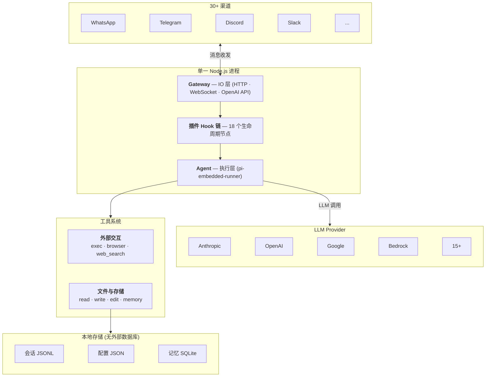
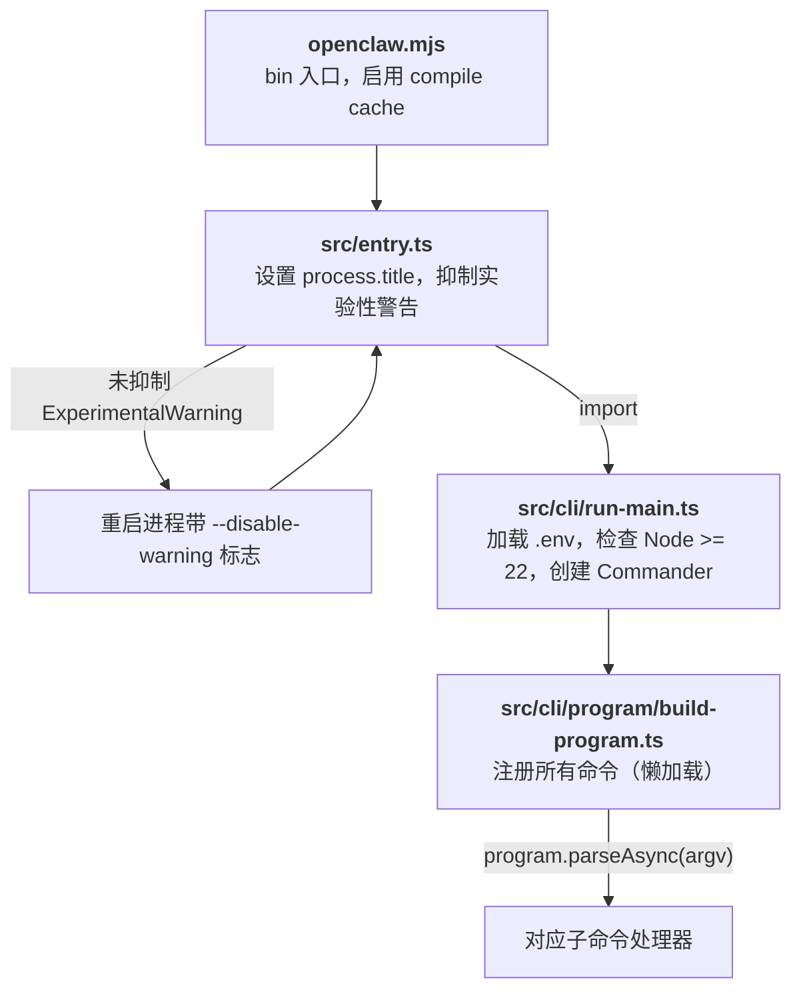
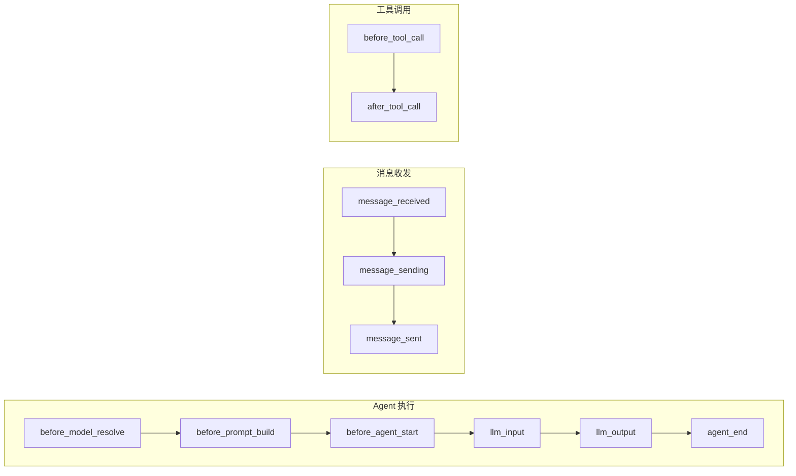

> 本文档基于 OpenClaw 源代码 (v2026.2.18) 逐文件分析编写，所有结论均有源码路径佐证。

## 系统概述

OpenClaw 是一个多渠道 AI 智能体网关平台。核心定位是：**自托管的 AI 编码 Agent 平台，通过统一网关将完整的 Agent 能力（代码执行、文件操作、浏览器控制）连接到 30+ 即时通讯渠道**。

**关键技术选型：**

| 项目 | 选型 | 说明 |
|------|------|------|
| 运行时 | Node.js >= 22.12.0 | 使用实验性 `node:sqlite` 模块 |
| 语言 | TypeScript (ESM) | `"type": "module"` |
| 包管理 | pnpm 10.23.0 | Monorepo 工作区 |
| HTTP 框架 | **Node.js 原生 `http`/`https`** | **不是 Express**（Express 仅用于 OpenAI 兼容端点） |
| WebSocket | `ws` 库 (`noServer` 模式) | 附着在原生 HTTP 服务器上 |
| CLI 框架 | commander | `openclaw` 命令行入口 |
| 构建工具 | tsdown (包装 rolldown) | 8 个入口点分别打包 |
| 格式化/Lint | oxfmt + oxlint | 不用 Prettier/ESLint |
| 测试 | Vitest v4 + V8 覆盖率 | 70% 覆盖率阈值 |

## 整体架构



## 启动流程

源码路径: `openclaw.mjs` → `src/entry.ts` → `src/cli/run-main.ts` → `src/cli/program/build-program.ts`



**命令注册采用懒加载模式**：只有匹配到的命令模块才会被 `import()`，保证启动速度。

核心 CLI 命令: `setup`, `onboard`, `configure`, `config`, `doctor`, `dashboard`, `agent`, `memory`, `browser`

子 CLI 命令: `gateway`, `models`, `sandbox`, `cron`, `plugins`, `channels`, `tui`, `hooks`, `security`, ...

## Gateway 详解

Gateway 本质上是 Agent 系统的 **IO 层**——它本身不做任何"智能"的事情，只负责消息的进和出：

- **输入**：从各种来源（WebSocket、HTTP、Telegram Webhook、Discord Bot...）收消息，统一格式后交给 Agent
- **输出**：把 Agent 的结果推回对应的来源

认证、协议、路由这些都是 IO 层的职责。没有 Gateway，Agent 照样能跑（`openclaw agent --local` 就是直接调用 Agent，跳过 Gateway）。但没有 Gateway，就只能在本地终端里用，接不上任何远程渠道。

### HTTP 与 WebSocket

Gateway 在同一个端口（默认 18789）上提供两种通信方式：

**HTTP**（源码: `src/gateway/server-http.ts`）— 一问一答，请求完连接就断：

- OpenAI 兼容 API（`POST /v1/responses`、`POST /v1/chat/completions`）
- 渠道 Webhook 回调（Slack、Telegram 等推送消息过来，回个 200 就行）
- Control UI 静态文件
- 路由采用顺序匹配链，每个 handler 返回 `true`（已处理）或 `false`（跳过），不是 Express 中间件模式

**WebSocket**（源码: `src/gateway/server-runtime-state.ts`、`src/gateway/protocol/`）— 连接一直保持，双方随时互发消息：

- 使用 `ws` 库的 `noServer` 模式，附着在 HTTP 服务器上
- 承载 93+ 个 RPC 方法（`chat.send`、`agent`、`config.get`、`sessions.list` 等）
- 服务端可以主动推送事件（Agent 执行进度、心跳、在线状态等）
- 适合 CLI、Web UI 这种需要实时看到 Agent 执行过程的客户端
- WebSocket 上跑的是自定义的 JSON RPC 协议（Protocol v3），使用 TypeBox 定义 Schema、Ajv 运行时校验，只有三种帧：
  - **req** — 客户端发起请求：`{ type: "req", id, method, params? }`
  - **res** — 服务端返回结果：`{ type: "res", id, ok, payload?, error? }`
  - **event** — 服务端主动推送：`{ type: "event", event, payload? }`
- 连接建立时有握手流程：服务端先发 challenge（含 nonce），客户端回复认证信息和协议版本，验证通过后回复 `hello-ok`

### 认证机制

源码: `src/gateway/auth.ts`

Gateway 支持四种认证模式，适应不同部署场景：

| 模式 | 场景 | 说明 |
|------|------|------|
| `token` | 最常用 | 共享密钥，通过 `OPENCLAW_GATEWAY_TOKEN` 环境变量设置 |
| `password` | 个人部署 | 密码认证 |
| `trusted-proxy` | 反向代理后 | 信任代理传递的用户身份 Header |
| `none` | 本地开发 | 无认证 |

额外机制：
- **本地绕过** — 来自 `127.0.0.1` / `::1` 的请求自动信任，无需凭证
- **设备配对** — 移动端使用 Ed25519 密钥对 + 签名 + nonce 防重放
- **速率限制** — Per-IP 限流，防暴力破解
- 密钥比较使用 `safeEqualSecret()` 常量时间比较，防时序攻击

## Agent 系统

OpenClaw 的 Agent 不是简单的聊天机器人，而是能**自主完成编码任务**的智能体。这个能力的核心是**工具循环**机制，由 `pi-embedded-runner` 模块编排实现，底层依赖 `@mariozechner/pi-*` 系列库。

### 工具循环（Tool Loop）

工具循环是 OpenClaw 能够自主完成任务的关键机制。它不是"用户问一句、LLM 答一句"的简单对话，而是一个自动化的执行循环：

```
用户: "帮我修复 login.ts 里的 bug"
        ↓
   ┌──────────────────────────────────────────┐
   │            工具循环 (自动执行)              │
   │                                          │
   │  LLM 思考 → 调用 read("login.ts")        │
   │       ↓                                  │
   │  拿到文件内容 → LLM 分析 bug              │
   │       ↓                                  │
   │  LLM 调用 exec("npm test") 确认问题       │
   │       ↓                                  │
   │  拿到测试结果 → LLM 决定修复方案           │
   │       ↓                                  │
   │  LLM 调用 edit("login.ts", ...) 修改代码  │
   │       ↓                                  │
   │  LLM 调用 exec("npm test") 验证修复       │
   │       ↓                                  │
   │  测试通过 → LLM 决定任务完成               │
   └──────────────────────────────────────────┘
        ↓
   返回: "已修复 login.ts 中的 bug，问题是..."
```

**每一轮**：LLM 输出一个工具调用 → runner 执行工具 → 将结果反馈给 LLM → LLM 决定下一步。这个循环**由 LLM 自主驱动**，直到 LLM 认为任务完成（不再调用工具，直接输出文本回复）。

工具循环的底层实现来自 `@mariozechner/pi-coding-agent` 的 `createAgentSession()`，`pi-embedded-runner` 通过 `subscribeEmbeddedPiSession()` 订阅每一轮的工具调用结果，用于实时推送状态和收集最终输出。

### pi-embedded-runner：Agent 编排器

源码: `src/agents/pi-embedded-runner/`

工具循环只是 Agent 执行的核心步骤。在它之前需要大量准备，之后需要处理各种异常。`pi-embedded-runner` 就是负责编排这一切的模块，核心函数为 `runEmbeddedPiAgent()`。

完整流程分三个阶段：

**阶段一：准备**（`run.ts`）

1. **排队** — 同一 session 的请求串行执行，避免并发写入会话文件
2. **解析工作区** — 确定 Agent 的工作目录
3. **解析模型** — 从配置中找到要用的 LLM（如 `anthropic/claude-opus-4-6`）
4. **检查上下文窗口** — 模型的上下文窗口太小则拒绝执行
5. **解析认证** — 找到对应的 API key，支持多 key 轮换

**阶段二：执行**（`run/attempt.ts`）

6. **加载会话** — 打开 JSONL 会话文件，恢复历史对话
7. **组装工具** — 把 read、write、edit、exec、browser 等工具注册给 LLM
8. **构建 System Prompt** — 注入身份、技能、记忆、工作区信息
9. **调用 LLM + 工具循环** — 发送用户消息，进入工具循环，直到 LLM 完成任务

**阶段三：异常处理**（贯穿 `run.ts` 和 `run/attempt.ts`）

- **上下文溢出** — 对话太长时自动压缩（用 LLM 摘要旧对话，最多重试 3 次）
- **API key 失败** — 遇到 401/429 自动切换到下一个可用 key
- **模型不可用** — 切换到配置的备选模型
- **Thinking 不支持** — 自动降级推理级别（high → medium → low → off）

#### 模块结构

| 文件 | 职责 |
|------|------|
| `run.ts` (~840 行) | 主入口：阶段一（准备）+ 阶段三（异常处理和重试） |
| `run/attempt.ts` (~930 行) | 阶段二（单次执行）：会话 → 工具 → prompt → LLM → 工具循环 |
| `runs.ts` (~141 行) | 追踪进行中的 run：支持中途插入消息、中止执行、查询状态 |
| `compact.ts` (~631 行) | 上下文压缩：用 LLM 摘要旧对话 / 截断大体积工具结果 |
| `model.ts` (~237 行) | 模型解析：从 ModelRegistry 查找模型配置 |
| `auth-profiles.ts` | API key 管理：多 key 轮换、失败冷却、用户锁定 |
| `system-prompt.ts` (~93 行) | System Prompt 构建：拼接身份、技能、记忆等上下文 |

### 核心依赖库

`pi-embedded-runner` 的能力建立在三个核心库之上（源码: [github.com/badlogic/pi-mono](https://github.com/badlogic/pi-mono)）：

| 库 | 职责 |
|-----|------|
| `@mariozechner/pi-ai` | LLM API 抽象层，流式调用，工具循环的底层引擎 |
| `@mariozechner/pi-coding-agent` | 会话管理、模型注册、编码工具（read/write/edit/exec） |
| `@mariozechner/pi-agent-core` | Agent 工具定义接口 |

简单说：**pi 提供了大脑（LLM 调用）和手脚（编码工具）**，`pi-embedded-runner` 负责编排整个执行过程（准备环境、驱动循环、处理异常），OpenClaw 则把这一切接入 30+ 即时通讯渠道。

### Agent 配置

源码: `src/config/types.agents.ts`

OpenClaw 支持在同一个实例中运行多个 Agent，每个 Agent 有独立的模型、工具、工作区配置。所有 Agent 在 `openclaw.json` 的 `agents.list` 数组中定义。

一个典型的 Agent 配置：

```json
{
  "id": "coder",
  "name": "编码助手",
  "default": true,
  "workspace": "/home/user/projects",
  "model": {
    "primary": "anthropic/claude-opus-4-6",
    "fallbacks": ["openai/gpt-4o"]
  },
  "tools": {
    "deny": ["web_search"]
  },
  "identity": { "name": "Coder", "emoji": "🤖" }
}
```

各字段和前面提到的执行流程的关系：

| 字段 | 对应的执行阶段 | 说明 |
|------|---------------|------|
| `workspace` | 阶段一：解析工作区 | Agent 的工作目录，工具循环中 read/write/exec 都在这个目录下执行 |
| `model.primary` / `fallbacks` | 阶段一：解析模型 + 异常处理：模型 failover | 主模型不可用时自动切换到备选模型 |
| `tools` | 阶段二：组装工具 | 控制哪些工具可用（`allow`/`deny` 列表） |
| `skills` | 阶段二：构建 System Prompt | 技能白名单，决定哪些能力注入 System Prompt |
| `sandbox` | 阶段二：组装工具 | 是否在 Docker 容器中执行 exec 工具 |
| `identity` | 阶段二：构建 System Prompt | Agent 的名字和头像，注入 System Prompt 中 |
| `subagents` | — | 子 Agent 配置，允许 Agent 调用其他 Agent |

## Provider 系统

Agent 系统在执行阶段需要调用 LLM，但不同厂商的 API 格式完全不同——Anthropic 用 Messages API，OpenAI 用 Completions/Responses API，Google 用 Generative AI API，还有各种 OpenAI 兼容的国产模型。Provider 系统的作用就是**屏蔽这些差异**，让 Agent 不需要关心底层用的是哪家模型。

### 工作方式

每个 Provider 由三部分组成：

- **API 协议** — 7 种：`anthropic-messages`、`openai-completions`、`openai-responses`、`google-generative-ai`、`github-copilot`、`bedrock-converse-stream`、`ollama`
- **连接信息** — baseUrl、apiKey、认证方式、自定义 headers
- **模型列表** — 每个模型的 ID、上下文窗口大小、是否支持推理、输入类型（文本/图片）、费用

Agent 配置中的 `model: "anthropic/claude-opus-4-6"` 中，`anthropic` 是 Provider ID，`claude-opus-4-6` 是模型 ID。执行阶段的"解析模型"步骤就是根据这个格式找到对应的 Provider 和模型配置。

### 内置 Provider

OpenClaw 内置了 15+ 个 Provider（源码: `src/agents/models-config.providers.ts`）：

| Provider | API 协议 | 说明 |
|----------|----------|------|
| Anthropic | `anthropic-messages` | Claude 系列 |
| OpenAI | `openai-completions` / `openai-responses` | GPT 系列 |
| Google Gemini | `google-generative-ai` | Gemini 系列 |
| GitHub Copilot | `openai-responses` | 通过 Copilot 订阅使用 |
| Amazon Bedrock | `bedrock-converse-stream` | AWS 托管模型 |
| Ollama | `ollama` | 本地模型，自动发现 |
| MiniMax、小米 Mimo | Anthropic 兼容 | 国产模型 |
| Moonshot Kimi、通义千问、百度千帆 | OpenAI 兼容 | 国产模型 |
| vLLM、NVIDIA、HuggingFace、Together AI | OpenAI 兼容 | 推理服务 |

大部分国产模型和推理服务都走 OpenAI 兼容协议，只需要改 baseUrl 和 apiKey 就能接入。

## 工具系统

前面讲工具循环时提到，Agent 的能力完全取决于它有哪些工具。工具系统决定了 Agent 能"做"什么——读写文件、执行命令、控制浏览器、搜索网页、发送消息等。

### 三类工具

**编码工具**（来自 pi 库）— Agent 作为编码助手的核心能力：

| 工具 | 作用 |
|------|------|
| `read` | 读取文件内容 |
| `write` | 写入/创建文件 |
| `edit` | 编辑文件的特定部分 |
| `exec` | 执行 Shell 命令（支持 PTY） |
| `process` | 后台进程管理（发送按键、轮询输出） |

**OpenClaw 扩展工具** — 在编码之外的额外能力：

| 工具 | 作用 |
|------|------|
| `browser` | 控制浏览器（CDP 协议 / Playwright） |
| `web_search` | 网页搜索（Brave / Perplexity / Grok 后端） |
| `web_fetch` | 抓取 URL 内容（HTML → Markdown） |
| `message` | 发送消息到即时通讯渠道 |
| `memory_search` | 搜索长期记忆 |
| `cron` | 创建定时任务 |
| `sessions_spawn` | 启动子 Agent 会话 |
| `canvas`、`tts`、`image` | 画布、语音、图片生成 |

**渠道工具** — 由各渠道插件注入的特定工具（如 Telegram 的 sticker 发送）。

### 安全控制

让 LLM 执行 Shell 命令是危险的。OpenClaw 通过三层机制控制工具的使用：

**1. 执行审批**（`exec-approvals.json`）— 控制 `exec` 工具的安全级别：
- `deny` — 禁止执行任何命令（默认）
- `safe-only` — 仅允许白名单命令
- `full` — 允许所有命令

在非交互场景（如 Telegram Bot）中，通常配置 `security: "full", ask: "off"` 来自动批准所有命令。

**2. 工具策略管道**（`tool-policy-pipeline.ts`）— 多层级的 `allow`/`deny` 列表，从全局到 Agent 到群组到子 Agent，逐级细化控制。

**3. Docker 沙箱**（`src/agents/sandbox/`）— 可选的容器隔离。开启后 `exec` 在 Docker 容器内执行，容器默认只读文件系统、无网络、丢弃所有 Linux capabilities。适合运行不受信任的代码。

## 渠道系统

渠道系统是 OpenClaw 的"最后一公里"——把 Agent 的能力通过各种即时通讯平台交付给用户。你在 Telegram 给 Bot 发一条消息，渠道系统把它收进来交给 Gateway，Agent 处理完后渠道系统再把结果发回 Telegram。

### 一条消息的完整旅程

以 Telegram 为例，用户给 Bot 发了一条"帮我看看 nginx 的状态"：

```
用户在 Telegram 发送消息
      ↓
Telegram 服务器推送 Webhook → Gateway HTTP 端点
      ↓
Telegram 插件 (gateway 适配器) 接收并解析
  - 从 Webhook payload 中提取 chat_id、message_id、消息文本
  - 判断消息类型：私聊还是群组？文本还是图片/文件？
  - 转换为 OpenClaw 统一消息格式（与平台无关）
      ↓
根据 session key 路由到 Agent
  - key: "agent:coder:telegram:dm:123456"
  - 从 key 中提取 Agent ID、渠道、聊天类型
  - 找到或创建对应的会话文件
      ↓
pi-embedded-runner 启动工具循环
  - LLM 思考 → 调用 exec("systemctl status nginx")
  - 拿到输出 → 生成人类可读的回复
      ↓
Telegram 插件 (outbound 适配器) 发送回复
  - Markdown → Telegram MarkdownV2 格式转换
  - 超长消息自动分片（Telegram 限制 4096 字符）
  - 如果有图片或文件，作为媒体消息单独发送
      ↓
用户在 Telegram 看到 Agent 的回复
```

这条链路中，**渠道插件承担了两端的"翻译"工作**——入站时把 Telegram 的 Webhook 格式翻译成统一消息，出站时把 Agent 的回复翻译回 Telegram 格式。Gateway 和 Agent 完全不知道消息来自 Telegram 还是 Discord，这就是为什么 30+ 渠道可以共享同一套 Agent 逻辑。

### 两级架构

OpenClaw 把渠道分成两级：

**核心渠道**（8 个，内置在 `src/channels/`）：

| 渠道 | 协议 | 值得注意的点 |
|------|------|-------------|
| WhatsApp | Web 协议逆向（baileys） | 不是 Meta Business API，而是逆向 Web 端协议 |
| Telegram | Bot API（grammy） | |
| Discord | 原生 REST API | 没用 discord.js，用的是底层 `discord-api-types` |
| Slack | Socket Mode（bolt） | |
| IRC | 自实现协议解析 | 没用任何第三方库，直接用 `node:net` |
| Signal | signal-cli 外部进程 | 通过 JSON-RPC 与 signal-cli daemon 通信 |
| iMessage | macOS 原生 Bridge | 仅限 macOS |
| Google Chat | HTTP Webhook | |

**扩展渠道**（11 个，在 `extensions/` 目录）：飞书、LINE、Matrix、MS Teams、Mattermost、Twitch、Nostr 等。通过插件系统加载，和核心渠道有完全相同的能力。

### 渠道插件接口

每个渠道都实现统一的 `ChannelPlugin` 接口，通过适配器模式把不同平台的差异封装起来：

- **gateway 适配器** — 启动/停止连接、登录/登出
- **outbound 适配器** — 发送消息（文本、图片、文件等）
- **security 适配器** — 控制谁能给 Agent 发消息
- **capabilities 声明** — 告诉系统这个渠道支持什么（群组、回复、编辑、媒体、线程等）

这意味着接入一个新渠道，只需要实现这些适配器，不需要改 Agent 或 Gateway 的任何代码。

## 记忆系统

源码: `src/memory/`（89 个文件，约 8,900 行）

工具循环中，LLM 的上下文窗口是有限的（比如 200K tokens）。如果 Agent 需要回忆几天前的对话内容，或者参考用户写的备忘录，就需要记忆系统。

记忆系统的作用是：**把大量的历史信息索引起来，在 Agent 需要时搜索出最相关的片段，作为工具调用的结果注入 LLM 的上下文**。

### 一次记忆召回的完整过程

假设用户上周在 `memory/decisions.md` 里写了"数据库选用 PostgreSQL，原因是需要 JSONB 支持"。一周后用户问 Agent："我们之前数据库选型的结论是什么？"

```
用户: "我们之前数据库选型的结论是什么？"
      ↓
LLM 收到消息，System Prompt 中有一段指令：
  "回答关于之前的工作、决定、偏好等问题前，
   先调用 memory_search 搜索 MEMORY.md 和 memory/*.md"
      ↓
LLM 决定调用 memory_search("数据库选型")
      ↓
搜索引擎执行混合搜索（详见下文）
  → 返回: [{
      path: "memory/decisions.md",
      startLine: 12, endLine: 18,
      score: 0.82,
      snippet: "数据库选用 PostgreSQL，原因是需要 JSONB 支持..."
    }]
      ↓
LLM 看到搜索结果，想要更多上下文
  → 调用 memory_get("memory/decisions.md", startLine=8, endLine=25)
  → 拿到完整的决策记录
      ↓
LLM 基于记忆内容回答用户问题
```

关键点：**记忆不是自动注入的**。Agent 必须主动调用 `memory_search` 工具去搜索，搜索结果作为工具调用的返回值进入 LLM 上下文。System Prompt 中的指令引导 Agent 在合适的时机去搜索，但最终是否搜索由 LLM 自主决定。

### 两个记忆工具

| 工具 | 作用 | 参数 |
|------|------|------|
| `memory_search` | 搜索记忆，返回匹配片段的摘要和位置 | `query`（必填）、`maxResults`（默认 6）、`minScore`（默认 0.35） |
| `memory_get` | 根据搜索结果的位置，读取原文的完整内容 | `path`、`startLine`、`endLine` |

典型的使用模式是**先搜后读**：`memory_search` 找到相关片段的位置和摘要（每个摘要最多 700 字符），如果需要更多细节，再用 `memory_get` 读取原文。

### 数据来源

- **Markdown 文件**（主要来源）— 用户在工作区写的 `MEMORY.md`（或 `memory.md`）和 `memory/*.md` 目录下的文件，可以理解为 Agent 的"笔记本"
- **会话记录**（实验性功能）— 历史对话的 JSONL 文件，自动提取用户和 Agent 的消息文本。通过增量追踪（每 100KB 或 50 条消息触发一次同步）索引新内容

核心系统中的记忆是**只读的**——Agent 只能搜索和读取，不能写入。用户通过直接编辑 Markdown 文件来维护记忆内容，记忆系统会自动监测文件变化并增量更新索引。

### 索引流程

记忆内容从文件到可搜索状态，经历四个步骤：

```
Markdown 文件变化（新建/修改/删除）
      ↓
文件监听器检测到变化（chokidar，1.5 秒防抖）
      ↓
分块（chunking）
  - 按 token 切割：每块 400 tokens，80 tokens 重叠
  - 重叠保证块与块之间的语义连贯
  - 每个块记录：文本内容、起止行号、内容哈希（SHA256）
      ↓
生成嵌入向量
  - 先查 embedding cache（按 provider + model + 内容哈希）
  - 命中缓存则跳过，未命中则调用 embedding API
  - 分批处理：每批最多 8,000 tokens
      ↓
写入 SQLite 数据库（三张表）
  - chunks 表：存储文本内容和元数据
  - chunks_vec 表：sqlite-vec 向量索引（Float32 二进制存储）
  - chunks_fts 表：FTS5 全文索引
```

**同步触发时机**可配置：

| 触发方式 | 说明 |
|----------|------|
| 文件监听 | 默认开启，监控 `MEMORY.md` 和 `memory/` 目录变化 |
| 会话启动时 | 可选，新对话开始时预热同步 |
| 搜索前 | 可选，每次搜索前检查是否有脏数据 |
| 定时同步 | 每隔 N 分钟同步一次 |

### 搜索算法

搜索分两种模式，取决于是否有可用的 embedding provider：

**混合搜索**（有 embedding provider 时，默认模式）：

1. 将查询文本生成嵌入向量
2. 同时执行两路搜索：
   - **向量搜索** — `vec_distance_cosine()` 计算余弦距离，转换为相似度分数
   - **关键词搜索** — FTS5 BM25 排序，通过 `1/(1+rank)` 转换为 0-1 分数
3. 按权重合并两路结果（默认 70% 向量 + 30% 关键词）
4. **MMR 重排序**（λ=0.7）— 在相关性和多样性之间取平衡，用 Jaccard 相似度去除内容重复的结果
5. **时间衰减**（可选）— 对带日期的文件（如 `memory/2026-02-15.md`）应用指数衰减，半衰期 30 天
6. 过滤掉低于最低分数阈值的结果

**纯关键词搜索**（FTS-only 降级模式）：

当 embedding provider 不可用时（API 失败、未配置等），自动降级：
1. 从查询中提取关键词
2. 每个关键词单独搜索 FTS5 索引
3. 合并结果，保留每个块的最高分数

这意味着**即使没有配置任何 embedding API，记忆系统仍然可用**——只是搜索质量从语义匹配退化为关键词匹配。

### Embedding Provider

| Provider | 默认模型 | 向量维度 | 说明 |
|----------|----------|----------|------|
| OpenAI | text-embedding-3-small | 1,536 | 批量 API |
| Google Gemini | gemini-embedding-001 | 768 | 异步批量 |
| Voyage | voyage-4-large | 1,024 | 批量 API |
| 本地 | embedding-gemma-300m | 768 | node-llama-cpp，无需 API |

自动选择策略：优先尝试本地模型 → OpenAI → 其他可用 provider。连续 2 次失败后自动禁用该 provider 并切换。

**Embedding cache** 是性能关键——相同内容不会重复调用 API。缓存按 `(provider, model, provider_key, 内容哈希)` 去重，修改文件中未变化的段落不会产生额外的 API 调用。

### 存储架构

整个记忆系统**不依赖任何外部数据库**——全部基于 Node.js 内置的 `node:sqlite` 模块和本地文件系统：

| 表 | 引擎 | 用途 |
|-----|------|------|
| `files` | SQLite | 追踪已索引文件的路径、哈希、修改时间 |
| `chunks` | SQLite | 存储文本块的内容、元数据、嵌入向量（JSON） |
| `chunks_vec` | sqlite-vec | 向量索引，Float32 二进制存储，支持余弦距离查询 |
| `chunks_fts` | FTS5 | 全文索引，支持 BM25 排序 |
| `embedding_cache` | SQLite | 嵌入向量缓存，避免重复 API 调用 |

## 会话管理

每次用户和 Agent 的对话都是一个会话（session）。会话管理解决的是：**如何持久化对话历史，让 Agent 能在下次对话时恢复上下文**。

- **会话索引** — 一个 JSON 文件，记录所有会话的元数据（`sessions.json`）
- **会话记录** — 每个会话一个 JSONL 文件，每行是一条消息（用户消息、Agent 回复、工具调用结果等）
- **会话键** — 唯一标识一个对话线程，格式如 `"agent:coder:telegram:dm:123"`，从中可以提取 Agent ID、渠道、聊天类型等信息

会话文件的读写通过锁队列保护，这也是 `pi-embedded-runner` 阶段一中"排队"步骤存在的原因——避免并发写入损坏会话文件。

## 定时任务

Agent 不一定要等用户发消息才能行动。通过定时任务（Cron），Agent 可以按计划自动执行任务——比如每天早上汇总新闻、每小时检查服务器状态、在指定时间发送提醒。

三种调度方式：

- **一次性**（`at`）— 在指定时间点执行一次
- **周期性**（`every`）— 每隔固定时间执行
- **Cron 表达式**（`cron`）— 标准 Cron 语法，支持时区

每个定时任务触发时，会注入一条系统消息或直接触发一轮完整的 Agent 对话（走工具循环的完整流程）。任务持久化为本地 JSON 文件。

## 插件系统

OpenClaw 的渠道、工具、Hook 都是通过插件系统注册的。插件系统让 OpenClaw 可以在不修改核心代码的情况下扩展功能。

一个插件可以做以下任何事情：

| 能力 | 说明 |
|------|------|
| 注册渠道 | 接入新的即时通讯平台 |
| 注册工具 | 给 Agent 添加新能力 |
| 注册 Hook | 在 Agent 生命周期的关键节点插入逻辑 |
| 注册命令 | 添加用户可直接执行的命令（不经过 LLM） |
| 注册 HTTP 路由 | 在 Gateway 上添加自定义 API |
| 注册 WebSocket RPC 方法 | 在 Gateway 上添加自定义 RPC |

### 生命周期 Hook

插件可以在 Agent 执行的 18 个关键节点插入逻辑：



用前面 Telegram 的例子来看 Hook 在实际链路中的位置。用户发了"帮我看看 nginx 的状态"，消息进入 Agent 后：

```
message_received Hook 触发
  → 插件可以在这里做内容过滤、记录审计日志
        ↓
before_model_resolve Hook 触发
  → 插件可以根据用户身份切换模型（VIP 用户用 Claude，普通用户用本地模型）
        ↓
before_agent_start Hook 触发
  → 插件注入额外上下文："这台服务器是生产环境，只允许只读操作"
        ↓
工具循环开始
  before_tool_call Hook 触发（每次工具调用前）
    → 插件检查: exec("systemctl status nginx") — 只读命令，放行
    → 如果是 exec("rm -rf /") — 拦截，返回错误
  after_tool_call Hook 触发（每次工具调用后）
    → 插件记录工具执行结果，用于计费或审计
        ↓
message_sending Hook 触发
  → 插件扫描回复内容，过滤掉意外泄露的密钥或密码
        ↓
回复发送给用户
```

**Hook 不改变执行流程本身**，而是在关键节点提供"观察和干预"的机会。这让插件开发者可以在不修改 Agent 核心逻辑的情况下，实现审计、安全过滤、动态配置等横切关注点。

## 项目结构

OpenClaw 是一个 pnpm Monorepo，除了核心包之外还包含 UI、扩展和原生应用：

| 目录 | 内容 |
|------|------|
| `.`（根目录） | 核心包：Gateway、Agent、工具、渠道、记忆等 |
| `ui/` | 控制面板 Web UI（Vite + Lit） |
| `extensions/` | 31 个扩展：扩展渠道、额外功能 |
| `apps/ios/` | iOS 客户端（SwiftUI） |
| `apps/macos/` | macOS Menu Bar 应用（Swift） |
| `apps/android/` | Android 客户端（Gradle） |

---

*文档版本: 基于 OpenClaw v2026.2.18 源码分析*
