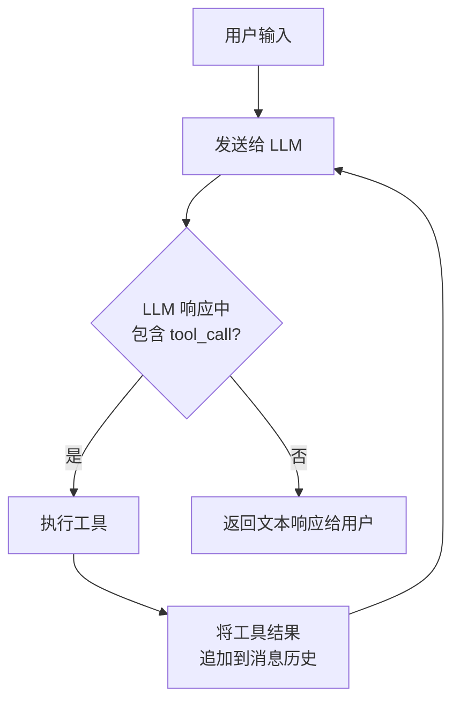
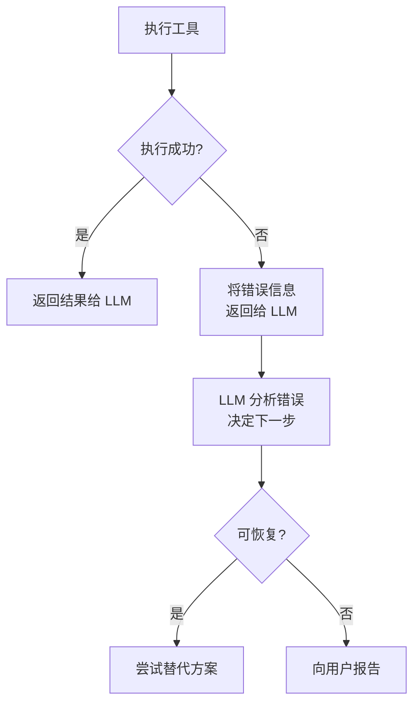
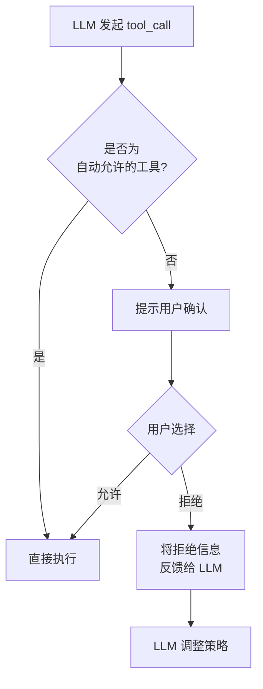
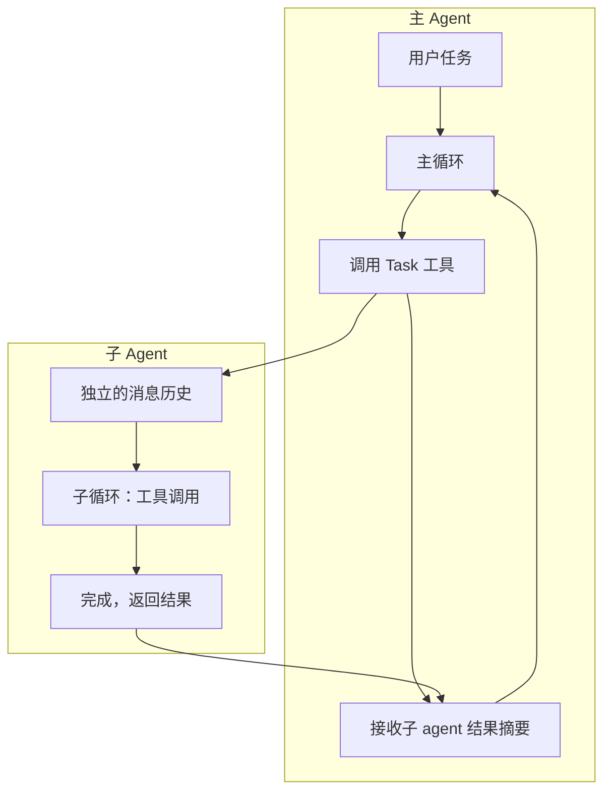

## 引言：为什么 Coding Agent 这么能干？

2025 年以来，AI coding agent 的能力出现了质的飞跃。Claude Code、Cursor、Windsurf 等工具已经可以独立完成"读代码 → 定位问题 → 修改 → 跑测试 → 修复失败 → 提交"这样的完整工作流。

但如果你仔细观察，底座模型（foundation model）本身并没有"执行代码"或"读文件"的能力——它只是一个文本输入、文本输出的函数。是什么让它从"聊天机器人"变成了"能干活的 agent"？

答案是**工具循环（Tool Loop）**。

工具循环是所有现代 AI agent 的核心运行时机制。理解它，就理解了 agent 系统设计的 80%。

## 什么是工具循环

### 从 ReAct 到工具循环

工具循环并不是凭空出现的。它的学术渊源可以追溯到 2022 年 Yao 等人提出的 [ReAct（Reasoning + Acting）](https://arxiv.org/abs/2210.03629) 模式。ReAct 的核心思想是：让 LLM 交替进行**推理**（Thought）和**行动**（Action），每次行动后获取**观察**（Observation），再基于观察继续推理。

```
Thought: 我需要找到 config.yaml 中的数据库配置
Action: search_file("config.yaml", "database")
Observation: 找到 3 处匹配...
Thought: 数据库端口配置在第 42 行，需要改为 5433
Action: edit_file("config.yaml", line=42, ...)
Observation: 文件已修改
Thought: 任务完成，无需进一步操作
```

而现代工具循环是 ReAct 的工程化演进。区别在于：ReAct 论文中 Thought 是显式文本输出，而在工具循环中，推理过程隐含在 LLM 决定调用哪个工具、传什么参数的过程中。正如 Simon Willison 所总结的：**agent 的本质就是 LLM + 工具循环**——一个 while 循环，让 LLM 反复调用工具直到任务完成。

### 核心模式

工具循环的实现极其简洁：

```python
while has_tool_calls(response):
    results = execute_tools(response.tool_calls)
    response = llm(messages + results)
return response.text
```

用一句话总结：**LLM 不断提出工具调用请求，系统执行后把结果反馈给 LLM，直到 LLM 认为任务完成、不再调用工具为止。**



这三行代码赋予了 LLM 三个关键能力：

1. **感知**：通过读文件、搜索代码、执行命令等工具获取环境信息
2. **行动**：通过写文件、运行测试、调用 API 等工具改变环境状态
3. **反思**：根据工具返回的结果（报错信息、测试输出等）调整下一步策略

### 一次真实的工具循环 Trace

抽象描述不够直观。下面是一个简化的真实场景——用户要求"修复 login 函数中的 bug"时，agent 内部的消息流转：

```
┌─ Turn 1 ──────────────────────────────────────────────┐
│ User: "修复 login 函数中的 bug"                         │
│ LLM → tool_call: Grep(pattern="def login", path=".")  │
│ Result: "src/auth.py:23: def login(username, password)" │
└───────────────────────────────────────────────────────┘
┌─ Turn 2 ──────────────────────────────────────────────┐
│ LLM → tool_call: Read(file="src/auth.py")              │
│ Result: [文件完整内容, 78 行]                            │
└───────────────────────────────────────────────────────┘
┌─ Turn 3 ──────────────────────────────────────────────┐
│ LLM → tool_call: Edit(file="src/auth.py",              │
│         old="if password == stored:",                   │
│         new="if verify_hash(password, stored):")        │
│ Result: "文件已修改"                                     │
└───────────────────────────────────────────────────────┘
┌─ Turn 4 ──────────────────────────────────────────────┐
│ LLM → tool_call: Bash(cmd="pytest tests/test_auth.py") │
│ Result: "PASSED (3/3)"                                  │
└───────────────────────────────────────────────────────┘
┌─ Turn 5 ──────────────────────────────────────────────┐
│ LLM → text: "已修复 login 函数中的明文密码比较 bug，      │
│        改为使用 verify_hash 进行哈希验证。测试全部通过。"   │
│ [无 tool_call → 循环结束]                                │
└───────────────────────────────────────────────────────┘
```

注意这个过程：LLM 先搜索定位（感知），再读取理解（感知），然后修改（行动），接着运行测试验证（感知+反思），最后确认完成。5 轮 API 调用，4 次工具执行，全程没有人类介入。这就是工具循环的威力。

## 工具循环的关键设计要素

看懂了基本模式后，真正的工程挑战在于细节设计。以下是四个决定 agent 质量的关键要素。

### 1. 工具粒度与描述

工具应该设计成什么粒度？这是最重要的架构决策之一。

| 粒度 | 示例 | 优点 | 缺点 |
|------|------|------|------|
| 太粗 | `solve_coding_task(desc)` | 调用少 | LLM 失去控制力，黑盒 |
| 太细 | `move_cursor(line, col)` | 精确 | 需要大量调用，浪费 token |
| **适中** | `edit_file(path, old, new)` | LLM 可理解且可控 | 需要仔细设计边界 |

好的工具粒度应该让 LLM **在一次调用中完成一个有意义的原子操作**，同时返回足够的信息供 LLM 做下一步决策。

但粒度只是第一步。**工具描述（tool description）的质量同样关键**，因为 LLM 完全依赖描述来理解工具的用途和约束。一个好的工具描述应该包含：

- **功能说明**：这个工具做什么
- **使用约束**：什么时候该用、什么时候不该用
- **参数语义**：每个参数的含义和边界条件
- **常见陷阱**：容易出错的用法提示

以 Claude Code 的 `Edit` 工具描述为例，它不只说"编辑文件"，而是明确告诉 LLM：`old_string` 必须在文件中唯一匹配、必须先 Read 再 Edit、不要包含行号前缀。这些约束直接写在工具描述中，让 LLM 在"决定如何调用"这一步就避开了大量错误。

工具描述本质上是一种**面向 LLM 的 API 文档**。它不是给人看的，而是给模型看的——这意味着它需要精确、无歧义、包含负面示例。

### 2. 上下文管理

每次循环迭代都会往消息历史中追加内容。一个复杂任务可能跑 50-200 轮循环，每轮工具结果可能几百到几千 token。这些内容快速堆积，context window 很快就被填满。

这不只是"放不下"的问题。即使模型支持 200K token 的上下文，**上下文过长会导致模型"注意力分散"**——关键信息被大量无关的工具输出淹没，LLM 的决策质量下降。这就是所谓的 "Lost in the Middle" 问题。

常见的上下文管理策略：

| 策略 | 原理 | 适用场景 |
|------|------|----------|
| **摘要压缩** | 用小模型对早期消息生成摘要，替换原始内容 | 长对话，早期上下文重要但不需要细节 |
| **滑动窗口** | 只保留最近 N 轮的完整内容，更早的截断 | 任务上下文主要依赖近期信息 |
| **选择性注入** | 只在需要时将相关文件内容注入上下文 | 代码库很大，不能全部塞进上下文 |
| **子 agent 隔离** | 将子任务委托给独立 agent，只取回结果摘要 | 可分解为独立子问题的复杂任务 |

Claude Code 的做法是组合使用这些策略：系统会自动压缩早期消息（"The system will automatically compress prior messages as it approaches context limits"），同时通过 `Task` 工具将子任务隔离到独立的上下文中。

一个有趣的设计是工具本身也参与上下文管理。比如 `Read` 工具支持 `offset` 和 `limit` 参数——不是一次读入整个大文件，而是让 LLM 按需读取特定行范围。`Grep` 工具返回匹配的文件路径而非全部文件内容。这些设计让 LLM 能精确控制"把什么信息放进上下文"。

### 3. 停止条件

LLM 什么时候应该停止循环？这不是一个简单的问题：

- **正常终止**：LLM 返回纯文本响应，不包含任何 tool_call
- **最大轮次限制**：防止无限循环，设置硬上限（如 200 轮）
- **用户中断**：用户随时可以中断当前执行
- **资源限制**：token 预算耗尽、API 配额用完

一个常见的陷阱是 agent 在遇到无法解决的问题时反复重试相同的操作——比如反复编译同一段有语法错误的代码，每次只做微小的无意义修改。好的 agent 设计会在 system prompt 层面显式要求模型检测这种模式：

> "If your approach is blocked, do not attempt to brute force your way to the outcome... Instead, consider alternative approaches or other ways you might unblock yourself."

这是一种用自然语言约束循环行为的方式——不是靠代码逻辑检测重复，而是靠 LLM 的推理能力自我觉察。

### 4. 错误恢复

工具执行失败是常态而非异常。网络超时、文件不存在、命令执行报错——这些都需要优雅处理：



关键原则是：**把错误信息作为工具结果反馈给 LLM，让 LLM 自己决定如何处理**。这比硬编码错误处理逻辑灵活得多——LLM 可以根据错误类型、上下文、任务目标灵活选择重试、换一种工具、调整参数、或者直接告诉用户无法完成。

这也是工具循环相比传统自动化的根本优势：传统脚本遇到预期外的错误就崩溃了，而工具循环中的 LLM 能"理解"错误信息并即兴应对。

## 以 Claude Code 为例

Claude Code 是 Anthropic 推出的 CLI 形态的 coding agent，其架构是工具循环模式的一个典型实现。通过分析它的设计，我们可以看到上述理论如何落地。

### 单线程主循环

Claude Code 的核心是一个**单线程的工具循环**。每一轮：

1. 将用户消息 + system prompt + 历史消息发送给 Claude API
2. 如果响应包含 `tool_use` block，执行对应工具
3. 将工具结果（`tool_result`）追加到消息列表
4. 回到步骤 1

没有复杂的调度器，没有有限状态机，没有 DAG 工作流引擎——就是一个朴素的 while 循环。这验证了一个反直觉的工程洞察：**简单的循环 + 强大的模型 + 精心设计的工具 = 高度自主的 agent**。

### 工具设计哲学

Claude Code 提供了约 10-15 个核心工具，每个工具都遵循"适中粒度"原则：

| 工具 | 职责 | 设计考量 |
|------|------|----------|
| `Read` | 读取文件内容 | 支持行号范围，避免大文件撑爆上下文 |
| `Edit` | 精确字符串替换 | 要求 `old_string` 唯一，避免歧义修改 |
| `Write` | 写入整个文件 | 要求先 Read 再 Write，防止盲写 |
| `Bash` | 执行 shell 命令 | 有超时限制，避免阻塞 |
| `Glob` | 按模式搜索文件 | 比 `find` 更快，结果按修改时间排序 |
| `Grep` | 按内容搜索文件 | 基于 ripgrep，支持正则 |
| `Task` | 启动子 agent | 隔离上下文，并行处理子任务 |

值得注意的是工具之间的**互锁约束**：`Edit` 和 `Write` 都要求先 `Read`。这不是技术限制，而是刻意设计——强制 LLM 先看再改，避免"凭记忆瞎改"导致的错误。这种约束通过工具描述传达给 LLM，在 system prompt 中强化：

> "In general, do not propose changes to code you haven't read."

这是一个精妙的设计：**用工具的前置条件来引导 LLM 的行为模式**，而不是靠模型"自觉"。

### 权限模型

工具循环的一个现实挑战是安全性。LLM 可以调用 `Bash` 执行任意命令、用 `Write` 覆盖任意文件——如果不加约束，后果不堪设想。

Claude Code 的做法是引入**分层权限模型**：



只读工具（如 `Read`、`Glob`、`Grep`）通常自动允许，而写入和执行类工具（如 `Edit`、`Bash`）需要用户确认。用户还可以配置不同的权限模式来调整自动化程度。

这个设计的巧妙之处在于：**权限拒绝也是工具循环的一部分**。用户拒绝某个操作后，拒绝信息会作为工具结果反馈给 LLM，LLM 可以据此调整策略——比如改用更安全的方式，或者向用户解释为什么需要这个操作。

### 子 Agent 与并行

当任务变得复杂时，Claude Code 会通过 `Task` 工具启动子 agent。子 agent 有自己独立的消息历史和工具循环，完成后只将摘要结果返回给主 agent。



子 agent 不只是"分担工作量"。它解决了工具循环中最棘手的工程问题：

- **上下文隔离**：子任务的大量中间结果（比如搜索了 50 个文件才找到目标）不会污染主 agent 的上下文。主 agent 只看到"找到了，在 src/auth.py 第 23 行"。
- **并行执行**：多个子 agent 可以同时运行。比如"在前端和后端分别修复这个问题"可以并行处理。
- **专业化**：不同类型的子 agent 可以有不同的工具集和 system prompt，比如 Explore agent 只有搜索工具不能写文件，天然更安全。

这种"主 agent 编排，子 agent 执行"的分层模式，本质上是把一个超长的工具循环拆分成了多个短循环的组合。

## 工具循环 vs 底座模型

一个常见的误解是：agent 的能力主要取决于底座模型的智能程度。现实更加微妙：

**底座模型决定了 agent 的"智商上限"，而工具循环设计决定了这个智商能发挥多少。**

具体来说：

| 维度 | 底座模型的贡献 | 工具循环的贡献 |
|------|----------------|----------------|
| 代码理解 | 理解语法和语义 | 决定 LLM 能看到哪些代码 |
| 问题诊断 | 推理错误原因 | 决定错误信息如何呈现给 LLM |
| 修复策略 | 生成修复方案 | 决定 LLM 能执行哪些操作 |
| 任务规划 | 分解复杂任务 | 决定执行计划如何落地 |

同一个底座模型在不同的工具循环实现中，表现可以天差地别。这就是为什么 Claude Code、Cursor、Windsurf 虽然可能使用相同的模型，但用户体验差异显著——**工具循环的工程质量是区分好坏 agent 的关键因素**。

更深层地看，工具循环的设计影响着 LLM 的"有效推理能力"。考虑两种极端：

- **工具循环 A**：只提供一个 `run_shell` 工具，不做上下文管理，不限制轮次。LLM 需要自己 `cat` 文件、`grep` 搜索、记住看过的所有内容——大量 token 浪费在低级操作上。
- **工具循环 B**：提供精心设计的搜索、读取、编辑工具，自动压缩旧上下文，工具描述中嵌入最佳实践约束。LLM 的每一次调用都在做高层决策。

同样的模型，在 B 中的表现可能比 A 好一个数量级。这就是工程的价值。

好的工具循环设计具备以下特征：

- **工具描述清晰**：LLM 能准确理解每个工具的用途和限制
- **反馈信息丰富**：工具结果包含足够的信息供 LLM 做决策
- **失败友好**：错误被优雅地传递而非静默吞掉
- **上下文高效**：在有限的 context window 中最大化有用信息密度
- **行为约束明确**：通过 system prompt 和工具描述引导 LLM 避开已知陷阱

## 总结

工具循环是 AI agent 的核心运行时机制。它的基本模式虽然简单——`调用 → 执行 → 反馈 → 重复`——但其工程实现中的每一个设计决策都会显著影响 agent 的最终表现。

回顾本文的核心观点：

1. **工具循环是 ReAct 模式的工程化演进**，本质是让 LLM 在感知-行动-反思的循环中自主完成任务
2. **四个关键设计要素**——工具粒度、上下文管理、停止条件、错误恢复——决定了 agent 的工程质量
3. **简单循环 + 精心设计的工具 + 强大的模型 = 高度自主的 agent**，Claude Code 的实践证明了这一点
4. **工具循环的工程质量是区分好坏 agent 的关键因素**，而非仅仅依赖底座模型的能力

理解工具循环，不仅有助于更好地使用现有的 coding agent，也是构建自己的 agent 系统的基础。

## 延伸阅读

**官方资源：**
- [Anthropic: Building effective agents](https://www.anthropic.com/research/building-effective-agents) — Anthropic 官方的 agent 设计指南
- [OpenAI: Unrolling the Codex Agent Loop](https://openai.com/index/unrolling-the-codex-agent-loop/) — OpenAI 官方解析 Codex 的 agent 循环
- [Anthropic: Building agents with the Claude Agent SDK](https://www.anthropic.com/engineering/building-agents-with-the-claude-agent-sdk) — 使用 Agent SDK 构建 agent

**深度分析：**
- [Simon Willison: Designing Agentic Loops](https://simonwillison.net/2025/Sep/30/designing-agentic-loops/) — Simon Willison 的经典文章，定义 agent 就是 LLM + 工具循环
- [Claude Code: A Simple Loop That Produces High Agency](https://medium.com/@aiforhuman/claude-code-a-simple-loop-that-produces-high-agency-814c071b455d) — 核心观点：一个简单循环如何产生高度自主性
- [Claude Code Behind the Scenes: the Master Agent Loop](https://blog.promptlayer.com/claude-code-behind-the-scenes-of-the-master-agent-loop/) — 深入分析 Claude Code 的主循环架构
- [Claude Code Internals Part 2: The Agent Loop](https://kotrotsos.medium.com/claude-code-internals-part-2-the-agent-loop-5b3977640894) — 内部机制详解
- [Tracing Claude Code's LLM Traffic](https://medium.com/@georgesung/tracing-claude-codes-llm-traffic-agentic-loop-sub-agents-tool-use-prompts-7796941806f5) — 通过抓包分析 Claude Code 的实际调用流程

**教程与实践：**
- [The Agent Execution Loop: How to Build](https://newsletter.victordibia.com/p/the-agent-execution-loop-how-to-build) — 从零构建 agent 循环的教程
- [From ReAct to Ralph Loop](https://www.alibabacloud.com/blog/from-react-to-ralph-loop-a-continuous-iteration-paradigm-for-ai-agents_602799) — 从 ReAct 到 Ralph Loop 的演进
- [Self-Improving Agents](https://addyosmani.com/blog/self-improving-agents/) — 自我改进的编码 agent 设计模式
