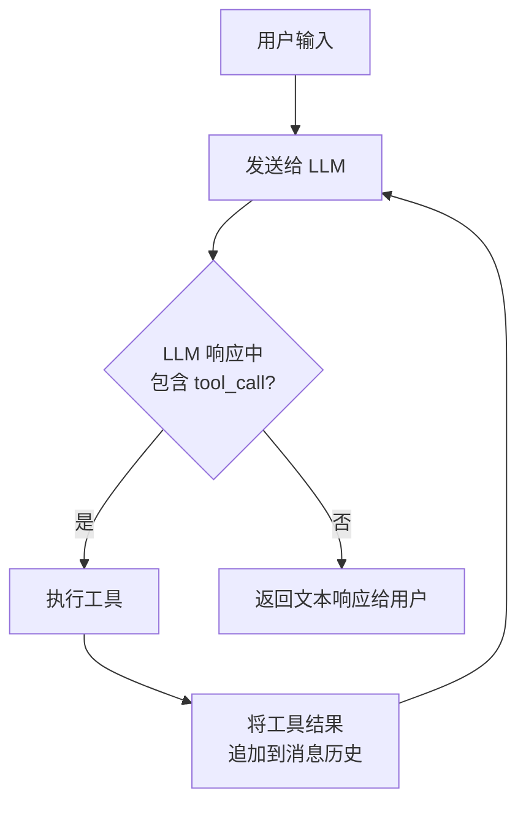
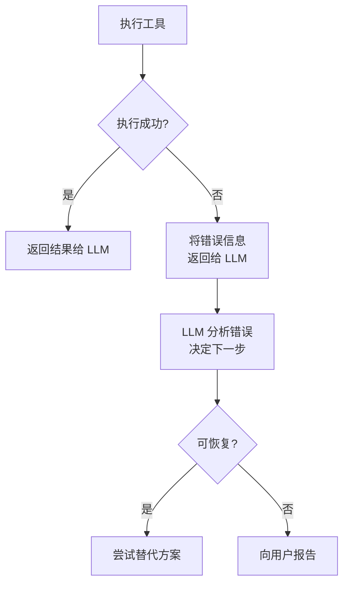
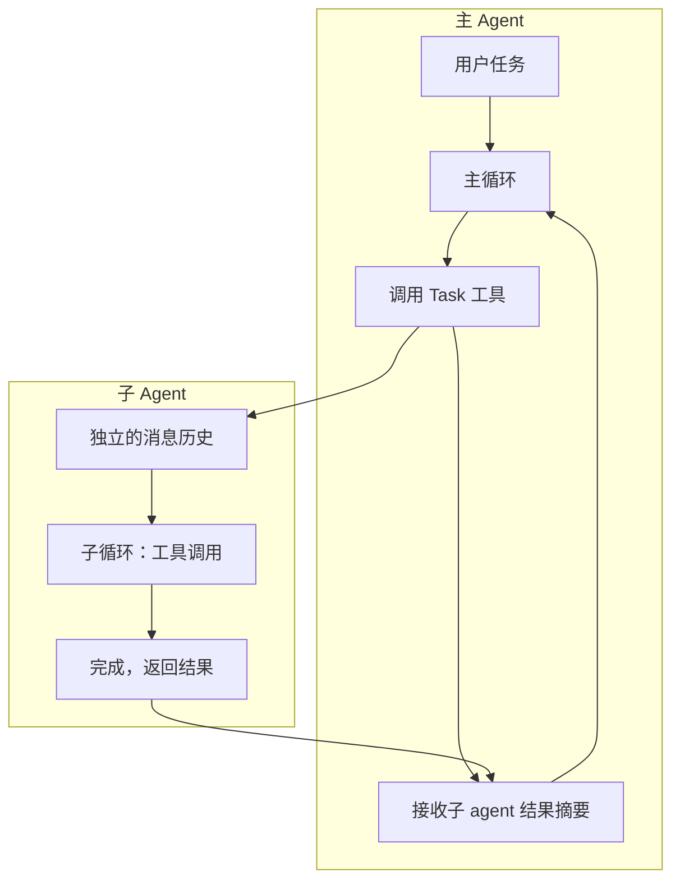

## 引言：为什么 Coding Agent 这么能干？

2025 年以来，AI coding agent 的能力出现了质的飞跃。Claude Code、Cursor、Windsurf 等工具已经可以独立完成"读代码 → 定位问题 → 修改 → 跑测试 → 修复失败 → 提交"这样的完整工作流。

但如果你仔细观察，底座模型（foundation model）本身并没有"执行代码"或"读文件"的能力——它只是一个文本输入、文本输出的函数。是什么让它从"聊天机器人"变成了"能干活的 agent"？

答案是**工具循环（Tool Loop）**。

工具循环是所有现代 AI agent 的核心运行时机制。理解它，就理解了 agent 系统设计的 80%。

## 什么是工具循环

工具循环的核心模式极其简洁：

```
while has_tool_calls(response):
    results = execute_tools(response.tool_calls)
    response = llm(messages + results)
return response.text
```

用一句话总结：**LLM 不断提出工具调用请求，系统执行后把结果反馈给 LLM，直到 LLM 认为任务完成、不再调用工具为止。**

下面是这个过程的可视化：



这个循环看似简单，但它赋予了 LLM 三个关键能力：

1. **感知**：通过读文件、搜索代码、执行命令等工具获取环境信息
2. **行动**：通过写文件、运行测试、调用 API 等工具改变环境状态
3. **反思**：根据工具返回的结果（报错信息、测试输出等）调整下一步策略

这正是经典的 **感知-行动-反思** 循环（Perceive-Act-Reflect），也是 agent 区别于普通 chatbot 的本质。

## 工具循环的关键设计要素

看懂了基本模式后，真正的工程挑战在于细节设计。以下是四个决定 agent 质量的关键要素。

### 1. 工具粒度

工具应该设计成什么粒度？这是最重要的架构决策之一。

| 粒度 | 示例 | 优点 | 缺点 |
|------|------|------|------|
| 太粗 | `solve_coding_task(desc)` | 调用少 | LLM 失去控制力，黑盒 |
| 太细 | `move_cursor(line, col)` | 精确 | 需要大量调用，浪费 token |
| **适中** | `edit_file(path, old, new)` | LLM 可理解且可控 | 需要仔细设计边界 |

好的工具粒度应该让 LLM **在一次调用中完成一个有意义的原子操作**，同时返回足够的信息供 LLM 做下一步决策。

### 2. 上下文管理

每次循环迭代都会往消息历史中追加内容。当对话变长时，context window 会被填满。常见策略包括：

- **摘要压缩**：对早期的工具结果进行摘要
- **滑动窗口**：只保留最近 N 轮交互的完整内容
- **选择性注入**：只在需要时将相关文件内容注入上下文
- **子 agent 隔离**：将子任务委托给独立的 agent，只取回结果摘要

### 3. 停止条件

LLM 什么时候应该停止循环？这不是一个简单的问题：

- **正常终止**：LLM 返回纯文本响应，不包含任何 tool_call
- **最大轮次限制**：防止无限循环，设置硬上限（如 200 轮）
- **用户中断**：用户随时可以中断当前执行
- **资源限制**：token 预算耗尽、API 配额用完

一个常见的陷阱是 agent 在遇到无法解决的问题时反复重试相同的操作。好的 agent 设计会检测这种模式并主动停下来向用户求助。

### 4. 错误恢复

工具执行失败是常态而非异常。网络超时、文件不存在、命令执行报错——这些都需要优雅处理：



关键原则是：**把错误信息作为工具结果反馈给 LLM，让 LLM 自己决定如何处理**。这比硬编码错误处理逻辑灵活得多。

## 以 Claude Code 为例

Claude Code 是 Anthropic 推出的 CLI 形态的 coding agent，其架构是工具循环模式的一个典型实现。

### 单线程主循环

Claude Code 的核心是一个单线程的工具循环。每一轮：

1. 将用户消息 + 系统提示 + 历史消息发送给 Claude API
2. 如果响应包含 `tool_use` block，执行对应工具
3. 将工具结果（`tool_result`）追加到消息列表
4. 回到步骤 1

没有复杂的调度器，没有状态机，没有工作流引擎——就是一个朴素的循环。

### 工具设计哲学

Claude Code 提供了约 10-15 个核心工具，每个工具都遵循"适中粒度"原则：

| 工具 | 职责 | 设计考量 |
|------|------|----------|
| `Read` | 读取文件内容 | 支持行号范围，避免大文件撑爆上下文 |
| `Edit` | 精确字符串替换 | 要求 `old_string` 唯一，避免歧义修改 |
| `Write` | 写入整个文件 | 要求先 Read 再 Write，防止盲写 |
| `Bash` | 执行 shell 命令 | 有超时限制，避免阻塞 |
| `Glob` | 按模式搜索文件 | 比 `find` 更快，结果按修改时间排序 |
| `Grep` | 按内容搜索文件 | 基于 ripgrep，支持正则 |
| `Task` | 启动子 agent | 隔离上下文，并行处理子任务 |

注意这些工具的设计——每个都在"一次有意义的操作"和"LLM 可理解的输入输出"之间取得了平衡。

### 子 Agent 机制

当任务变得复杂时，Claude Code 会启动子 agent（通过 `Task` 工具）。子 agent 有自己独立的消息历史和工具循环，完成后只将摘要结果返回给主 agent。



这种设计解决了两个问题：
- **上下文隔离**：子任务的大量中间结果不会污染主 agent 的上下文
- **并行执行**：多个子 agent 可以同时运行，处理独立的子任务

## 工具循环 vs 底座模型

一个常见的误解是：agent 的能力主要取决于底座模型的智能程度。现实更加微妙：

**底座模型决定了 agent 的"智商上限"，而工具循环设计决定了这个智商能发挥多少。**

具体来说：

| 维度 | 底座模型的贡献 | 工具循环的贡献 |
|------|----------------|----------------|
| 代码理解 | 理解语法和语义 | 决定 LLM 能看到哪些代码 |
| 问题诊断 | 推理错误原因 | 决定错误信息如何呈现给 LLM |
| 修复策略 | 生成修复方案 | 决定 LLM 能执行哪些操作 |
| 任务规划 | 分解复杂任务 | 决定执行计划如何落地 |

同一个底座模型在不同的工具循环实现中，表现可以天差地别。这就是为什么 Claude Code、Cursor、Windsurf 虽然可能使用相同的模型，但用户体验差异显著——**工具循环的工程质量是区分好坏 agent 的关键因素**。

好的工具循环设计具备以下特征：

- **工具描述清晰**：LLM 能准确理解每个工具的用途和限制
- **反馈信息丰富**：工具结果包含足够的信息供 LLM 做决策
- **失败友好**：错误被优雅地传递而非静默吞掉
- **上下文高效**：在有限的 context window 中最大化有用信息密度

## 总结

工具循环是 AI agent 的核心运行时机制。它的基本模式虽然简单——`调用 → 执行 → 反馈 → 重复`——但其工程实现中的每一个设计决策都会显著影响 agent 的最终表现。

理解工具循环，不仅有助于更好地使用现有的 coding agent，也是构建自己的 agent 系统的基础。

## 延伸阅读

**官方资源：**
- [Anthropic: Building effective agents](https://www.anthropic.com/research/building-effective-agents) — Anthropic 官方的 agent 设计指南
- [OpenAI: Unrolling the Codex Agent Loop](https://openai.com/index/unrolling-the-codex-agent-loop/) — OpenAI 官方解析 Codex 的 agent 循环
- [Anthropic: Building agents with the Claude Agent SDK](https://www.anthropic.com/engineering/building-agents-with-the-claude-agent-sdk) — 使用 Agent SDK 构建 agent

**深度分析：**
- [Simon Willison: Designing Agentic Loops](https://simonwillison.net/2025/Sep/30/designing-agentic-loops/) — Simon Willison 的经典文章，定义 agent 就是 LLM + 工具循环
- [Claude Code: A Simple Loop That Produces High Agency](https://medium.com/@aiforhuman/claude-code-a-simple-loop-that-produces-high-agency-814c071b455d) — 核心观点：一个简单循环如何产生高度自主性
- [Claude Code Behind the Scenes: the Master Agent Loop](https://blog.promptlayer.com/claude-code-behind-the-scenes-of-the-master-agent-loop/) — 深入分析 Claude Code 的主循环架构
- [Claude Code Internals Part 2: The Agent Loop](https://kotrotsos.medium.com/claude-code-internals-part-2-the-agent-loop-5b3977640894) — 内部机制详解
- [Tracing Claude Code's LLM Traffic](https://medium.com/@georgesung/tracing-claude-codes-llm-traffic-agentic-loop-sub-agents-tool-use-prompts-7796941806f5) — 通过抓包分析 Claude Code 的实际调用流程

**教程与实践：**
- [The Agent Execution Loop: How to Build](https://newsletter.victordibia.com/p/the-agent-execution-loop-how-to-build) — 从零构建 agent 循环的教程
- [From ReAct to Ralph Loop](https://www.alibabacloud.com/blog/from-react-to-ralph-loop-a-continuous-iteration-paradigm-for-ai-agents_602799) — 从 ReAct 到 Ralph Loop 的演进
- [Self-Improving Agents](https://addyosmani.com/blog/self-improving-agents/) — 自我改进的编码 agent 设计模式
