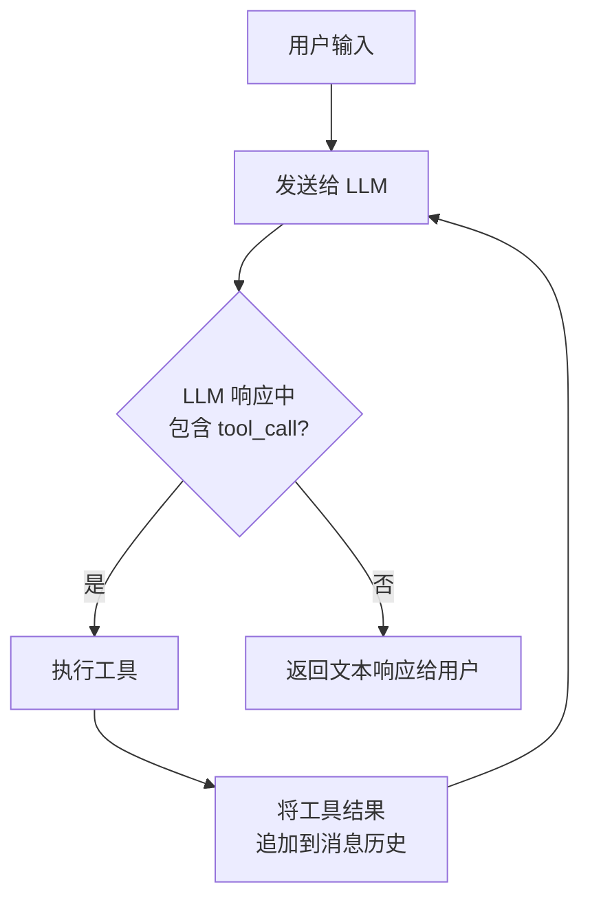
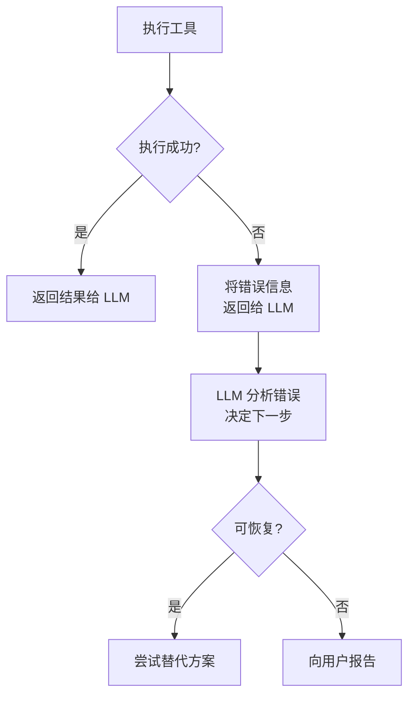
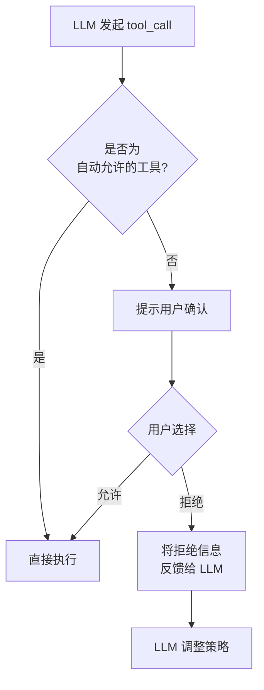
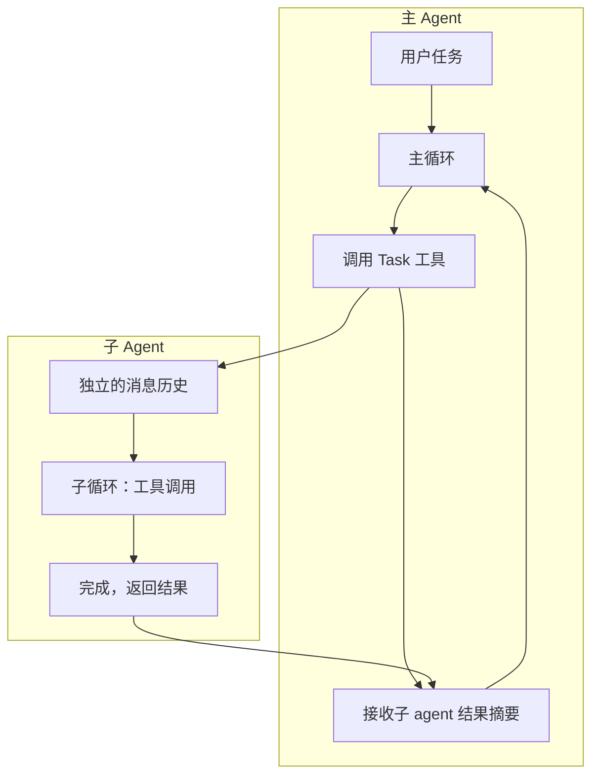

## 引言：为什么 Coding Agent 这么能干？

2025 年以来，AI coding agent 的能力出现了质的飞跃。Claude Code、Codex CLI、Cursor 等工具已经可以独立完成"读代码 → 定位问题 → 修改 → 跑测试 → 修复失败 → 提交"这样的完整工作流。

但如果你仔细观察，底座模型（foundation model）本身并没有"执行代码"或"读文件"的能力——它只是一个文本输入、文本输出的函数。是什么让它从"聊天机器人"变成了"能干活的 agent"？

答案是**工具循环（Tool Loop）**。

Simon Willison 给出了一个简洁有力的定义：

> "An LLM agent is something that runs tools in a loop to achieve a goal."
> ——[Designing Agentic Loops](https://simonwillison.net/2025/Sep/30/designing-agentic-loops/)

三个关键词：**工具（tools）**、**循环（loop）**、**目标（goal）**。理解工具循环，就理解了 agent 系统设计的 80%。

## 什么是工具循环

### 从 ReAct 到工具循环

工具循环并不是凭空出现的。它的学术渊源可以追溯到 2022 年 Yao 等人提出的 [ReAct（Reasoning + Acting）](https://arxiv.org/abs/2210.03629) 模式。ReAct 的核心思想是：让 LLM 交替进行**推理**（Thought）和**行动**（Action），每次行动后获取**观察**（Observation），再基于观察继续推理。

```
Thought: 我需要找到 config.yaml 中的数据库配置
Action: search_file("config.yaml", "database")
Observation: 找到 3 处匹配...
Thought: 数据库端口配置在第 42 行，需要改为 5433
Action: edit_file("config.yaml", line=42, ...)
Observation: 文件已修改
Thought: 任务完成，无需进一步操作
```

现代工具循环是 ReAct 的工程化演进。区别在于：ReAct 论文中 Thought 是显式文本输出，而在工具循环中，推理过程隐含在 LLM 决定调用哪个工具、传什么参数的过程中。这个模式模拟了开发者的真实工作方式：**思考 → 写代码 → 执行 → 验证 →（调试）→ 重复**。

### 核心模式

工具循环的实现极其简洁：

```python
while has_tool_calls(response):
    results = execute_tools(response.tool_calls)
    response = llm(messages + results)
return response.text
```

用一句话总结：**LLM 不断提出工具调用请求，系统执行后把结果反馈给 LLM，直到 LLM 认为任务完成、不再调用工具为止。**



这三行代码赋予了 LLM 三个关键能力：

1. **感知**：通过读文件、搜索代码、执行命令等工具获取环境信息
2. **行动**：通过写文件、运行测试、调用 API 等工具改变环境状态
3. **反思**：根据工具返回的结果（报错信息、测试输出等）调整下一步策略

Anthropic 在 [Building Effective Agents](https://www.anthropic.com/research/building-effective-agents) 中对此做了更精确的区分：**工作流（workflow）**是多个 LLM 按预定义模式编排协作，而**真正的 agent** 是 LLM "dynamically direct their own processes and tool usage"——自主决定下一步做什么。工具循环正是实现这种自主性的核心机制。

### 暴力破解哲学

Simon Willison 提出了一个反直觉但极其实用的视角：

> "Coding agents are brute force tools for finding solutions to coding problems. If you can reduce your problem to a clear goal and a set of tools that can iterate towards that goal, a coding agent can often brute force its way to an effective solution."

**Agent 本质上是暴力搜索器**。它不需要一次性给出完美答案——它可以搜索、尝试、失败、再试，通过不知疲倦的迭代逼近正确解。魔法发生在循环多次运行之后——每次迭代都建立在上一次的基础上，让 AI 渐进式地发展理解，而非把所有内容塞进一个巨大的 prompt。

而善用 agent 的艺术在于：**精心设计供它使用的工具和循环（"the art of using them well is to carefully design the tools and loop for them to use"）**。

### 一次真实的工具循环 Trace

抽象描述不够直观。下面是一个简化的真实场景——用户要求"修复 login 函数中的 bug"时，agent 内部的消息流转：

```
┌─ Turn 1 ──────────────────────────────────────────────┐
│ User: "修复 login 函数中的 bug"                         │
│ LLM → tool_call: Grep(pattern="def login", path=".")  │
│ Result: "src/auth.py:23: def login(username, password)" │
└───────────────────────────────────────────────────────┘
┌─ Turn 2 ──────────────────────────────────────────────┐
│ LLM → tool_call: Read(file="src/auth.py")              │
│ Result: [文件完整内容, 78 行]                            │
└───────────────────────────────────────────────────────┘
┌─ Turn 3 ──────────────────────────────────────────────┐
│ LLM → tool_call: Edit(file="src/auth.py",              │
│         old="if password == stored:",                   │
│         new="if verify_hash(password, stored):")        │
│ Result: "文件已修改"                                     │
└───────────────────────────────────────────────────────┘
┌─ Turn 4 ──────────────────────────────────────────────┐
│ LLM → tool_call: Bash(cmd="pytest tests/test_auth.py") │
│ Result: "PASSED (3/3)"                                  │
└───────────────────────────────────────────────────────┘
┌─ Turn 5 ──────────────────────────────────────────────┐
│ LLM → text: "已修复 login 函数中的明文密码比较 bug，      │
│        改为使用 verify_hash 进行哈希验证。测试全部通过。"   │
│ [无 tool_call → 循环结束]                                │
└───────────────────────────────────────────────────────┘
```

注意这个过程：LLM 先搜索定位（感知），再读取理解（感知），然后修改（行动），接着运行测试验证（感知+反思），最后确认完成。5 轮 API 调用，4 次工具执行，全程没有人类介入。这就是工具循环的威力。

## 工具循环的关键设计要素

看懂了基本模式后，真正的工程挑战在于细节设计。Anthropic 总结的核心原则是：**找到最简单的可行方案，只在必要时增加复杂度（"find the simplest solution possible, and only increase complexity when needed"）**。以下是四个决定 agent 质量的关键要素。

### 1. 工具粒度与 ACI 设计

工具应该设计成什么粒度？这是最重要的架构决策之一。

| 粒度 | 示例 | 优点 | 缺点 |
|------|------|------|------|
| 太粗 | `solve_coding_task(desc)` | 调用少 | LLM 失去控制力，黑盒 |
| 太细 | `move_cursor(line, col)` | 精确 | 需要大量调用，浪费 token |
| **适中** | `edit_file(path, old, new)` | LLM 可理解且可控 | 需要仔细设计边界 |

好的工具粒度应该让 LLM **在一次调用中完成一个有意义的原子操作**，同时返回足够的信息供 LLM 做下一步决策。

但粒度只是第一步。Anthropic 在 [Building Effective Agents](https://www.anthropic.com/research/building-effective-agents) 中提出了一个重要概念：**ACI（Agent-Computer Interface，智能体-计算机接口）**。就像 HCI（人机交互）需要精心设计界面一样，ACI 需要精心设计工具的接口——**投入在 ACI 上的精力应该和 HCI 一样多**。

好的 ACI 设计包含以下实践：

- **工具描述要面向模型**：不是给人看的 API 文档，而是给 LLM 看的——需要精确、无歧义、包含负面示例和边界条件
- **Poka-yoke（防错设计）**：通过参数设计减少模型犯错的可能。例如，Anthropic 发现使用相对路径的工具在目录切换后容易出错，于是改为**强制要求绝对路径**
- **测试模型如何使用工具**：用大量样本测试模型的调用行为，观察它犯什么错，然后迭代改进工具定义

以 Claude Code 的 `Edit` 工具为例，它的描述不只说"编辑文件"，而是明确告诉 LLM：`old_string` 必须在文件中唯一匹配、必须先 Read 再 Edit、不要包含行号前缀。OpenAI 的 Codex CLI 则走了另一条路——它用 `apply_patch` 工具推动模型生成最小化的 diff 补丁，而非整文件重写。两种设计思路不同，但都体现了 ACI 的核心原则：**让模型更难犯错，更容易做对**。

### 2. 上下文管理

每次循环迭代都会往消息历史中追加内容。一个复杂任务可能跑 50-200 轮循环，每轮工具结果可能几百到几千 token。这些内容快速堆积，context window 很快就被填满。

OpenAI 工程师 Michael Bolin 在 [Unrolling the Codex Agent Loop](https://openai.com/index/unrolling-the-codex-agent-loop/) 中指出了一个关键性能问题：**朴素的工具循环推理开销是二次方级别的（"quadratic in terms of the amount of JSON sent to the Responses API"）**——因为每轮迭代都要重新发送完整的消息历史。Prompt caching 是关键的优化手段：通过复用前一次推理的前缀缓存，将推理性能从二次方降到线性。但缓存需要**精确的前缀匹配**——Codex CLI 早期就因为 MCP 工具枚举顺序不一致导致缓存频繁失效，性能大幅下降。

除了性能问题，上下文过长还会导致模型"注意力分散"——关键信息被大量无关的工具输出淹没，LLM 的决策质量下降（即 "Lost in the Middle" 问题）。

主流 agent 的上下文管理策略对比：

| 策略 | Claude Code | Codex CLI |
|------|-------------|-----------|
| **压缩机制** | Compressor（约 92% 上下文使用时触发，自动摘要） | Compaction（调用专门的 API 端点，生成加密的压缩表示） |
| **历史管理** | 扁平消息历史，自动压缩早期消息 | 完全无状态，每次重发完整历史（为支持 Zero Data Retention） |
| **工具级控制** | Read 支持 offset/limit，Grep 只返回路径 | 类似思路，工具结果可过滤 |
| **子任务隔离** | Task 工具启动子 agent，独立上下文 | 类似，通过独立循环隔离 |

一个有趣的设计共识是：**工具本身也参与上下文管理**。比如 `Read` 工具支持按行范围读取而非一次读入整个大文件，`Grep` 返回匹配的文件路径而非全部内容。这让 LLM 能精确控制"把什么信息放进上下文"。

### 3. 停止条件与测试驱动

LLM 什么时候应该停止循环？这不是一个简单的问题：

- **正常终止**：LLM 返回纯文本响应，不包含任何 tool_call
- **最大轮次限制**：防止无限循环，设置硬上限（如 200 轮）
- **用户中断**：用户随时可以中断当前执行
- **资源限制**：token 预算耗尽、API 配额用完

一个常见的陷阱是 agent 在遇到无法解决的问题时反复重试相同的操作。好的 agent 设计会在 system prompt 层面显式要求模型检测这种模式：

> "If your approach is blocked, do not attempt to brute force your way to the outcome... Instead, consider alternative approaches."

Simon Willison 提出了一个更优雅的解法：**把测试作为循环的一等公民**。一套完善的自动化测试可以给 agent 提供明确的"完成信号"——`pytest` 全部通过意味着任务完成，有失败就继续修。这让循环有了**客观的停止标准**，而非依赖 LLM 的主观判断。

> "A robust agent loop incorporates tests as first-class citizens... if tests fail, the loop knows the task isn't done and can prompt the agent to fix the code."

这也解释了为什么 TDD 方法论与 agent 工作流天然契合：先写测试、运行失败、编写实现、测试通过——这正是工具循环最擅长的迭代模式。

### 4. 错误恢复

工具执行失败是常态而非异常。网络超时、文件不存在、命令执行报错——这些都需要优雅处理：



关键原则是：**把错误信息作为工具结果反馈给 LLM，让 LLM 自己决定如何处理**。Anthropic 在 Building Effective Agents 中强调，agent 在每一步都需要从环境中获取 **"ground truth"（真实反馈）**——工具调用结果、代码执行输出、测试结果——来评估自己的进展。同时建议将 AI agent 的灵活性与确定性的保障措施结合——比如重试逻辑和定期检查点（checkpoint），让 agent 既能灵活应对，又不会完全失控。

这也是工具循环相比传统自动化的根本优势：传统脚本遇到预期外的错误就崩溃了，而工具循环中的 LLM 能"理解"错误信息并即兴应对。

## 实战对比：Claude Code vs Codex CLI

为了更深入地理解工具循环的工程实现，我们对比两个最有代表性的 coding agent：Anthropic 的 Claude Code 和 OpenAI 的 Codex CLI。两者都是工具循环模式的典型实现，但在具体设计上有不少差异。

### 架构哲学

Claude Code 的设计哲学被 [PromptLayer 的深度分析](https://blog.promptlayer.com/claude-code-behind-the-scenes-of-the-master-agent-loop/)总结为两句话：

> **"Do the simple thing first"** — 先做简单的事。选择正则表达式而非 embeddings 做搜索，选择 Markdown 文件而非数据库做记忆。
>
> **"Less scaffolding, more model"** — 少搭脚手架，多依赖模型。删除多余的框架代码，让模型能力自然发挥。

两者的核心都是**单线程的 while 循环**，没有复杂的调度器或状态机。正如 PromptLayer 文章所说："驱动一个能重构整个代码库的 AI Agent 的，其实是与 CS101 课堂上 while 循环相同的模式。"

### 工具设计对比

| 维度 | Claude Code | Codex CLI |
|------|-------------|-----------|
| 搜索 | `Grep`（基于 ripgrep 的正则搜索，[选择正则而非 embeddings](https://blog.promptlayer.com/claude-code-behind-the-scenes-of-the-master-agent-loop/)） | shell 命令 + MCP tools |
| 编辑 | `Edit`（精确字符串替换，要求 `old_string` 唯一） | `apply_patch`（最小化 diff 补丁） |
| 文件写入 | `Write`（整文件覆盖，要求先 Read） | `apply_patch` 统一处理 |
| 命令执行 | `Bash`（有超时和权限控制） | `shell`/`container_exec`（沙箱执行） |
| 子 agent | `Task`（独立上下文，不能递归生成子 agent） | 类似机制 |
| 项目记忆 | `CLAUDE.md` 文件 | `AGENTS.md` 文件 |

值得注意的差异是编辑工具的设计。Claude Code 要求 LLM 找到要替换的**唯一字符串**，这是一种 poka-yoke（防错）设计——如果匹配到多处，工具会报错而非盲改。Codex CLI 则采用 patch 格式，推动模型生成手术刀式的最小修改。两种思路的共同目标是：**让模型更难犯破坏性错误**。

还有一个重要的互锁约束：Claude Code 的 `Edit` 和 `Write` 都要求先 `Read`。这不是技术限制，而是刻意设计——强制 LLM 先看再改，避免"凭记忆瞎改"导致的错误：

> "In general, do not propose changes to code you haven't read."

### 权限与安全

工具循环的一个现实挑战是安全性。LLM 可以调用 shell 执行任意命令——如果不加约束，后果不堪设想。Simon Willison 明确指出了三大风险：

1. **破坏性命令**：可能删除或损坏你关心的文件
2. **数据外泄**：Agent 可见的源代码或环境变量中的密钥可能被窃取（尤其是通过 prompt injection 攻击）
3. **代理攻击**：你的机器可能被用作攻击其他目标的跳板



Claude Code 的做法是**分层权限模型**：只读工具自动允许，写入和执行类工具需要用户确认。据 Anthropic 内部数据，沙箱化机制安全地减少了 84% 的权限提示。而 Codex CLI 在安全上更激进——在 macOS 上使用 Apple Seatbelt 限制文件系统访问，在 Linux 上运行在 Docker 容器中，通过 iptables 限制网络访问。

Willison 指出了一个两难困境：频繁请求用户确认虽然安全，但**极大降低了 agent 暴力搜索的效率**。每种工具都提供了自己的"YOLO 模式"（自动批准所有操作），这很危险，但也是获得最大生产力的关键。他推荐的折中方案是**在隔离环境（如 GitHub Codespaces 或 Docker 容器）中运行 YOLO 模式**——即使出了问题，也只是烧掉一个容器而已。

**权限拒绝也是工具循环的一部分**：用户拒绝某个操作后，拒绝信息会作为工具结果反馈给 LLM，LLM 可以据此调整策略。

### 子 Agent 与分层循环

当任务变得复杂时，两者都会启动子 agent。子 agent 有自己独立的消息历史和工具循环，完成后只将摘要结果返回给主 agent。



Claude Code 的子 agent 有一个重要约束：**子 agent 不能递归生成自己的子 agent**，以防止递归爆炸。子 agent 的结果作为普通的工具输出反馈回主循环，维持整个系统单线程的简洁性。不同类型的子 agent 还可以有不同的工具集和权限——比如 Explore agent 只有搜索工具不能写文件，天然更安全。

这种"主 agent 编排，子 agent 执行"的分层模式，本质上是把一个超长的工具循环拆分成了多个短循环的组合。

## 工具循环 vs 底座模型

一个常见的误解是：agent 的能力主要取决于底座模型的智能程度。现实更加微妙：

**底座模型决定了 agent 的"智商上限"，而工具循环设计决定了这个智商能发挥多少。**

具体来说：

| 维度 | 底座模型的贡献 | 工具循环的贡献 |
|------|----------------|----------------|
| 代码理解 | 理解语法和语义 | 决定 LLM 能看到哪些代码 |
| 问题诊断 | 推理错误原因 | 决定错误信息如何呈现给 LLM |
| 修复策略 | 生成修复方案 | 决定 LLM 能执行哪些操作 |
| 任务规划 | 分解复杂任务 | 决定执行计划如何落地 |

考虑两种极端的工具循环设计：

- **设计 A**：只提供一个 `run_shell` 工具，不做上下文管理，不限制轮次。LLM 需要自己 `cat` 文件、`grep` 搜索、记住看过的所有内容——大量 token 浪费在低级操作上。
- **设计 B**：提供精心设计的搜索、读取、编辑工具，自动压缩旧上下文，工具描述中嵌入 poka-yoke 约束和最佳实践。LLM 的每一次调用都在做高层决策。

同样的模型，在 B 中的表现可能比 A 好一个数量级。这就是为什么 Claude Code、Cursor、Codex CLI 虽然可能使用相同或相近的底座模型，但用户体验差异显著——**工具循环的工程质量是区分好坏 agent 的关键因素**。

Anthropic 在 Building Effective Agents 中对此有一个精辟的总结：成功的 agent 实现不是靠复杂的框架或专业库，而是靠**简单的、可组合的模式（"simple, composable patterns"）**。

## 总结

工具循环是 AI agent 的核心运行时机制。它的基本模式虽然简单——`调用 → 执行 → 反馈 → 重复`——但其工程实现中的每一个设计决策都会显著影响 agent 的最终表现。

回顾本文的核心观点：

1. **工具循环是 ReAct 模式的工程化演进**，本质是让 LLM 在感知-行动-反思的循环中自主完成任务。Simon Willison 的定义最为精炼：agent = LLM + tools + loop + goal
2. **四个关键设计要素**——工具粒度（ACI 设计）、上下文管理（压缩与缓存）、停止条件（测试驱动）、错误恢复——决定了 agent 的工程质量
3. **"Less scaffolding, more model"**——Claude Code 和 Codex CLI 的实践都证明，简单的循环 + 精心设计的工具 + 强大的模型 = 高度自主的 agent
4. **工具循环的工程质量是区分好坏 agent 的关键因素**，而非仅仅依赖底座模型的能力。善用 agent 的艺术在于精心设计工具和循环

理解工具循环，不仅有助于更好地使用现有的 coding agent，也是构建自己的 agent 系统的基础。

## 延伸阅读

**官方资源：**
- [Anthropic: Building effective agents](https://www.anthropic.com/research/building-effective-agents) — Anthropic 官方的 agent 设计指南，提出 ACI、workflow vs agent 的区分、五种组合模式
- [OpenAI: Unrolling the Codex Agent Loop](https://openai.com/index/unrolling-the-codex-agent-loop/) — OpenAI 工程师 Michael Bolin 解析 Codex CLI 的工具循环内部机制，包括 prompt caching 和 compaction
- [Anthropic: Building agents with the Claude Agent SDK](https://www.anthropic.com/engineering/building-agents-with-the-claude-agent-sdk) — 使用 Agent SDK 构建 agent

**深度分析：**
- [Simon Willison: Designing Agentic Loops](https://simonwillison.net/2025/Sep/30/designing-agentic-loops/) — 定义 agent 为 "LLM + tools in a loop"，提出暴力破解哲学、YOLO 模式三大风险、TDD 与 agent 循环的结合
- [Claude Code Behind the Scenes: the Master Agent Loop](https://blog.promptlayer.com/claude-code-behind-the-scenes-of-the-master-agent-loop/) — Claude Code 主循环架构深度分析，包括 "less scaffolding, more model" 哲学、Compressor 机制、子 agent 深度限制
- [Claude Code: A Simple Loop That Produces High Agency](https://medium.com/@aiforhuman/claude-code-a-simple-loop-that-produces-high-agency-814c071b455d) — 一个简单循环如何产生高度自主性
- [Claude Code Internals Part 2: The Agent Loop](https://kotrotsos.medium.com/claude-code-internals-part-2-the-agent-loop-5b3977640894) — 内部机制详解
- [Tracing Claude Code's LLM Traffic](https://medium.com/@georgesung/tracing-claude-codes-llm-traffic-agentic-loop-sub-agents-tool-use-prompts-7796941806f5) — 通过抓包分析 Claude Code 的实际调用流程

**教程与实践：**
- [The Agent Execution Loop: How to Build](https://newsletter.victordibia.com/p/the-agent-execution-loop-how-to-build) — 从零构建 agent 循环的教程
- [From ReAct to Ralph Loop](https://www.alibabacloud.com/blog/from-react-to-ralph-loop-a-continuous-iteration-paradigm-for-ai-agents_602799) — 从 ReAct 到 Ralph Loop 的演进
- [Self-Improving Agents](https://addyosmani.com/blog/self-improving-agents/) — 自我改进的编码 agent 设计模式
