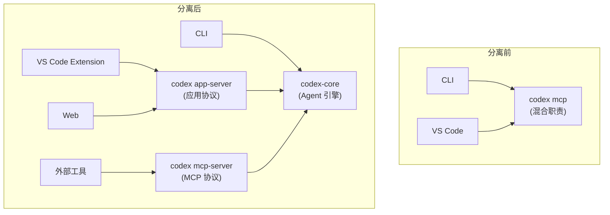
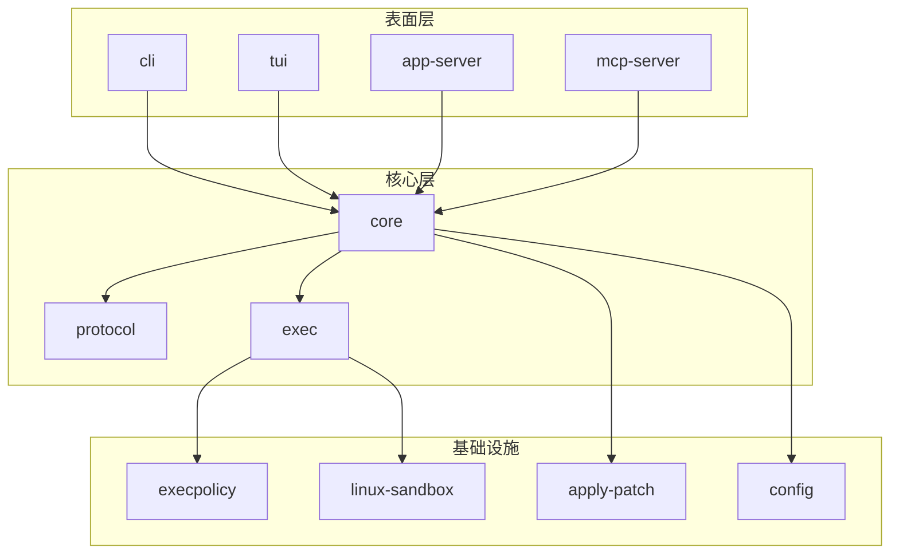

> 本文基于 [openai/codex](https://github.com/openai/codex) 仓库完整 Git 历史（3913 commits，2025-04-16 至 2026-02-21）分析编写。所有 commit hash、PR 编号和日期均可在仓库中验证。

## 引言

在上一篇[《AI Agent 的核心引擎：工具循环（Tool Loop）导论》](/posts/ai-agent-tool-loop-introduction/)中，我们拆解了 coding agent 的核心运行机制。今天我们来做一件更有意思的事：**通过 3913 个 commit，还原 OpenAI Codex 从零到一的完整构建过程**。

为什么选 Codex？因为它是少数完全开源的顶级 coding agent。10 个月，368 位贡献者，从一个 TypeScript CLI 原型演进到一个跨平台、多表面、支持语音交互的完整 agent 系统——这个过程的每一步都被 Git 历史忠实记录了下来。

**基本统计：**

| 指标 | 数据 |
|------|------|
| 时间跨度 | 2025-04-16 至 2026-02-21（10 个月） |
| 总 commit 数 | 3913 |
| 贡献者 | 368 人 |
| 核心贡献者 | Michael Bolin (613)、jif-oai (495)、Ahmed Ibrahim (301) |
| 主要语言 | TypeScript → Rust |

**月度 commit 分布：**

| 月份 | Commits | 趋势 |
|------|---------|------|
| 2025-04 | 261 | 开源首发 |
| 2025-05 | 153 | Rust 重写启动 |
| 2025-06 | 49 | 低谷期（内部重构） |
| 2025-07 | 137 | 回升 |
| 2025-08 | 417 | 协议化 + 缓存优化 |
| 2025-09 | 399 | App Server 解耦 |
| 2025-10 | 383 | 稳定输出 |
| 2025-11 | 387 | 稳定输出 |
| 2025-12 | 420 | 加速 |
| 2026-01 | 654 | 高速期 |
| 2026-02 | 658 | 高速期 |

一个显著趋势：**开发速度不减反增**。从早期 ~300/月到后期 ~650/月，翻了一倍多。这说明架构做对了——好的抽象能加速而非拖累后续开发。

**关键里程碑一览：**

| 日期 | 里程碑 | 阶段 |
|------|--------|------|
| 4月16日 | TypeScript CLI 首次公开 | 开源首发 |
| 4月24日 | PR #629 引入 Rust 实现 | 开源首发 |
| 5月1日 | Linux Landlock 沙箱 | Rust 重写 |
| 5月9日 | AGENTS.md 取代 instructions.md | Rust 重写 |
| 5月中旬 | MCP server/client 集成 | Rust 重写 |
| 7月31日 | /compact 上下文压缩 | 协议与性能 |
| 8月11日 | prompt_cache_key 优化 | 协议与性能 |
| 8月15日 | codex-protocol crate | 协议与性能 |
| 8月25日 | MCP 工具排序修复缓存 | 协议与性能 |
| 9月29日 | TypeScript SDK | App Server 解耦 |
| 9月30日 | app-server 与 mcp-server 分离 | App Server 解耦 |
| 1月9日 | Bazel 构建系统 | 规模化 |
| 2月17日 | Realtime/Voice API | 规模化 |

## 阶段一：开源首发（2025 年 4 月 16-30 日）— 261 commits

### Day 1：一个 TypeScript CLI 的诞生

2025 年 4 月 16 日，Ilan Bigio 提交了 [Initial commit](https://github.com/openai/codex/commit/59a180dde)。这个初始代码库已经是一个功能完整的 coding agent：

**初始源码结构（`codex-cli/src/`）：**

```
codex-cli/src/
├── cli.tsx                          # CLI 入口（Ink + React）
├── app.tsx                          # 主应用组件
├── components/
│   ├── chat/                        # 终端聊天 UI（8 个组件）
│   └── onboarding/                  # 引导流程
├── utils/
│   ├── agent/
│   │   ├── agent-loop.ts            # 核心：Agent 循环
│   │   ├── apply-patch.ts           # 文件修改
│   │   ├── handle-exec-command.ts   # 命令执行
│   │   ├── sandbox/
│   │   │   ├── interface.ts         # 沙箱接口
│   │   │   ├── macos-seatbelt.ts    # macOS 沙箱
│   │   │   └── raw-exec.ts          # 原始执行
│   │   └── review.ts               # 审批流程
│   └── config.ts                    # 配置管理
└── lib/
    ├── approvals.ts                 # 审批策略
    └── parse-apply-patch.ts         # apply_patch 解析器
```

几个值得注意的设计决策：

**1. Agent Loop 直接构建在 OpenAI Responses API 上。** [Responses API](https://platform.openai.com/docs/api-reference/responses) 是 OpenAI 在 2025 年推出的新一代 API，取代了此前的 Chat Completions API。它的核心区别在于：原生支持工具调用（tool use）、多模态输入、以及通过 `previous_response_id` 实现的服务端对话状态管理——这意味着客户端不需要每次都发送完整的消息历史，API 会自动追踪对话上下文。`AgentLoop` 类基于此封装了一个标准的工具循环：调用模型 → 收到 tool_call → 执行工具 → 将结果反馈 → 继续循环。这和我们在上一篇文章中讨论的 `while has_tool_calls(response)` 模式完全一致。

**2. apply_patch 是自定义的文件修改格式。** 不是标准的 unified diff，而是一种更紧凑的格式（`\*** Begin Patch` / `\*** End Patch`），专为 LLM 生成优化。这是 Codex 的核心工具之一——让模型可以精确修改文件而非重写整个文件。

**3. 沙箱从 Day 1 就是核心关注点。** 初始版本就包含了 macOS Seatbelt 沙箱实现，通过 `sandbox-exec` 限制文件写入范围。这不是事后补上的安全措施，而是从一开始就内建的设计。

### 社区风暴

开源当天，社区立即涌入。第一天的 46 个 commit 中，大量来自外部贡献者：

- `mkusaka`：修复 package-lock.json 命名 ([#4](https://github.com/openai/codex/pull/4))
- `ddgond`：修复 README 默认值 ([#12](https://github.com/openai/codex/pull/12))
- `Jon Church`：移除未使用的 express 依赖 ([#20](https://github.com/openai/codex/pull/20))
- `Arash Ari Sheyda`：修复 README 错别字 ([#27](https://github.com/openai/codex/pull/27))

注意 PR 编号的跳跃——从 #1 到 #27，说明有大量 issue 和 PR 在同时涌入。这是成功开源发布的典型特征。

### 第 8 天：一个改变一切的决定

2025 年 4 月 24 日，Michael Bolin 提交了 [PR #629](https://github.com/openai/codex/pull/629)——`feat: initial import of Rust implementation of Codex CLI in codex-rs/`。

开源仅 8 天就引入第二语言，这个决定的 PR 描述非常坦诚：

> Today, Codex CLI is written in TypeScript and requires Node.js 22+ to run it. For a number of users, this runtime requirement inhibits adoption: they would be better served by a standalone executable. As maintainers, we want Codex to run efficiently in a wide range of environments with minimal overhead. We also want to take advantage of operating system-specific APIs to provide better sandboxing.

动机清晰：**独立二进制 + 原生沙箱 API + 性能**。

初始 Rust 导入包含 9 个 crate：

```
codex-rs/
├── ansi-escape/     # ANSI 转义处理
├── apply-patch/     # apply_patch Rust 实现
├── cli/             # CLI 入口
├── core/            # 核心逻辑
├── exec/            # 命令执行
├── interactive/     # 交互模式
├── repl/            # REPL
└── tui/             # 终端 UI
```

到 2026 年 2 月，这个数字增长到了 **69 个 crate**。

## 阶段二：Rust 重写 + MCP 集成（2025 年 5 月）— 153 commits

### 双轨并行

5 月是一个「双轨并行」的月份：TypeScript CLI 继续接收 bug 修复和功能增强，同时 Rust 实现在快速追赶。

**Rust 端的关键进展：**

1. **Linux Landlock 沙箱**（[#763](https://github.com/openai/codex/pull/763)，2025-05-01）：Michael Bolin 为 TypeScript CLI 添加了基于 Landlock 的 Linux 沙箱，这是在 Rust 版本中已经原生支持的能力的回移。

2. **MCP 集成**（5 月中下旬）：在短短几周内，完成了完整的 MCP（Model Context Protocol）集成：
   - `mcp-types` crate（[#787](https://github.com/openai/codex/pull/787)）：类型定义
   - `mcp-server` crate（[#792](https://github.com/openai/codex/pull/792)）：让 Codex 可以作为 MCP 服务器被其他工具调用
   - `McpClient`（[#822](https://github.com/openai/codex/pull/822)）：让 Codex 可以调用外部 MCP 服务器提供的工具
   - `mcp_servers` 配置支持（[#829](https://github.com/openai/codex/pull/829)）

3. **[AGENTS.md](https://openai.com/index/introducing-codex/)**（2025-05-09）：引入 `AGENTS.md` 取代 `instructions.md`。这是一种放在仓库根目录的纯文本文件，相当于「给 AI agent 看的 README」——包含构建步骤、测试命令、代码规范等 agent 需要但不适合放在 README 里的上下文。Codex 在开始工作前会自动读取 AGENTS.md 构建指令链。这个格式后来被 [GitHub 上超过 2 万个仓库](https://www.infoq.com/news/2025/08/agents-md/)采用，成为 coding agent 生态的[事实标准](https://agents.md/)——Claude Code（CLAUDE.md）、Cursor（.cursorrules）等都支持类似机制。

### 为什么这么早引入 Rust？

从 commit 历史看，这不是一个冲动的决定。PR #629 的作者 Michael Bolin 是之后贡献最多的开发者（613 commits），他从 Day 8 就开始了 Rust 实现，说明这个方向在内部早已有共识。

技术动机也很实际：
- **沙箱需要系统调用**：macOS Seatbelt 和 Linux seccomp/Landlock 都是操作系统级 API，Node.js FFI 调用远不如 Rust 直接绑定优雅
- **分发问题**：要求用户安装 Node.js 22+ 是一个实际的adoption阻碍
- **性能可预测性**：GC 暂停在 agent loop 的关键路径上不可接受

## 阶段三：协议化与性能优化（2025 年 7-8 月）— 556 commits

6 月是 commit 数量最低的月份（仅 49），这通常意味着大规模内部重构或方向调整。7 月开始，commit 数量回升并急剧增长到 8 月的 417——这是整个项目的第一个「产出爆发期」。

### /compact：解决上下文膨胀

2025 年 7 月 31 日，Ahmed Ibrahim 提交了 [/compact](https://github.com/openai/codex/pull/1527)（`Add /compact`）。

上下文膨胀是所有 coding agent 的共同挑战：随着对话进行，消息历史不断增长，模型推理变慢、成本上升。`/compact` 的解决方案很实际：

1. 运行一个单独的 LLM 调用，将当前上下文摘要化
2. 用摘要替换完整历史
3. 释放上下文窗口

这不是什么革命性的算法创新，而是一个简单有效的工程解决方案。后续还有多次迭代修复（[#1798](https://github.com/openai/codex/pull/1798)、[#2746](https://github.com/openai/codex/pull/2746) 修复竞态条件），说明看似简单的功能在生产环境中总是比预期复杂。

### prompt_cache_key：从二次方到线性

2025 年 8 月 11 日，pakrym-oai 提交了一个仅 3 行改动的 commit：[Send prompt_cache_key](https://github.com/openai/codex/pull/2200)。

```rust
// codex-rs/core/src/client_common.rs
// 仅增加了 prompt_cache_key 字段
```

改动虽小，影响巨大。Prompt caching 的原理是：如果请求的前缀与之前的请求相同，服务端可以跳过这部分的计算。在 agent loop 中，每一轮对话都会携带完整的消息历史，前缀重叠度极高。通过 `prompt_cache_key`，API 可以识别并缓存这些重复前缀，**将多轮对话的推理成本从 O(n^2) 降低到接近 O(n)**。

### MCP 工具排序：一个 1 行 bug 导致缓存全部失效

2025 年 8 月 25 日，社区贡献者 Uhyeon Park 提交了 [Fix cache hit rate by making MCP tools order deterministic](https://github.com/openai/codex/pull/2611)：

> Currently, MCP servers are stored in a HashMap, which does not guarantee ordering. As a result, the tool order changes across turns, effectively breaking prompt caching in multi-turn sessions.

**因为 HashMap 不保证顺序，每轮对话中工具列表的排列可能不同，导致请求前缀不一致，prompt caching 完全失效。** 修复方式极其简单——排序。但这个 bug 曾导致用户的缓存命中率降到 1% 以下，配额消耗速度异常加快。

这是一个典型的「性能是工程而非算法」的案例：正确性问题和性能问题在系统交互处最容易出现。

### codex-protocol crate：通信标准化

2025 年 8 月 15 日，Michael Bolin 引入了 [codex-protocol](https://github.com/openai/codex/pull/2355) crate。这是一个关键的架构决策——将 agent 内部的通信协议从 `core` 中提取出来，形成独立的协议定义。

这为下一个阶段的「多表面」扩展铺平了道路：无论是 CLI、VS Code 扩展还是 Web 界面，都使用同一套协议与 agent core 通信。

## 阶段四：App Server 解耦（2025 年 9-11 月）— 1162 commits

### 为什么需要 App Server？

2025 年 9 月 30 日，Michael Bolin 提交了一个「非常大的 PR」——[separate `codex mcp` into `codex mcp-server` and `codex app-server`](https://github.com/openai/codex/pull/4471)。PR 描述清晰地解释了动机：

> Historically, `codex mcp` started a JSON-RPC-ish server that had two overlapping responsibilities:
> - Running an MCP server, providing some basic tool calls.
> - Running the app server used to power experiences such as the VS Code extension.
>
> This PR aims to separate these into distinct concepts.

这反映了 Codex 从「单一 CLI 工具」到「多表面平台」的转变：



### TypeScript SDK

2025 年 9 月 29 日（app-server 分离的前一天），pakrym-oai 提交了 [TypeScript SDK scaffold](https://github.com/openai/codex/pull/4455)。SDK 的出现意味着 Codex 不再只是一个终端工具，而是一个可以被程序化调用的 agent 引擎。

后续快速迭代了核心功能：
- 模型和沙箱模式支持（[#4503](https://github.com/openai/codex/pull/4503)）
- 可执行文件检测和导出（[#4532](https://github.com/openai/codex/pull/4532)）
- npm 包 `@openai/codex-sdk` 发布（[#4543](https://github.com/openai/codex/pull/4543)）
- 工作目录和 Git 检查选项（[#4563](https://github.com/openai/codex/pull/4563)）

### 架构演进全景

从 9 个初始 crate 到此时，Codex 的 Rust 架构已经形成了清晰的分层：



## 阶段五：规模化与前沿探索（2025 年 12 月 - 2026 年 2 月）— 1740 commits

这是 commit 数量最密集的阶段，3 个月贡献了 1740 个 commit（月均 580）。

### Bazel 构建系统

2026 年 1 月 9 日，zbarsky-openai 引入了 [Bazel 构建支持](https://github.com/openai/codex/pull/8875)。从 Cargo 到 Bazel 的迁移反映了工程规模的增长——当 crate 数量达到 69 个时，增量编译、远程缓存、跨平台构建成为刚需。

PR 描述透露了实际痛点：

> - `just bazel-remote-test` to run tests remotely (currently, the remote build is for x86_64 Linux regardless of your host platform).

远程构建意味着开发团队不再只是几个人在本地编译——这是组织规模化的信号。

### Realtime/Voice API

2026 年 2 月 17 日，Ahmed Ibrahim 提交了 [realtime websocket session.create](https://github.com/openai/codex/pull/12036)，引入了基于 WebSocket 的实时语音交互能力。

这是 Codex 向全新交互模态的探索——从文本 CLI 到语音对话。后续快速跟进了 WebSocket 后端连接（[#12268](https://github.com/openai/codex/pull/12268)）和 prompt 配置（[#12418](https://github.com/openai/codex/pull/12418)）。

### 开发速度的悖论

一个反直觉的现象：**代码库越大，开发速度越快**。

| 阶段 | 时间 | Commits/月 |
|------|------|-----------|
| 开源首发 | 4月 | 261 |
| Rust 重写 | 5月 | 153 |
| 低谷期 | 6月 | 49 |
| 协议化 | 7-8月 | 277 |
| App Server | 9-11月 | 390 |
| 规模化 | 12月-2月 | 577 |

从 6 月的低谷（49）到 2 月的高峰（658），增长了 13 倍。这不仅是团队规模增长的结果，更是架构设计的复利效应——protocol crate 的抽象让新表面可以快速接入，app-server 的解耦让前端团队可以独立迭代，Bazel 的引入让构建不再是瓶颈。

## 关键工程洞察

从 3913 个 commit 中，可以提炼出以下构建顶级 coding agent 的核心经验：

### 1. Prototype 用最快的语言，Production 用最合适的语言

TypeScript 是优秀的原型语言——快速迭代、丰富的生态、低门槛的社区贡献。但当需要系统级沙箱、跨平台二进制分发、可预测的性能时，Rust 是更合适的选择。

关键在于**时机**：Day 8 就开始 Rust 重写，说明这不是「TypeScript 不够用了才换」，而是「从一开始就知道最终要用 Rust，TypeScript 只是验证阶段」。

### 2. 安全是架构而非功能

Codex 的沙箱不是事后补上的安全层，而是从第一个 commit 就存在的核心抽象：

```
Day 1:  macOS Seatbelt (sandbox-exec)
Day 15: Linux Landlock (系统调用级)
Day 8:  Rust 版 seccomp + Landlock (原生实现)
```

沙箱接口（`interface.ts`）从一开始就是抽象的——后端可以是 Seatbelt、Landlock、或 raw exec，上层不需要知道。这是典型的「对扩展开放，对修改关闭」的设计。

### 3. 协议驱动的扩展性

Codex 的架构演进有一个清晰的模式：**先标准化通信协议，再扩展表面**。

- 阶段三（8月）：提取 codex-protocol crate
- 阶段四（9月）：基于 protocol 分离 app-server 和 mcp-server
- 阶段四（9月）：基于 app-server 构建 SDK

每一步都是在上一步的抽象之上构建。如果没有 protocol crate 的抽象，app-server 的分离就会是一场噩梦。

### 4. 性能优化是系统工程

Codex 的性能优化不是算法层面的突破，而是系统交互处的精细工程：

| 优化 | 原理 | 影响 |
|------|------|------|
| prompt_cache_key | 利用 API 前缀缓存 | 推理成本 O(n^2) → O(n) |
| /compact | 摘要替换完整历史 | 释放上下文窗口 |
| MCP 工具排序 | HashMap → 有序列表 | 缓存命中率 1% → 正常 |

三个优化都不涉及模型本身，都是在「模型调用方式」上的工程优化。这说明 coding agent 的性能瓶颈往往不在模型推理，而在**如何高效地构造请求**。

### 5. 开源社区的杠杆效应

368 位贡献者中，核心团队不超过 10 人。社区贡献了大量的：
- bug fix（PR 编号的快速增长说明 Day 1 就有大量 issue）
- 平台兼容性（Windows、各种 Linux 发行版、ARM）
- 工具集成（MCP 工具排序修复就来自社区贡献者 Uhyeon Park）

但核心架构决策（Rust 重写、protocol 提取、app-server 分离）全部由核心团队主导。**好的开源项目 = 核心团队把控方向 + 社区推动完善**。

## 与 Claude Code 的对比

基于上一篇工具循环文章的框架，Codex 和 Claude Code 的设计哲学有几个有趣的差异：

| 维度 | Codex | Claude Code |
|------|-------|-------------|
| 语言 | TypeScript → Rust | TypeScript (Node.js) |
| 文件修改工具 | apply_patch（自定义格式） | Edit（搜索替换） |
| 沙箱 | Seatbelt / Landlock / seccomp | Docker + 权限控制 |
| 协议 | codex-protocol (自定义) | Anthropic Messages API |
| 多表面 | app-server 解耦 | CLI 为主 + IDE 插件 |
| MCP 角色 | 同时是 server 和 client | 主要作为 client |

最大的哲学差异在于 **「嵌入式 vs 独立式」**：

- **Codex** 走的是「平台化」路线——通过 app-server 和 SDK 把 agent 能力嵌入到各种表面（CLI、VS Code、Web）
- **Claude Code** 走的是「独立工具」路线——CLI 本身就是完整的使用体验，IDE 集成更像是附加功能

两种路线没有优劣之分。Codex 的平台化路线需要更多的架构投入（protocol crate、app-server 分离、SDK），但一旦搭建完成，扩展新表面的成本很低。Claude Code 的独立工具路线更简单直接，但每个新集成都需要额外的适配工作。

## 总结

3913 个 commit 告诉我们的不只是 Codex 的技术细节，更是**如何从零构建一个复杂软件系统**的方法论：

1. **用最快的方式验证，用最合适的方式构建**——TypeScript 原型 → Rust 重写
2. **安全是 Day 1 的事**——不是等出了安全问题再补
3. **先协议后表面**——标准化通信是多表面扩展的前提
4. **性能优化在系统边界**——模型调用方式比模型本身更容易优化
5. **架构的复利**——好的抽象让开发速度随时间增长而非下降

下一篇，我们将深入 Codex 的 Rust 核心实现，看看 69 个 crate 是如何协作完成一次完整的 agent loop 的。
