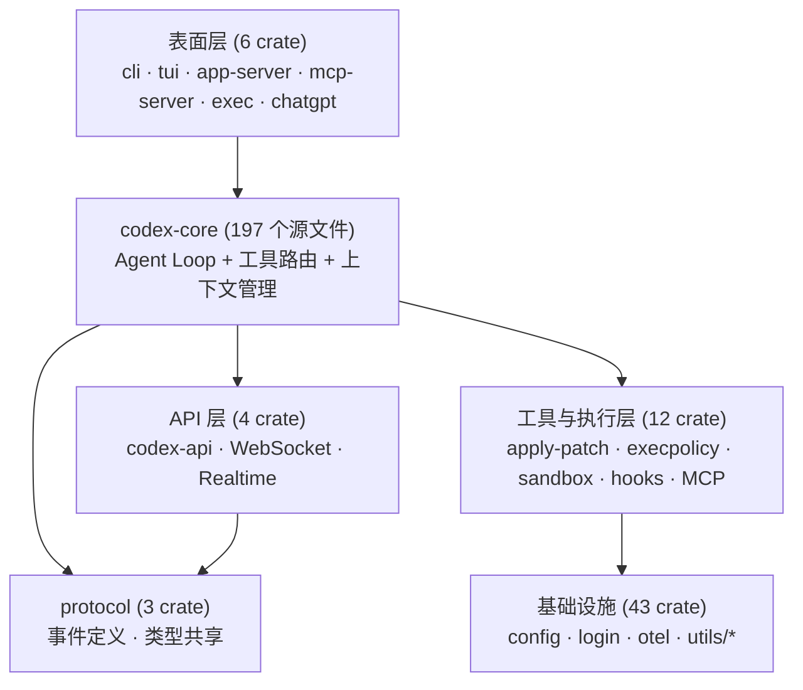
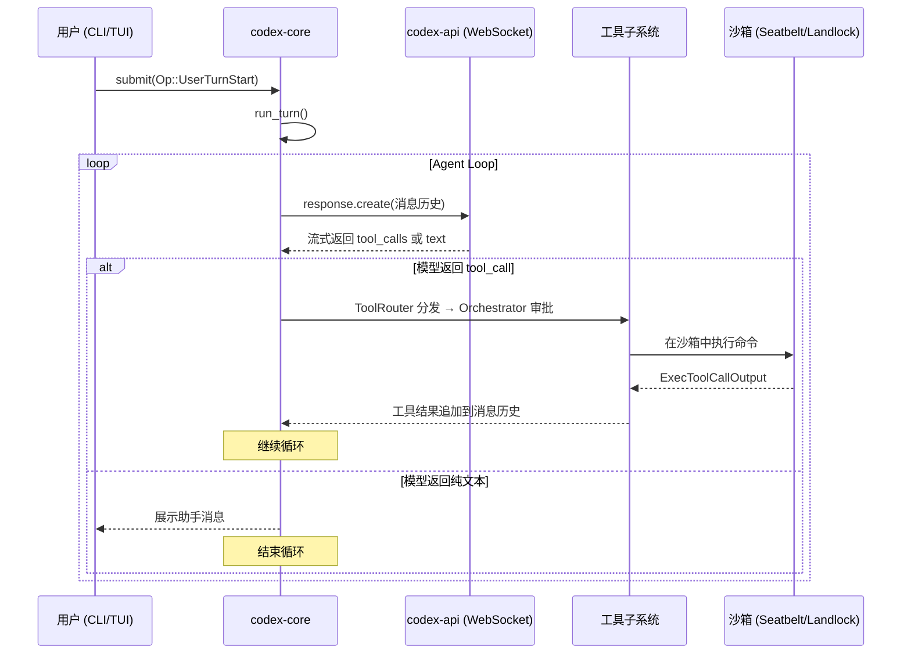
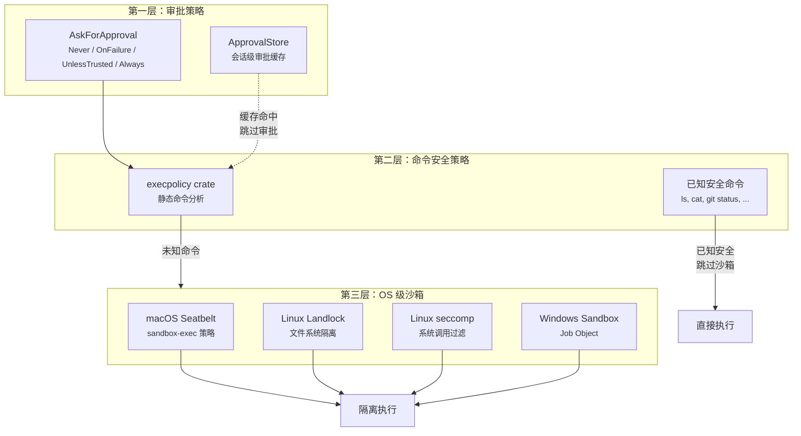

> 本文基于 [openai/codex](https://github.com/openai/codex) 仓库 HEAD（2026-02-21）的源码分析。所有文件路径和代码引用均可在仓库中验证。

## 引言

在[上一篇文章](/posts/codex-commit-history-analysis/)中，我们通过 3913 个 commit 追踪了 Codex 的演进历程。我们知道它从 9 个 Rust crate 成长为 69 个——但这 69 个 crate **具体是什么**？它们如何组织？当用户输入一条指令时，数据流是怎样穿越这些 crate 最终完成任务的？

本文将拆解 Codex 的 Rust 内核架构，追踪一次完整 agent loop 的执行流程。

## 69 个 Crate 的全景

先看整体分类。69 个 crate 可以归为 6 个层次：

| 层次 | Crate 数量 | 核心职责 |
|------|-----------|---------|
| 表面层（Surface） | 6 | CLI、TUI、App Server、MCP Server |
| 核心层（Core） | 1（但 197 个源文件） | Agent 循环、工具路由、上下文管理 |
| 协议层（Protocol） | 3 | 事件定义、类型共享、App Server 协议 |
| API 层 | 4 | Responses API、WebSocket、Realtime |
| 工具与执行层 | 12 | 沙箱、命令执行、文件修改、MCP |
| 基础设施层 | 43 | 配置、认证、日志、工具库 |



## codex-core：197 个源文件的 Agent 引擎

`codex-core` 是整个系统的心脏。它只有一个 crate，但包含 197 个源文件，覆盖了 agent 运行的所有核心逻辑。

### 内部模块结构

```
codex-rs/core/src/
├── codex.rs              # Session + run_turn：主循环入口
├── client.rs             # ModelClient：模型 API 通信
├── client_common.rs      # Prompt 构建、ResponseEvent 解析
│
├── tools/                # 工具子系统（14 个文件）
│   ├── router.rs         # ToolRouter：工具名 → Handler 分发
│   ├── registry.rs       # ToolRegistry：Handler 注册表
│   ├── orchestrator.rs   # ToolOrchestrator：审批 + 沙箱 + 重试
│   ├── parallel.rs       # ToolCallRuntime：并行执行
│   ├── sandboxing.rs     # 审批缓存、ToolRuntime trait
│   ├── spec.rs           # 工具定义生成
│   ├── handlers/         # 14 个工具实现
│   │   ├── shell.rs      # Shell 命令执行
│   │   ├── apply_patch.rs# 文件修改
│   │   ├── read_file.rs  # 文件读取
│   │   ├── list_dir.rs   # 目录列表
│   │   ├── grep_files.rs # 文件搜索
│   │   ├── mcp.rs        # MCP 工具转发
│   │   ├── multi_agents.rs # 子 Agent 派生
│   │   ├── plan.rs       # 计划工具
│   │   ├── view_image.rs # 图片查看
│   │   └── ...
│   └── runtimes/         # 沙箱运行时实现
│       ├── shell.rs      # Shell 沙箱运行时
│       ├── apply_patch.rs# apply_patch 沙箱运行时
│       └── unified_exec.rs # 统一执行运行时
│
├── context_manager/      # 上下文窗口管理
│   ├── history.rs        # ContextManager：消息历史维护
│   ├── normalize.rs      # 消息规范化
│   └── updates.rs        # 增量更新
│
├── compact.rs            # /compact 上下文压缩
├── compact_remote.rs     # 远程 compact 任务
├── config/               # 配置系统（8 个文件）
├── sandboxing.rs         # SandboxManager
├── exec.rs               # 命令执行引擎
├── instructions/         # 用户指令加载（AGENTS.md 等）
├── mcp_connection_manager.rs # MCP 服务器连接池
├── tasks/                # 任务类型（regular, review, undo, shell）
└── ...
```

### Session 与 TurnContext

Codex 的执行模型围绕两个核心概念：

- **Session**：整个会话的生命周期，持有模型客户端、MCP 连接、消息历史、审批缓存等状态
- **TurnContext**：单次对话轮次的上下文，包含当前模型、沙箱策略、工作目录等

源码：[`codex-rs/core/src/codex.rs`](https://github.com/openai/codex/blob/main/codex-rs/core/src/codex.rs)（简化）

```rust
pub struct Session {
    model_client: ModelClient,          // 模型 API 客户端
    mcp_connection_manager: McpConnectionManager, // MCP 连接池
    hooks: Hooks,                       // 生命周期钩子
    // ... 消息历史、审批缓存、分析等
}

pub struct TurnContext {
    model_info: ModelInfo,       // 当前模型信息
    sandbox_policy: SandboxPolicy, // 沙箱策略
    cwd: PathBuf,                // 工作目录
    network: Option<NetworkProxy>, // 网络代理
    // ... 更多每轮配置
}
```

## 追踪一次完整的 Agent Loop

当用户在 CLI 输入 `codex "fix the bug in auth.rs"` 时，数据流是这样的：



### 第一步：CLI 入口 → Core

`codex-rs/cli/src/main.rs` 是 CLI 的入口。它使用 clap 解析命令行参数，然后根据子命令分发：

源码：[`codex-rs/cli/src/main.rs`](https://github.com/openai/codex/blob/main/codex-rs/cli/src/main.rs)（简化）

```rust
#[derive(Debug, Parser)]
struct MultitoolCli {
    #[clap(subcommand)]
    subcommand: Option<Subcommand>,
    #[clap(flatten)]
    interactive: TuiCli,  // 默认：交互模式
}

enum Subcommand {
    Exec(ExecCli),      // 非交互执行
    McpServer,           // MCP 服务器模式
    AppServer,           // 应用服务器模式
    // ...
}
```

没有子命令时，默认启动交互式 TUI。TUI 通过 `codex-core` 的 `Session` 创建会话，通过 SQ/EQ（Submission Queue / Event Queue）模式与 core 通信。

### 第二步：run_turn — Agent 循环的核心

`run_turn()` 是整个 agent loop 的主函数。它的核心结构是一个 `loop`，每次迭代包含：

1. **构建采样请求**：收集完整消息历史（包括之前所有 tool 结果）
2. **调用模型**：通过 WebSocket 发送 `response.create`，流式接收响应
3. **处理响应**：如果包含 `tool_call`，执行工具并将结果追加到历史；如果是纯文本，结束循环
4. **自动 compact**：如果 token 用量超过阈值，自动触发上下文压缩后继续

源码：[`codex-rs/core/src/codex.rs`](https://github.com/openai/codex/blob/main/codex-rs/core/src/codex.rs)（简化）

```rust
pub(crate) async fn run_turn(
    sess: Arc<Session>,
    turn_context: Arc<TurnContext>,
    input: Vec<UserInput>,
    prewarmed_client_session: Option<ModelClientSession>,
    cancellation_token: CancellationToken,
) -> Option<String> {
    // 记录用户输入到历史
    sess.record_user_prompt(...).await;

    let mut client_session = prewarmed_client_session
        .unwrap_or_else(|| sess.services.model_client.new_session());

    loop {
        // 1. 构建采样输入（完整消息历史）
        let sampling_request_input = sess.clone_history().await
            .for_prompt(&turn_context.model_info.input_modalities);

        // 2. 发送采样请求
        match run_sampling_request(
            sess.clone(), turn_context.clone(),
            &mut client_session,
            sampling_request_input,
            cancellation_token.child_token(),
        ).await {
            Ok(result) => {
                // 3. 检查是否需要 auto-compact
                if token_limit_reached && result.needs_follow_up {
                    run_auto_compact(&sess, &turn_context).await;
                    continue;  // compact 后重新采样
                }

                if !result.needs_follow_up {
                    break;  // 模型认为任务完成
                }
                continue;  // 还有 tool_call 需要处理
            }
            Err(_) => break,
        }
    }
}
```

一个精妙的设计：`ModelClientSession` 在整个 turn 中复用，它缓存了 WebSocket 连接和 sticky routing 状态。这意味着同一个 turn 内的多次 API 调用会尽可能路由到同一个后端节点，最大化 prompt caching 效率。

### 第三步：工具路由 — ToolRouter → ToolOrchestrator → Handler

当模型返回 `tool_call` 时，执行流进入工具子系统：

**ToolRouter** 负责将工具名映射到具体的 Handler：

源码：[`codex-rs/core/src/tools/router.rs`](https://github.com/openai/codex/blob/main/codex-rs/core/src/tools/router.rs)（简化）

```rust
pub struct ToolRouter {
    registry: ToolRegistry,
    specs: Vec<ConfiguredToolSpec>,
}

impl ToolRouter {
    pub async fn build_tool_call(
        session: &Session,
        item: ResponseItem,
    ) -> Result<Option<ToolCall>, FunctionCallError> {
        match item {
            ResponseItem::FunctionCall { name, arguments, call_id, .. } => {
                // 检查是否为 MCP 工具（带有 server 前缀）
                if let Some((server, tool)) = session.parse_mcp_tool_name(&name).await {
                    Ok(Some(ToolCall {
                        payload: ToolPayload::Mcp { server, tool, raw_arguments: arguments },
                        ..
                    }))
                } else {
                    Ok(Some(ToolCall {
                        payload: ToolPayload::Function { arguments },
                        ..
                    }))
                }
            }
            // ... CustomToolCall, LocalShellCall 等
        }
    }
}
```

**ToolOrchestrator** 是工具执行的中央调度器，处理：
1. **审批**：检查缓存 → 如果未缓存，请求用户确认
2. **沙箱选择**：根据策略选择合适的沙箱隔离级别
3. **执行**：调用具体的 ToolRuntime
4. **重试**：如果沙箱拒绝，尝试升级沙箱策略后重试

源码：[`codex-rs/core/src/tools/orchestrator.rs`](https://github.com/openai/codex/blob/main/codex-rs/core/src/tools/orchestrator.rs)（简化）

```rust
impl ToolOrchestrator {
    pub async fn run<Rq, Out, T>(
        &mut self, tool: &mut T, req: &Rq,
        tool_ctx: &ToolCtx<'_>,
        approval_policy: AskForApproval,
    ) -> Result<OrchestratorRunResult<Out>, ToolError> {
        // 1. 审批
        let decision = with_cached_approval(...).await;
        if decision == ReviewDecision::Deny { return Err(...); }

        // 2. 沙箱 + 执行 + 重试
        let attempt = self.sandbox.first_attempt(...);
        let (result, network) = Self::run_attempt(tool, req, &attempt).await;

        match result {
            Err(ToolError::SandboxDenied) => {
                // 升级沙箱策略后重试
                let retry = self.sandbox.retry_attempt(...);
                Self::run_attempt(tool, req, &retry).await
            }
            _ => result,
        }
    }
}
```

### 第四步：工具执行 — 以 Shell 为例

Codex 的内置工具列表：

| 工具 | Handler | 功能 |
|------|---------|------|
| `shell` / `shell_command` | ShellHandler | 在沙箱中执行命令 |
| `apply_patch` | ApplyPatchHandler | 修改文件 |
| `read_file` | ReadFileHandler | 读取文件 |
| `list_dir` | ListDirHandler | 列出目录 |
| `grep_files` | GrepFilesHandler | 搜索文件内容 |
| `view_image` | ViewImageHandler | 查看图片 |
| `multi_agent` | MultiAgentHandler | 派生子 Agent |
| `plan` | PlanHandler | 规划工具 |
| `mcp` | McpHandler | 转发 MCP 工具调用 |
| `search_bm25` | SearchToolBm25Handler | BM25 搜索 |
| `js_repl` | JsReplHandler | JavaScript REPL |
| `request_user_input` | RequestUserInputHandler | 请求用户输入 |
| `unified_exec` | UnifiedExecHandler | 统一执行（PTY） |

以 Shell 执行为例，数据流穿越 4 个 crate：

```
ShellHandler (core/tools/handlers/shell.rs)
  → ShellRuntime (core/tools/runtimes/shell.rs)
    → exec() (core/src/exec.rs)
      → SandboxManager (core/src/sandboxing.rs)
        → codex-linux-sandbox / process-hardening / Seatbelt
```

`exec.rs` 中的命令执行有严格的资源限制：

源码：[`codex-rs/core/src/exec.rs`](https://github.com/openai/codex/blob/main/codex-rs/core/src/exec.rs)

```rust
const DEFAULT_EXEC_COMMAND_TIMEOUT_MS: u64 = 10_000;  // 默认 10 秒超时
const EXEC_OUTPUT_MAX_BYTES: usize = 1024 * 1024;     // 输出上限 1 MiB
const MAX_EXEC_OUTPUT_DELTAS_PER_CALL: usize = 10_000; // 流式事件上限
```

## 沙箱架构：三层防御

Codex 的沙箱不是单一机制，而是三层防御体系：



`execpolicy` crate 的工作方式值得一提——它不执行命令，而是静态分析命令内容，判断命令是否「已知安全」。例如 `ls`、`cat`、`git status` 这类纯读取命令可以跳过沙箱直接执行，而 `rm`、`chmod` 等则需要进入沙箱。

## 协议层：SQ/EQ 模式

`codex-protocol` crate 定义了 Codex 内部的通信协议，采用 SQ（Submission Queue）/ EQ（Event Queue）的异步模式：

源码：[`codex-rs/protocol/src/protocol.rs`](https://github.com/openai/codex/blob/main/codex-rs/protocol/src/protocol.rs)（简化）

```rust
/// 用户 → Agent 的请求
pub struct Submission {
    pub id: String,
    pub op: Op,
}

/// 可提交的操作
pub enum Op {
    UserTurnStart { input: Vec<UserInput> },
    UserTurnCancel,
    ApprovalResponse { decision: ReviewDecision },
    Compact,
    // ... 更多操作
}

/// Agent → 用户的事件
pub enum Event {
    TurnStarted(TurnStartedEvent),
    AgentMessageContentDelta(AgentMessageContentDeltaEvent),
    ExecApprovalRequest(ExecApprovalRequestEvent),
    ItemCompleted(ItemCompletedEvent),
    // ... 更多事件
}
```

这种设计的精妙之处在于：**无论前端是 CLI、TUI、VS Code 还是 Web，都使用同一套 Op/Event 协议**。前端只需实现 `submit(Op)` 和 `handle(Event)` 两个方法。

`codex-app-server-protocol` 进一步将这个协议序列化为 JSON-RPC 格式，供 VS Code 扩展等外部客户端使用。

## API 层：WebSocket 优先

`codex-api` 封装了与 OpenAI Responses API 的通信。一个关键设计：**优先使用 WebSocket 而非 HTTP SSE**。

```
codex-api/src/endpoint/
├── responses.rs              # HTTP SSE 客户端（备用）
├── responses_websocket.rs    # WebSocket 客户端（首选）
├── realtime_websocket/       # Realtime/Voice WebSocket
├── compact.rs                # Compact API
├── memories.rs               # Memories API
└── models.rs                 # Models API
```

WebSocket 的优势在于：
1. **双向通信**：可以在同一连接上发送 `response.create` 和 `response.append`
2. **Sticky routing**：通过持久连接保持路由到同一后端节点
3. **更好的 prompt caching**：同一连接 = 同一节点 = 更高的缓存命中率
4. **启动预热**：`ModelClientSession` 支持在 turn 开始前预建连接

源码：[`codex-rs/core/src/tasks/regular.rs`](https://github.com/openai/codex/blob/main/codex-rs/core/src/tasks/regular.rs)（简化）

```rust
impl RegularTask {
    pub(crate) fn with_startup_prewarm(
        model_client: ModelClient,
        model_info: ModelInfo,
    ) -> Self {
        // 在后台预建 WebSocket 连接
        let prewarmed = tokio::spawn(async move {
            let mut session = model_client.new_session();
            session.prewarm_websocket(&model_info).await.ok()?;
            Some(session)
        });
        // ...
    }
}
```

## 上下文管理：ContextManager

`ContextManager` 维护完整的消息历史，并负责：

1. **历史追踪**：记录所有 user/assistant/tool 消息
2. **模态过滤**：根据模型支持的输入模态（text/image/audio）过滤消息
3. **Token 估算**：估算当前上下文的 token 数量
4. **Compact 协调**：当 token 超过阈值时触发上下文压缩

Compact 的实现分为本地和远程两种：

源码：[`codex-rs/core/src/compact.rs`](https://github.com/openai/codex/blob/main/codex-rs/core/src/compact.rs)（简化）

```rust
pub(crate) async fn run_inline_auto_compact_task(
    sess: &Session,
    turn_context: &TurnContext,
    injection: InitialContextInjection,
) -> CodexResult<()> {
    // 1. 收集当前消息历史
    let history = sess.clone_history().await;

    // 2. 构建 compact prompt
    let prompt = format!("{SUMMARIZATION_PROMPT}\n{history_text}");

    // 3. 调用模型生成摘要
    let summary = model_client.create_response(prompt).await?;

    // 4. 用摘要替换完整历史
    sess.replace_history_with_summary(summary).await;
    Ok(())
}
```

远程 compact（`compact_remote.rs`）将摘要任务下发到服务端执行，适用于 OpenAI 自有 provider。

## Hooks 系统

`codex-hooks` crate 实现了一个轻量级的生命周期钩子系统，让用户可以在关键节点插入自定义逻辑：

源码：[`codex-rs/hooks/src/types.rs`](https://github.com/openai/codex/blob/main/codex-rs/hooks/src/types.rs)（简化）

```rust
pub enum HookEvent {
    AfterToolUse,   // 工具执行后
    AfterAgent,     // Agent 轮次结束后
}

pub struct HookPayload {
    pub session_id: Uuid,
    pub cwd: PathBuf,
    pub tool_input: Option<HookToolInput>,
}

pub enum HookResult {
    Approved,
    Denied { reason: String },
}
```

Hooks 在 `ToolOrchestrator` 的执行流中被调用——工具执行完成后，hook 可以审查输出并决定是否允许结果返回给模型。

## 值得关注的工程细节

### 1. 并行工具执行

`ToolCallRuntime`（`tools/parallel.rs`）支持并行执行多个工具调用。关键设计是用 `RwLock` 控制并发——支持并行的工具（如 `read_file`）获取读锁，不支持并行的工具获取写锁：

源码：[`codex-rs/core/src/tools/parallel.rs`](https://github.com/openai/codex/blob/main/codex-rs/core/src/tools/parallel.rs)（简化）

```rust
let _guard = if supports_parallel {
    Either::Left(lock.read().await)   // 可并行：读锁
} else {
    Either::Right(lock.write().await) // 不可并行：写锁（独占）
};
```

### 2. apply_patch 的 Lark 文法

`apply_patch` 工具使用 Lark 文法（`tool_apply_patch.lark`）定义补丁格式，而不是正则表达式。这使得解析更加健壮，并且文法本身可以作为 LLM 的格式约束传给模型。

### 3. 取消传播

整个系统使用 `tokio_util::CancellationToken` 实现取消传播。当用户按 Escape 时，取消信号从 TUI 层传播到 core 层，再到具体的工具执行，确保正在运行的命令被及时终止：

源码：[`codex-rs/core/src/tools/parallel.rs`](https://github.com/openai/codex/blob/main/codex-rs/core/src/tools/parallel.rs)

```rust
tokio::select! {
    _ = cancellation_token.cancelled() => {
        Ok(Self::aborted_response(&call, elapsed))
    },
    res = async { /* 实际执行 */ } => res,
}
```

### 4. 多 Agent（子 Agent 派生）

`multi_agents` handler 允许 Codex 派生子 Agent 并行处理子任务。每个子 Agent 有自己的 TurnContext，但共享同一个 Session 的 MCP 连接和认证状态。

## 与第一篇文章的呼应

回看第一篇文章中的架构演进：

| 阶段 | 从代码中看到了什么 |
|------|------------------|
| 阶段一 TypeScript | agent-loop.ts → codex.rs 的 `run_turn()`，结构高度相似 |
| 阶段二 Rust 重写 | 初始 9 个 crate 的边界至今清晰可见（core, exec, apply-patch, cli, tui） |
| 阶段三 协议化 | `codex-protocol` 确实成为了所有 crate 的共享类型基础 |
| 阶段四 App Server | `app-server` 和 `mcp-server` 的分离干净利落 |
| 阶段五 Realtime | `codex-api` 中的 `realtime_websocket` 模块已经就位 |

最终的架构验证了我们在第一篇中的判断：**好的抽象是复利**。`codex-protocol` 的 Op/Event 模式让新增表面的成本降到了最低；`ToolOrchestrator` 的审批-沙箱-重试管道让新增工具变得安全且一致；`codex-api` 的 WebSocket 优先设计让性能优化可以在一个点生效而非到处修改。

## 总结

69 个 crate 看起来很多，但架构是清晰的：

- **1 个重量级核心**（core，197 个文件）承载了 agent loop 的全部逻辑
- **3 个协议 crate** 确保所有表面说同一种语言
- **6 个表面 crate** 各自独立演进
- **12 个工具/执行 crate** 通过 ToolRuntime trait 统一接入
- **43 个工具库 crate** 提供基础设施

一次完整的 agent loop 穿越的路径是：

```
用户输入 → CLI/TUI → Session.submit(Op)
→ run_turn() → ModelClient.stream()
→ codex-api WebSocket → OpenAI Responses API
→ tool_call 返回 → ToolRouter → ToolOrchestrator
→ 审批 → 沙箱 → Handler.handle()
→ 结果追加到 ContextManager → 继续循环
→ 模型返回文本 → 结束 → Event 推送给前端
```

这就是 69 个 crate 协作完成一次 agent loop 的完整故事。
