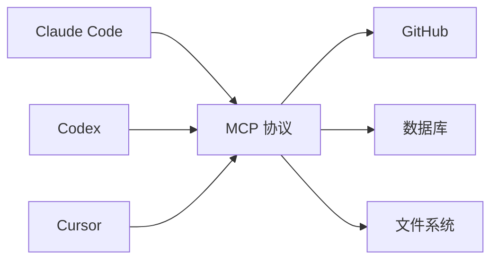
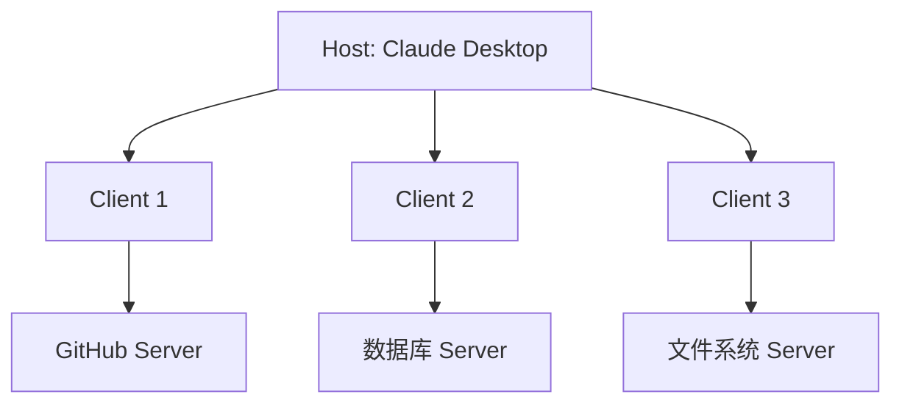
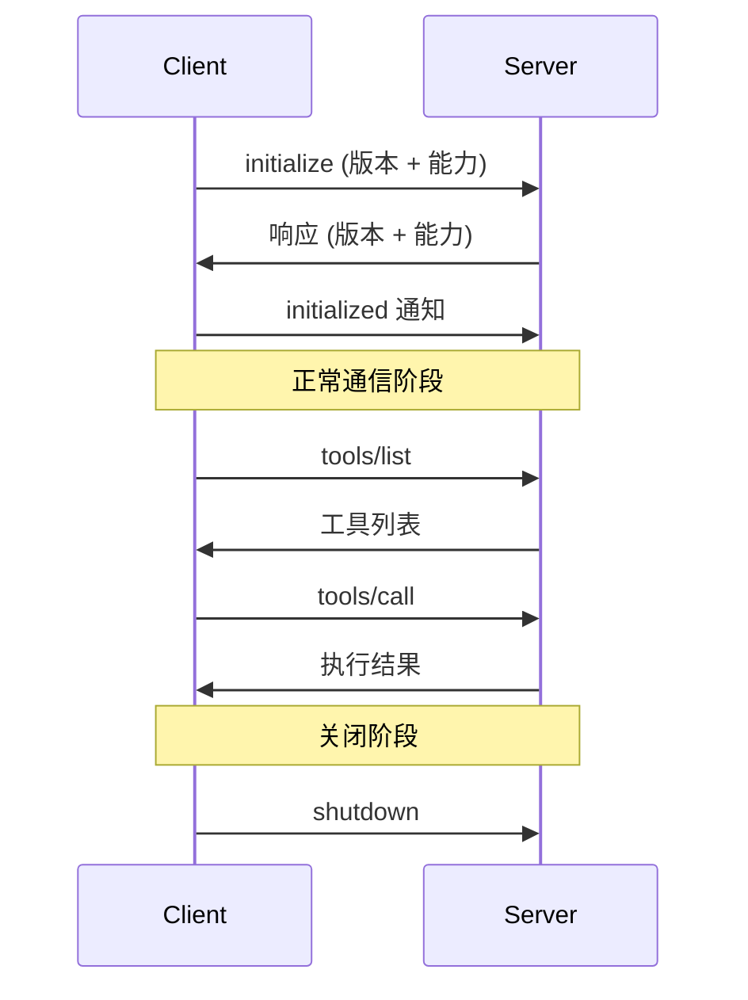

> Model Context Protocol（MCP）是连接 AI 模型和外部工具的开放协议。本文从协议设计、真实实现到动手搭建，完整拆解 MCP 的工作原理。

## MCP 解决什么问题

假设你有 3 个 AI 工具（Claude Code、Codex、Cursor）和 5 个外部服务（GitHub、Slack、数据库、文件系统、Jira）。没有统一协议的话，你需要 3 × 5 = 15 个定制集成。

这就是经典的 **M × N 问题**。

MCP 的解法和 USB 一样：定义一个统一接口。每个 AI 工具实现一个 MCP Client，每个外部服务实现一个 MCP Server，连接数从 M × N 降到 M + N。



这个思路并不新鲜。熟悉 VS Code 的开发者会想到 LSP（Language Server Protocol）——一个让编辑器和语言服务器通信的协议。MCP 的创造者之一 David Soria Parra 正是从 LSP 获得灵感：

> 他在 Anthropic 工作时，反复在 Claude Desktop 和编辑器之间复制粘贴代码。作为 LSP 的参与者，他想到：能不能为 AI 模型做一个类似的协议？六周后，第一版 MCP 集成到了 Claude Desktop 中。

## 一分钟历史

| 时间 | 事件 |
|------|------|
| 2024-11-25 | Anthropic 开源 MCP，发布 Python 和 TypeScript SDK |
| 2025-03 | OpenAI 官方采纳，集成到 Agents SDK 和 ChatGPT 桌面端 |
| 2025-03-26 | 规范大更新：Streamable HTTP 取代 SSE，OAuth 2.1，工具注解 |
| 2025-04 | Google DeepMind 确认 Gemini 支持 MCP |
| 2025-05 | Microsoft Build：Windows 11 + Azure AI + GitHub Copilot 全面接入 |
| 2025-06-18 | 规范再更新：结构化工具输出、Elicitation、资源链接 |
| 2025-09 | 官方 MCP Registry 上线 |
| 2025-11-25 | 一周年规范：Tasks 原语、Extensions 框架、服务器身份验证 |
| 2025-12-09 | Anthropic 将 MCP 捐赠给 [AAIF（Linux Foundation）](https://www.linuxfoundation.org/press/linux-foundation-announces-the-formation-of-the-agentic-ai-foundation) |

从发布到成为行业标准，只用了一年。目前 GitHub 上 [modelcontextprotocol/servers](https://github.com/modelcontextprotocol/servers) 仓库有 79,000+ stars，SDK 月下载量超过 9700 万次，活跃 MCP Server 超过 10,000 个。

## MCP 和 Tool Loop 的关系

在[《AI Agent 的核心引擎：工具循环（Tool Loop）导论》](/posts/ai-agent-tool-loop-introduction/)中，我们拆解了 coding agent 的核心执行模式：

```
模型推理 → 决定调用工具 → 执行工具 → 结果返回模型 → 继续推理 → …
```

MCP 处于这个循环的**工具执行层**——它不改变 Tool Loop 的控制流，而是标准化了"执行工具"那一步的连接方式：

```
模型推理 → 决定调用工具 → [MCP Client → JSON-RPC → MCP Server → 执行] → 结果返回模型
```

换个方式理解：

- **Tool Loop** 回答"agent 怎么思考和行动"——是循环的控制流
- **MCP** 回答"agent 怎么找到和调用工具"——是工具层的通信标准

没有 MCP，Tool Loop 照样跑（工具可以是内置函数）。没有 Tool Loop，MCP 只是一个通信协议。MCP 的价值在于：**当你需要连接外部工具时，不用为每个 agent 和每个工具写定制集成**。

## 核心架构：三个角色

MCP 的架构由三个角色组成：

| 角色 | 职责 | 例子 |
|------|------|------|
| **Host** | 宿主应用，管理多个 Client，控制权限和安全策略 | Claude Desktop、Cursor、VS Code |
| **Client** | 连接器，Host 内部创建，每个 Client 与一个 Server 保持 1:1 会话 | Host 内部组件（用户不直接接触） |
| **Server** | 提供能力（工具、资源、提示模板） | GitHub MCP Server、数据库 Server |

关键设计约束：**Server 之间相互隔离**。Server A 看不到 Server B 的数据，也看不到完整的对话历史。完整上下文只存在于 Host 中。



## 三个原语：Resources、Tools、Prompts

MCP 的能力通过三种原语暴露：

### Resources（资源）— 给模型提供上下文

资源是**只读数据**，由 URI 标识（`file://`、`https://`、`git://` 或自定义协议）。

```json
{
  "uri": "file:///project/src/main.rs",
  "name": "main.rs",
  "mimeType": "text/x-rust"
}
```

客户端通过 `resources/list` 发现资源，通过 `resources/read` 读取内容。支持订阅变更通知。

**典型场景**：数据库 schema、项目文档、API 定义文件。

### Tools（工具）— 让模型执行操作

工具是 MCP 最核心的原语。模型决定何时调用哪个工具，每个工具有 JSON Schema 定义的输入参数。

```json
{
  "name": "create_issue",
  "description": "Create a GitHub issue",
  "inputSchema": {
    "type": "object",
    "properties": {
      "title": { "type": "string" },
      "body": { "type": "string" }
    },
    "required": ["title"]
  }
}
```

工具调用流程：

1. 客户端通过 `tools/list` 获取可用工具列表
2. 模型根据上下文决定调用某个工具
3. 客户端发送 `tools/call` 请求到对应 Server
4. Server 执行操作，返回结果
5. 结果回传给模型，继续推理

**关键安全约束**：工具代表任意代码执行，Host **必须** 在调用前获得用户确认。工具注解（`readOnlyHint`、`destructiveHint`）帮助 Host 判断风险等级，但注解本身是不可信的——除非 Server 来源可信。

### Prompts（提示模板）— 用户触发的预设交互

Prompts 是用户主动选择的模板（类似斜杠命令），支持参数化：

```json
{
  "name": "review-code",
  "description": "Review code changes",
  "arguments": [
    { "name": "pr_number", "description": "PR number to review", "required": true }
  ]
}
```

**与 Tools 的区别**：Tools 由模型自主决定调用，Prompts 由用户显式触发。

## 协议细节：JSON-RPC 2.0

MCP 基于 [JSON-RPC 2.0](https://www.jsonrpc.org/specification)，所有消息都是 UTF-8 编码的 JSON。

### 连接生命周期



### 能力协商

初始化时，双方交换支持的能力：

```json
// Client → Server
{
  "jsonrpc": "2.0",
  "id": 1,
  "method": "initialize",
  "params": {
    "protocolVersion": "2025-03-26",
    "capabilities": {
      "roots": { "listChanged": true },
      "sampling": {}
    },
    "clientInfo": { "name": "my-client", "version": "1.0" }
  }
}

// Server → Client
{
  "jsonrpc": "2.0",
  "id": 1,
  "result": {
    "protocolVersion": "2025-03-26",
    "capabilities": {
      "tools": { "listChanged": true },
      "resources": { "subscribe": true }
    },
    "serverInfo": { "name": "github-server", "version": "2.0" }
  }
}
```

Client 声明"我支持 roots 和 sampling"，Server 声明"我提供 tools 和 resources"。双方只使用对方声明支持的能力。

### 两种传输协议

**stdio**（本地进程）：

```bash
# Client 启动 Server 作为子进程
codex-mcp-server | client
```

Server 从 stdin 读 JSON-RPC，往 stdout 写响应，stderr 用于日志。适合本地工具，最简单高效。

**Streamable HTTP**（远程服务）：

2025-03-26 引入，取代了之前的 HTTP+SSE 方案。

旧方案的问题是需要**两个连接**：一个 POST 端点用于发送请求，一个独立的 GET 端点用于接收 SSE 流。这给部署带来了麻烦——防火墙、负载均衡器、反向代理都需要分别处理两个长连接。

Streamable HTTP 合并为**单一端点**：

```
Client ──POST /mcp──> Server
         │
         ├─ 简单响应 → Content-Type: application/json（一次性返回）
         └─ 流式响应 → Content-Type: text/event-stream（SSE 流）

Client ──GET /mcp───> Server（可选，用于接收服务端主动推送）
```

完整的请求-响应流程：

1. Client 发 POST 请求（JSON-RPC 消息体）
2. Server 根据需要选择响应方式：
   - 短操作（如 `tools/list`）：直接返回 `application/json`
   - 长操作（如流式工具执行）：返回 `text/event-stream`，通过 SSE 逐步推送结果
3. 每条 SSE 事件携带唯一 Event ID，Client 断线后通过 `Last-Event-ID` 头恢复

会话管理：

- Server 在初始化响应中返回 `Mcp-Session-Id` 头
- Client 在后续所有请求中携带该 header
- Server 可以拒绝无效或过期的 session ID（返回 HTTP 404）
- Client 收到 404 后重新走初始化流程

```
# 初始化
POST /mcp
→ {"jsonrpc":"2.0","id":1,"method":"initialize",...}
← Mcp-Session-Id: abc123
← {"jsonrpc":"2.0","id":1,"result":{...}}

# 后续请求携带 session ID
POST /mcp
Mcp-Session-Id: abc123
→ {"jsonrpc":"2.0","id":2,"method":"tools/call",...}
← Content-Type: text/event-stream
← event: message
← data: {"jsonrpc":"2.0","id":2,"result":{...}}
```

这个设计的好处：一个 URL、一个端口、标准 HTTP 语义，任何 HTTP 基础设施（CDN、API Gateway、负载均衡）都能直接工作。

## 真实案例：Codex 如何使用 MCP

在[前面的文章](/posts/codex-rust-crate-architecture/)中，我们分析了 Codex 的 69 个 Rust crate。其中有两个 crate 专门负责 MCP：

- **`rmcp-client`**：MCP 客户端，连接外部 MCP Server
- **`mcp-server`**：将 Codex 自身暴露为 MCP Server

### 作为 Client：连接外部工具

Codex 在 `~/.codex/config.toml` 中配置 MCP Server：

```toml
[mcp_servers.context7]
command = "npx"
args = ["-y", "@upstash/context7-mcp"]
```

启动会话时，Codex 自动启动所有配置的 Server，完成能力协商，将它们的工具和内置工具一起暴露给模型。

从[源码](https://github.com/openai/codex/blob/main/codex-rs/rmcp-client/src/rmcp_client.rs)可以看到，`rmcp-client` 支持两种传输：

- `TokioChildProcess`：stdio 本地进程
- `StreamableHttpClientTransport`：Streamable HTTP 远程服务（支持 OAuth）

### 作为 Server：让其他 Agent 调用 Codex

这是更有趣的部分。运行 `codex mcp-server`，Codex 自身变成一个 MCP Server，暴露两个工具：

- **`codex`**：创建对话、发送消息、获取结果
- **`codex-reply`**：回复审批请求

[接口文档](https://github.com/openai/codex/blob/main/codex-rs/docs/codex_mcp_interface.md)描述了完整的 JSON-RPC API：

```json
// 创建对话
{ "method": "newConversation", "params": { "model": "gpt-5.1", "approvalPolicy": "on-request" } }

// 发送消息
{ "method": "sendUserMessage", "params": { "conversationId": "c7b0…", "items": [{ "type": "text", "text": "帮我修复这个 bug" }] } }
```

Server 在处理过程中通过 `codex/event` 通知推送 agent 事件，遇到需要审批的操作时向 Client 发送 `applyPatchApproval` 或 `execCommandApproval` 请求。

这意味着你可以**用一个 Agent 编排另一个 Agent**——比如让 Claude Code 通过 MCP 调用 Codex。

## 动手：10 分钟搭建一个 MCP Server

### Python 版（FastMCP）

```python
from mcp.server.fastmcp import FastMCP

mcp = FastMCP("weather-server")

@mcp.tool()
async def get_weather(city: str) -> str:
    """获取城市天气信息"""
    # 实际项目中这里调用天气 API
    return f"{city}: 25°C, 晴"

@mcp.resource("config://app")
async def get_config() -> str:
    """应用配置信息"""
    return '{"theme": "dark", "language": "zh-CN"}'

if __name__ == "__main__":
    mcp.run(transport="stdio")
```

安装依赖：`pip install mcp`

### TypeScript 版

```typescript
import { McpServer } from "@modelcontextprotocol/sdk/server/mcp.js";
import { StdioServerTransport } from "@modelcontextprotocol/sdk/server/stdio.js";
import { z } from "zod";

const server = new McpServer({
  name: "weather-server",
  version: "1.0.0",
});

server.registerTool(
  "get_weather",
  {
    description: "获取城市天气信息",
    inputSchema: { city: z.string().describe("城市名称") },
  },
  async ({ city }) => ({
    content: [{ type: "text", text: `${city}: 25°C, 晴` }],
  })
);

const transport = new StdioServerTransport();
await server.connect(transport);
```

安装依赖：`npm install @modelcontextprotocol/sdk zod`

### 注册到 Claude Code

```bash
claude mcp add weather-server -- python weather_server.py
```

或直接编辑 `.claude/settings.json`：

```json
{
  "mcpServers": {
    "weather-server": {
      "command": "python",
      "args": ["weather_server.py"]
    }
  }
}
```

启动 Claude Code 后，`get_weather` 工具自动出现在可用工具列表中。

## 规范演进：一年四个版本

MCP 规范在一年内迭代了四个版本，每次都有实质性变化：

| 版本 | 关键变化 |
|------|---------|
| **2024-11-05** | 初始版本：stdio + HTTP+SSE，基本三原语 |
| **2025-03-26** | Streamable HTTP 取代 SSE；OAuth 2.1；工具注解（readOnly / destructive）；JSON-RPC 批处理 |
| **2025-06-18** | 移除 JSON-RPC 批处理（仅 3 个月就反悔）；结构化工具输出；Elicitation（Server 向用户提问）；资源链接 |
| **2025-11-25** | Tasks 原语（异步任务）；Extensions 框架；`.well-known` 服务器身份；Client ID Metadata |

有几个值得注意的设计决策：

**Streamable HTTP 取代 SSE**：旧方案需要两个连接（一个 POST 发送，一个 GET 接收 SSE），新方案合并为单一端点，简化了部署和防火墙配置。

**JSON-RPC 批处理的引入与撤回**：2025-03-26 加入，2025-06-18 就移除了。这说明协议团队务实：如果一个功能增加了复杂度但收益有限，宁可回滚。

**Elicitation**：允许 Server 主动向用户提问（通过 Client 中转）。典型场景：OAuth 登录时，Server 需要用户授权。这拓展了 MCP 从"被动响应"到"主动交互"的能力。

**Tasks 原语**（2025-11-25）：支持异步的"现在调用，稍后获取"模式，状态包括 `working`、`input_required`、`completed`、`failed`、`cancelled`。适合长时间运行的操作（如 CI/CD 部署）。

## 安全模型

MCP 的安全设计围绕一个核心原则：**用户必须对所有操作有最终控制权**。

### OAuth 2.1 认证

2025-03-26 引入，后续版本持续加强：

- **PKCE** 强制要求（防止授权码拦截）
- **Resource Indicators**（[RFC 8707](https://datatracker.ietf.org/doc/html/rfc8707)）防止恶意 Server 获取超范围 token
- MCP Server 被明确分类为 **OAuth Resource Server**，禁止将 token 透传给上游 API

### 工具审批

Host 必须在调用工具前获得用户确认。工具注解帮助判断风险：

```json
{
  "name": "delete_file",
  "annotations": {
    "destructiveHint": true,
    "readOnlyHint": false
  }
}
```

但注解是**自声明的**——恶意 Server 可以把破坏性工具标记为只读。因此 Host 不能完全信任注解，对未知来源的 Server 应该默认要求用户确认每次调用。

### 已知攻击面

2025 年安全研究者发现了几类攻击：

- **Prompt injection**：恶意工具描述中嵌入指令，劫持模型行为
- **工具组合攻击**：单独看每个工具无害，但组合使用可以实现数据外泄
- **伪装工具**：创建与可信工具同名的恶意工具，静默替换

防御依赖 Host 端的严格权限控制和用户审批流程。协议本身提供了框架，但安全边界的执行在 Host。

## 生态一览

### 官方 SDK（10 种语言）

| 语言 | 仓库 |
|------|------|
| TypeScript | [modelcontextprotocol/typescript-sdk](https://github.com/modelcontextprotocol/typescript-sdk) |
| Python | [modelcontextprotocol/python-sdk](https://github.com/modelcontextprotocol/python-sdk) |
| Java / Kotlin | [modelcontextprotocol/java-sdk](https://github.com/modelcontextprotocol/java-sdk) |
| Go | [modelcontextprotocol/go-sdk](https://github.com/modelcontextprotocol/go-sdk) |
| Rust | [modelcontextprotocol/rust-sdk](https://github.com/modelcontextprotocol/rust-sdk) |
| C# / Swift / Ruby / PHP | 各自独立仓库 |

### Server 生态

| 注册中心 | 规模 |
|---------|------|
| [官方 MCP Registry](https://registry.modelcontextprotocol.io/) | 2025-09 上线，API v0.1 |
| [PulseMCP](https://www.pulsemcp.com/servers) | 8,600+ servers |
| [mcp.so](https://mcp.so) | 16,000+ servers |

热门官方 Server：

| Server | 功能 |
|--------|------|
| Filesystem | 安全的文件读写操作 |
| GitHub | 仓库管理、Issue、PR |
| Git | Git 仓库读写操作 |
| Fetch | 网页内容抓取 |
| Memory | 基于知识图谱的持久化记忆 |
| PostgreSQL / SQLite | 数据库查询 |
| Slack | 消息、频道管理 |
| Puppeteer | 浏览器自动化 |

### 主流客户端支持

Claude Desktop、Claude Code、ChatGPT、Codex CLI、Cursor、VS Code（Copilot）、Windsurf、Zed、Replit 等均已支持 MCP。

## MCP vs Function Calling

一个常见的困惑：MCP 和各家 API 的 Function Calling 是什么关系？

| 维度 | Function Calling | MCP |
|------|-----------------|-----|
| 范围 | 单一 API 提供商的功能 | 跨提供商的开放协议 |
| 工具发现 | 静态定义（API 调用时指定） | 动态发现（运行时 `tools/list`） |
| 工具执行 | 应用侧实现 | 分布式，每个 Server 独立运行 |
| 供应商锁定 | 高（每家 schema 不同） | 无（通用标准） |
| 扩展性 | 绑定应用 | 每个 Server 独立扩展 |

简单说：**Function Calling 是"点菜"（模型决定调用什么），MCP 是"菜单系统"（标准化工具的发现、描述、调用和安全）**。两者互补而非替代——MCP 在底层用 Function Calling 触发工具调用，但在上层提供了完整的连接协议。

## 总结

MCP 的设计哲学可以用三个关键词概括：

1. **简单**：JSON-RPC 2.0 + 三个原语，核心概念 30 分钟能理解
2. **安全**：用户控制一切，工具调用必须经过审批
3. **开放**：10 种语言 SDK，10,000+ Server，所有主流 AI 工具支持

从 2024 年 11 月发布到 2025 年 12 月捐赠给 Linux Foundation，MCP 用一年时间从 Anthropic 的内部项目变成了行业标准。这个速度的背后是一个真实的痛点：AI 模型越强大，它与外部世界连接的需求就越迫切。MCP 提供的不是一个完美的解决方案，而是一个**足够好且所有人都同意**的解决方案——这正是好协议的特征。

下次你在 Claude Code 或 Codex 中调用一个 MCP 工具时，不妨想想背后发生了什么：一条 JSON-RPC 消息从 Host 出发，经过 Client 路由到 Server，在沙箱中执行，结果原路返回。整个过程，用户始终拥有最终控制权。
