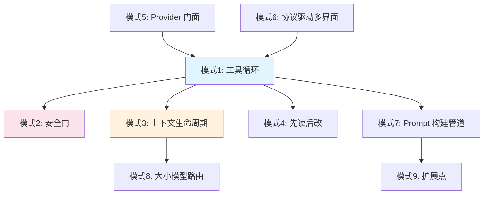
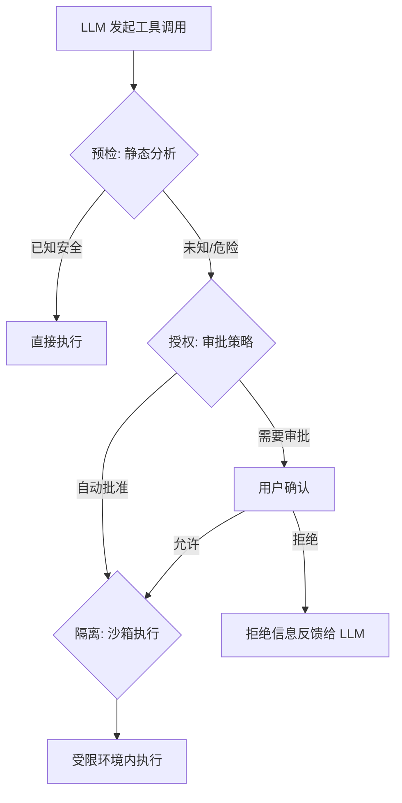

> 读完 Codex（Rust，69 crates）、Crush（Go，263 文件）、OpenClaw（TypeScript）的完整源码，并调研了 Claude Code、Aider、Cline、Cursor 的机制后，我发现虽然语言和定位不同，但在几乎每个设计决策点上，都有可辨识的共性模式。这不是理论框架——每个模式都有真实的源码佐证。

## 引言

过去几周，我写了 9 篇文章深入分析了多个开源 coding agent 的源码。一个反复出现的感受是：**这些项目在独立演化的过程中，不约而同地收敛到了相似的解决方案**。

Codex 用 Rust 从零写了 OS 级沙箱，Crush 用 Go 内嵌了 POSIX Shell 解释器，OpenClaw 用 TypeScript 搭了一个 30+ 渠道的 Gateway——语言不同、产品定位不同、团队背景不同，但它们都需要解决同样的 9 个核心问题。

本文将这些问题和解决方案提炼为 9 个设计模式。如果你想构建自己的 coding agent，这是一份从源码中提取的参考框架。



## 模式 1：工具循环（Tool Loop）

### 问题

LLM 本身不能执行任何操作——它只是一个文本输入、文本输出的函数。怎么让它完成"读代码 → 定位问题 → 修改 → 跑测试 → 修复失败"这样的多步骤编码任务？

### 解决方案

让 LLM 在一个循环中不断提出工具调用请求，系统执行后把结果反馈给 LLM，直到 LLM 认为任务完成。

```python
while has_tool_calls(response):
    results = execute_tools(response.tool_calls)
    response = llm(messages + results)
return response.text
```

三行代码赋予 LLM 三个能力：**感知**（读文件、搜索代码）、**行动**（写文件、执行命令）、**反思**（分析工具结果、调整策略）。

### 实现变体

**Codex** 的循环由 `codex-core` 的 `run_turn()` 函数驱动。核心流程：

```
User input → Session.submit(Op::UserTurnStart)
→ run_turn() → build sampling_request_input
→ ModelClient → WebSocket → response.create
→ stream ResponseEvents
→ if tool_call: ToolRouter → ToolOrchestrator → execute → append → continue
→ if text: break → emit Event
→ if token_limit: auto-compact → continue
```

通过 SQ/EQ（Submission Queue / Event Queue）模式，所有前端（CLI、TUI、VS Code、Web）共享同一个循环实现。

**Crush** 的循环由 `SessionAgent.Run()` 驱动，通过 Fantasy 库的 `agent.Stream()` 进入工具循环。关键特点是**可变状态快照**——`csync.Value` 在循环开始前原子拷贝 tools、model、systemPrompt，运行中切换模型不影响当前请求。通过回调链（`PrepareStep`、`OnTextDelta`、`OnToolCall`、`OnToolResult`、`OnStepFinish`）驱动 TUI 更新。

**OpenClaw** 的循环由 `pi-embedded-runner` 编排，调用 `@mariozechner/pi-ai` 库的 `createAgentSession()`，通过 `subscribeEmbeddedPiSession()` 订阅每一步的结果。上层有队列保证同一 session 的请求串行执行。

### 停止条件

工具循环不能无限跑下去。各项目的停止条件：

| 条件 | Codex | Crush | OpenClaw |
|------|-------|-------|----------|
| 正常结束 | LLM 返回 `end_turn` | LLM 无 tool_call | LLM 无 tool_call |
| 上下文溢出 | auto-compact 后继续 | 自动摘要后继续 | 最多重试 3 次 |
| 循环检测 | 隐式（token limit） | SHA-256 签名（窗口=10, 重复≥5） | 无 |
| 用户取消 | CancellationToken 传播 | Context cancel | AbortController |

Crush 的循环检测最精巧——用工具名 + 输入 + 输出的 SHA-256 哈希判断 agent 是否在原地打转。80 行代码解决了一个高频问题。

### 取舍

工具循环的核心取舍是**自主性 vs 可控性**。循环越深、工具越多，agent 越能自主完成复杂任务；但也越可能跑偏、耗费大量 token、甚至执行危险操作。所有后续模式都是为了在保持自主性的同时增加可控性。

## 模式 2：三层安全门（Safety Gate）

### 问题

工具循环的杀手级能力是执行 shell 命令，但这也是最危险的能力——一条 `rm -rf /` 就能毁掉一切。怎么让 agent 能干活，又不让它干坏事？

### 解决方案

三层防御：**预检**（在执行前静态分析命令安全性）→ **授权**（人工审批或策略判断）→ **隔离**（沙箱限制执行环境）。



### 实现变体

**Codex：OS 级沙箱**

三层完整实现：

1. **execpolicy crate**（预检）：静态分析命令，识别 `git status`、`ls` 等安全命令，跳过沙箱
2. **ApprovalPolicy**（授权）：四级策略——`Never`（从不问）、`OnFailure`（失败才问）、`UnlessTrusted`（除非已信任）、`Always`（总是问）。`ApprovalStore` 缓存已批准的命令
3. **OS Sandbox**（隔离）：macOS Seatbelt profile、Linux Landlock+seccomp、Windows Job Object——内核级限制进程可访问的文件路径和系统调用

代价：只支持 macOS + Linux。每个 OS 的沙箱都要单独实现。

**Crush：内嵌解释器 + 命令黑名单**

```go
// 不是 exec.Command，而是在 Go 进程内解析执行
line, _ := syntax.NewParser().Parse(strings.NewReader(command), "")
runner, _ := s.newInterp(stdout, stderr)
runner.Run(ctx, line)
```

1. **AST 拦截**（预检）：命令先被解析为 AST，`blockHandler` 在解释器的 `ExecHandler` 链中拦截。60+ 个命令被禁止（curl、wget、ssh、sudo 等），还有子命令级过滤——`npm install` 允许，`npm install --global` 禁止
2. **Permission**（授权）：`safe.go` 定义安全命令白名单（git status、ls 等）跳过确认，其他通过 PubSub 请求用户审批
3. **无 OS 沙箱**（隔离）：为了支持 8 个 OS（含 Android、BSD），放弃了 OS 级沙箱

代价：内嵌解释器和真实 bash 存在行为差异，一些依赖 bashism 的命令可能不工作。

**OpenClaw：策略配置 + Hook + Docker（可选）**

1. **工具策略管道**（预检）：全局策略 → Agent 策略 → 群组策略 → 子 Agent 策略，层层过滤
2. **执行审批级别**（授权）：`deny`（禁止一切）、`safe-only`（仅白名单）、`full`（允许所有）
3. **Docker 沙箱**（隔离，可选）：只读文件系统、无网络、无 Linux capabilities

非交互场景（如 Telegram Bot）通常配置 `security: "full"` 自动批准。安全靠 Hook 补偿——`before_tool_call` 可以拦截危险命令。

### 取舍

| | 安全深度 | 平台广度 | Agent 自由度 |
|---|---|---|---|
| Codex | 最深（OS 内核） | 最窄（2 OS） | 沙箱内完全自由 |
| Crush | 中等（应用层） | 最广（8 OS） | 黑名单外可执行 |
| OpenClaw | 最灵活（可配置） | 取决于 Node.js | 取决于配置 |

三种哲学：Codex 说"让你自由但关在笼子里"，Crush 说"告诉你什么不能做"，OpenClaw 说"你自己决定信任等级"。

安全不能后补——三个项目都在第一天就考虑了安全。Codex 初始 TypeScript 版本就有 Seatbelt 沙箱，Crush 从一开始就有命令黑名单，OpenClaw 的 exec 工具默认是 `deny`。

## 模式 3：上下文生命周期（Context Lifecycle）

### 问题

工具循环天然膨胀上下文。一个"帮我修 bug"的请求，agent 可能需要读 5 个文件、跑测试、改代码、再跑测试——每步的工具调用和返回结果都保留在对话里。一个中等复杂度的任务轻松消耗 50K-100K tokens，连续工作数小时可达 200K+。上下文窗口有限，怎么办？

### 解决方案

三阶段防御，按成本和延迟递进：

**第一阶段：工具结果截断（快、便宜）**

一个 `find / -name "*.log"` 的输出可能几十万字符。先在源头控制单次工具结果的大小。

| 项目 | 单次上限 | 截断方式 |
|------|---------|---------|
| Claude Code | 动态（基于窗口） | 保留头尾 |
| Codex | 1MiB | 保留头尾 |
| Crush | 30,000 字符 | 前后各一半 |
| OpenClaw | 上下文窗口的 30% | 按比例分配 + 换行符对齐 |

**第二阶段：LLM 摘要压缩（慢、贵）**

当上下文接近窗口上限时，用 LLM 自己生成摘要替换早期历史。

| 项目 | 触发阈值 | 摘要策略 |
|------|---------|---------|
| Claude Code | ~83.5% 有效窗口 | 9 段结构化摘要，逐字保留用户消息 |
| Codex | 90% 上下文窗口 | 精简 4 条指令 + "交接"框架 |
| Crush | 剩余 ≤ 20K 或 ≤ 20% | 5 部分摘要，注入 Todo 列表 |
| Aider | 超过 token budget | 递归分治（在 token budget 一半位置切分） |

Crush 的双阈值策略值得关注：200K 的 20% 是 40K——留 40K 缓冲太浪费；而 4K 模型的 20% 只有 800 tokens，已是最低限度。固定 20K 对大模型更经济，百分比对小模型更安全。

Codex 的"交接"框架也很巧妙——把压缩后的续接框定为"接手别人的工作"而非"回忆自己做过的事"。

**第三阶段：Prompt Caching（省钱）**

工具循环每一步都要发送完整的历史对话和工具定义。如果不缓存，成本是二次方增长的。

| 项目 | 缓存策略 |
|------|---------|
| Codex | WebSocket sticky routing → 请求打到同一台 inference server，最大化前缀缓存命中 |
| Crush | 三层 cache control：system prompt + 最后一个 tool 定义 + 最近 2 条消息；工具列表按名称排序防缓存失效 |
| Claude Code | system prompt 设独立 `cache_control` 断点，对话压缩不影响系统提示缓存 |

### 取舍

压缩是一个**必要的妥协，不是无损操作**。Codex 在每次压缩后显示警告。JetBrains 2025 年 12 月的研究也证实，LLM 摘要会导致 agent 多运行 13-15%——因为摘要模糊了"应该停止"的信号。

触发阈值也没有银弹：太早压缩浪费准确性，太晚有溢出风险。每个项目都在这个滑动窗口上做自己的权衡。

## 模式 4：先读后改（View-Before-Edit）

### 问题

LLM 可能幻觉文件内容或路径。更隐蔽的问题是：agent 读了一个文件，用户在 agent 工作期间手动改了它，agent 再写回去，用户的修改被静默覆盖。

### 解决方案

三层保护：**强制读取**（编辑前必须先读）→ **时间锁检测**（检查文件是否被外部修改）→ **版本历史**（每次编辑留快照，可回滚）。

### 实现变体

**Crush（最完整）**

```go
// 1. 强制读取：没 view 过的文件拒绝编辑
if !filetracker.HasBeenRead(path) {
    return error("must view file before editing")
}

// 2. 时间锁：检查 modTime 是否比上次 view 更新
if modTime.After(filetracker.LastReadTime(path)) {
    return error("file modified externally since last read")
}

// 3. 版本历史：SQLite 存储每次编辑的前后状态
files.CreateVersion(path, beforeContent, afterContent)
```

三层全覆盖。SQLite 版本历史的回滚粒度细到单次工具调用。

**Claude Code**

强制先 Read 再 Edit/Write（系统 prompt 明确指令），`old_string` 必须在文件中唯一匹配（poka-yoke 防错设计）。没有时间锁或版本历史。

**Codex**

`apply_patch` 用 Lark 语法定义 patch 格式（不是正则），在沙箱内自由写入，安全靠 OS 沙箱的路径限制。

### 取舍

保护越多，agent 越慢。Crush 的三层保护意味着每次编辑前要查询 SQLite 和文件系统 mtime。Claude Code 只用 prompt 级约束，零额外 I/O。Codex 完全依赖沙箱，编辑本身没有额外检查。

选择取决于你的安全模型——如果有 OS 沙箱限制写入范围（Codex），文件级保护不那么必要；如果没有沙箱（Crush），应用层保护就是最后一道防线。

## 模式 5：Provider 门面（Provider Facade）

### 问题

不同 LLM provider 的 API 格式、认证方式、特殊参数、模型能力都不同。如果直接对接每个 provider，agent core 会充满 `if provider == "anthropic"` 的分支。

### 解决方案

统一接口 + 社区模型注册表 + 对不可避免的泄漏做显式处理。

### 实现变体

**Codex：单 Provider 深度优化**

Codex 只支持 OpenAI，但做到了极致：
- WebSocket-first（不用 REST），sticky routing 保证 prompt cache 命中率最高
- 启动预热：在用户输入第一条消息之前就预连接 WebSocket
- `prompt_cache_key` 维持压缩前后的缓存连续性

这不是"门面"模式，而是**深度绑定模式**——用平台灵活性换取性能极致。

**Crush：Fantasy + Catwalk**

Fantasy 库统一了 14+ 个 provider 的接口。Catwalk 是社区模型注册表（JSON），包含模型 ID、定价、上下文窗口——新模型可以不升级 Crush 就被支持。

但**抽象必然泄漏**。源码中散布着 provider 专属处理：

- Anthropic API 支持在 tool result 中携带图片，OpenAI 和 Google 不支持。Crush 悄悄把图片从 tool result 抽出来，伪装成 user message（`workaroundProviderMediaLimitations`）
- Anthropic 需要 `interleaved-thinking` beta header 启用思考模式
- OpenRouter 对特定模型追加 `:exacto` 后缀
- `hyper` provider 根据模型名猜测该用哪个 SDK

这些"泄漏"不是设计缺陷，而是**现实的代价**。统一接口能覆盖 80% 的通用路径，剩下 20% 的 provider 特性需要显式处理。

**OpenClaw：多 Provider + 熔断降级**

15+ provider 支持，外加生产级容错：
- 多 key 轮换：同一 provider 配多个 API key，401/429 时自动切换
- 模型 fallback 链：`claude-opus-4-6 → gpt-4o → gemini-2.5-flash`，逐级降级
- Thinking 能力降级：`high → medium → low → off`
- 指数退避：失败后冷却 30s → 60s → 120s

这是 OpenClaw 作为 7×24 运行的服务端应用的需求——CLI 工具可以让用户重试，Gateway 不能。

### 取舍

| 策略 | 优点 | 代价 |
|------|------|------|
| 单 Provider 深度优化（Codex） | 极致性能和缓存效率 | 厂商锁定 |
| 多 Provider 统一接口（Crush） | 用户可选择任何模型 | 抽象泄漏、兼容性维护成本高 |
| 多 Provider + 容错（OpenClaw） | 生产级可靠性 | 系统复杂度最高 |

## 模式 6：协议驱动多界面（Protocol-Driven Multi-Surface）

### 问题

同一个 agent core 怎么同时服务 CLI、TUI、VS Code 插件、Web 界面？如果每个界面都直接调用 core 的函数，core 的 API 就被界面层绑定了，新增界面意味着修改 core。

### 解决方案

定义协议（Op/Event 或 RPC），core 只通过协议通信。界面层只负责两件事：把用户操作翻译成 Op，把 Event 渲染成 UI。

### 实现变体

**Codex：SQ/EQ 协议**

Codex 是这个模式的最佳实践。它定义了两个队列：

- **Submission Queue (SQ)**：界面 → core 的操作——`UserTurnStart`、`UserTurnCancel`、`ApprovalResponse`、`Compact` 等
- **Event Queue (EQ)**：core → 界面的事件——`TurnStarted`、`AgentMessageContentDelta`、`ExecApprovalRequest`、`ItemCompleted` 等

所有界面（CLI、TUI、VS Code、Web）用同一套 Op/Event 协议。添加新界面只需实现协议的生产者/消费者，不需要改 core 一行代码。

关键 commit：`d26224472`（2025-08-15）将 `codex-protocol` 独立为 crate，进一步解耦。`d9dbf4882`（2025-09-30）的 `app-server` 分拆让 Web 和 VS Code 通过 HTTP/WebSocket 接入同一个 core。

**OpenClaw：WebSocket JSON RPC**

OpenClaw 的 `app-server` 暴露 WebSocket 和 HTTP 端点，前端通过 JSON RPC 调用 agent 能力。但它的协议更偏向 client-server 架构而非消息队列。

**Crush（反例）：TUI 和 Agent 紧耦合**

Crush 的 Bubble Tea TUI 和 `SessionAgent` 直接交互——agent 的回调函数（`OnTextDelta` 等）直接更新 TUI 状态。这意味着 Crush **只有一个界面**。如果要加 Web 界面，需要大量重构。

这不是"错误"——Crush 的定位就是终端 TUI 工具，一个界面做到极致比多个界面都平庸更有价值。

### 取舍

协议层增加了抽象成本。如果你只需要一个界面，直接调用比经过协议更简单高效。但如果你预期多界面需求（VS Code 插件、Web IDE），**越早引入协议层，后期越轻松**。Codex 在第 4 个月就独立了 protocol crate，这说明它很早就预见了多界面需求。

## 模式 7：Prompt 构建管道（Prompt Assembly Pipeline）

### 问题

System prompt 不是一个静态字符串。它需要动态组装：基础模板 + 项目配置文件 + git 状态 + 可用技能 + 记忆 + MCP 指令。每次 LLM 调用的 prompt 都可能不同。

### 解决方案

管道式构建——**模板引擎** → **上下文注入**（项目文件、git 状态、MCP）→ **缓存友好排序**。

### 实现变体

**Crush（最复杂）**

```
Go template 引擎
  ↓
promptData() 收集上下文
  ├── defaultContextPaths: .cursorrules, CLAUDE.md, GEMINI.md, AGENTS.md 全部读取
  ├── skills.Discover(): 递归扫描 SKILL.md
  ├── git branch + git status --short + git log --oneline -n 3
  └── MCP instructions
  ↓
coder.md.tpl: 392 行，11 个 XML 模块
  <critical_rules>, <communication_style>, <workflow>,
  <task_completion>, <error_handling>, <memory_instructions>,
  <code_conventions>, <testing>, <tool_usage>, <proactiveness>,
  <final_answers>
```

Crush 的 prompt 策略有两个独特点：

1. **通吃竞品配置文件**：它自动读取 `.cursorrules`、`CLAUDE.md`、`GEMINI.md`、`AGENTS.md`。已经在用 Claude Code 或 Cursor 的项目，切换到 Crush 时零迁移成本
2. **Git 状态自动注入**：agent 在开始对话时就知道当前分支和最近 commit，不需要先调 git 工具

**Codex（AGENTS.md 生态）**

Codex 推广了 AGENTS.md 格式——根目录一份全局的，子目录可以有专属的，给 agent 提供项目约定、构建命令、禁区声明。60,000+ 开源项目已采用。

Codex 的 prompt 更注重结构化指令而非模板引擎，约 300 行。环境信息（AGENTS.md 内容、工具列表）在 `run_turn()` 构建 `sampling_request_input` 时注入。

**OpenClaw（记忆系统注入）**

prompt 最短（约 93 行），拼接式组装：身份描述 + 技能列表 + 记忆搜索指令。独特之处是**记忆系统注入**——agent 的 system prompt 包含记忆搜索指令，让 agent 在合适时机主动搜索历史信息。记忆用 SQLite + FTS5 + sqlite-vec 实现混合检索（70% 向量 + 30% 关键词）。

### 缓存关键细节

工具列表的排序影响 prompt caching 命中率。Crush 和 Codex 都按工具名称字母序排序。Codex 甚至有一个专门的 commit（`ee2ccb5cb`，2025-08-25）修复了 MCP 工具枚举顺序不一致导致的缓存失效问题。

### 取舍

prompt 越丰富，agent 的初始理解越好，但也占用更多上下文窗口。Crush 的 392 行模板 + 所有竞品配置文件可能消耗几千 tokens，对小窗口模型是沉重负担。OpenClaw 的 93 行 prompt 对小模型更友好，但 agent 需要更多轮工具调用来建立上下文。

## 模式 8：大小模型路由（Model Size Router）

### 问题

所有任务都用最强模型（Opus、GPT-4o）太贵。一次网页内容分析用 Opus 可能花 $0.10，用 Haiku 只要 $0.001——差 100 倍。压缩摘要、代码搜索、网页抓取这些辅助任务，真的需要最强模型吗？

### 解决方案

根据任务类型路由到不同大小的模型。核心编码任务用大模型，辅助任务用小模型。

### 实现变体

**Crush：显式大小模型分离**

Coordinator 的 `buildAgentModels()` 为每个 session 创建一对模型：

- **largeModel**：核心编码任务——代码理解、修改、推理
- **smallModel**：辅助任务——网页内容分析（`agentic_fetch`）

`agentic_fetch` 子 agent 使用 small model 分析网页内容，有独立的工具集（`web_fetch`、`web_search`、`glob`、`grep`、`view`）和自动批准的权限。用大模型分析一个网页的 HTML 可能花几美分，用小模型可能只要零点几美分。

**Cursor：压缩用 flash 模型**

Cursor 是唯一明确使用更小模型做上下文压缩摘要的项目。用 Haiku 做摘要可能便宜 10 倍，但摘要质量可能影响后续任务的准确性。

**Codex：远程压缩 API**

对 OpenAI 模型使用远程 `compact_conversation_history` API，让 OpenAI 在服务端优化压缩过程（可能利用已有的 prompt cache）。这不是传统的大小模型路由，但本质上是将压缩任务外包给更高效的处理方式。

**Claude Code：子 agent 模型选择**

Claude Code 的 Task 工具可以指定子 agent 使用的模型（`sonnet`、`opus`、`haiku`）。研究类任务用 Haiku，编码任务用 Opus——用户可以在 prompt 中控制路由。

### 取舍

小模型省钱但可能降低质量。关键是找到**质量不敏感的任务**——网页摘要、代码搜索、工具结果截断这些任务的质量阈值较低，用小模型足够。核心推理任务（bug 修复、架构决策）的质量敏感度高，不应降级。

## 模式 9：扩展点（Extension Points）

### 问题

核心功能不够，怎么让第三方扩展 agent 的能力？直接修改 core 不现实——每个用户的需求不同，core 不可能内置所有工具。

### 解决方案

三种扩展范式，可组合使用：

**范式一：协议标准化（MCP）**

定义一个标准协议（JSON-RPC），第三方实现 MCP Server 暴露工具，agent 的 MCP Client 自动发现并注册这些工具。工具和内置工具在 agent 循环中一视同仁。

MCP 解决的是经典的 M × N 问题——3 个 agent + 5 个外部服务 = 15 个定制集成 → M + N = 8 个标准化实现。

**范式二：生命周期钩子（Hooks）**

在 agent 执行的关键节点暴露回调接口，让外部代码在特定时机插入逻辑。

**范式三：项目级技能（Skills）**

把常见任务封装为可复用的 prompt + 工具组合，通过约定格式（如 `SKILL.md`）让 agent 自动发现。

### 实现变体

**Codex：MCP 早期采用者**

完整的 MCP client（`rmcp-client` crate）和 server（`mcp-server` crate）。`codex mcp-server` 让 Codex 自身变成 MCP Server，暴露 `codex` 和 `codex-reply` 两个工具——**一个 agent 可以编排另一个 agent**。

**Crush：MCP + Agent Skills 双吃**

同时支持 MCP 和 Agent Skills（`agentskills.io` 规范）。MCP instructions 在每次 `Run` 前注入，Skills 通过 `Discover()` 递归扫描项目目录发现 `SKILL.md` 文件，转换为 XML 注入 system prompt。

这种"两个标准都支持"的策略和 prompt 管道中通吃竞品配置文件的思路一脉相承——**不挑生态，全部兼容**。

**OpenClaw：插件系统 + 20 个 Hook**

最完整的扩展架构：
- **插件**可以注册：渠道（Telegram、Slack 等）、工具、HTTP 路由、WebSocket RPC 方法、命令
- **20 个生命周期 Hook**覆盖 agent 执行的所有关键节点
- Hook 支持 `block`（拦截并返回替代结果）和 `cancel`（静默取消）两种控制信号
- 按优先级排序执行

这反映了 OpenClaw 的平台化定位——它不只是一个 agent，而是一个**构建 agent 的框架**。

### 取舍

| 范式 | 适用场景 | 复杂度 | 安全风险 |
|------|---------|--------|---------|
| MCP | 连接外部工具和服务 | 中（需实现 Server） | 中（工具调用需审批） |
| Hooks | 控制 agent 行为（拦截、修改、注入） | 低（shell 命令即可） | 高（可改变执行流） |
| Skills | 复用常见任务模式 | 低（Markdown 文件） | 低（只是 prompt 注入） |

如果你只需要加几个工具，MCP 是最标准化的选择。如果你需要控制 agent 的执行流程（比如在生产环境中拦截危险操作），Hooks 更合适。Skills 最轻量，适合团队内部的知识共享。

## 总结

### 模式之间的依赖关系

这 9 个模式不是独立的，它们之间有清晰的依赖关系：

- **工具循环**是基础，没有它其他模式都无从谈起
- **安全门**和**上下文生命周期**是工具循环的必需补充——没有安全门，agent 可能搞破坏；没有上下文管理，agent 跑不了复杂任务
- **先读后改**保护工具循环中的文件操作不出错
- **Provider 门面**决定了工具循环底层调用哪个 LLM
- **协议驱动多界面**解耦了工具循环和 UI
- **Prompt 构建管道**决定了工具循环每一步的 LLM 输入质量
- **大小模型路由**优化工具循环的成本
- **扩展点**让工具循环的工具集可以动态扩展

### 最小可行 Agent

你不需要全部实现。根据定位选择优先级：

**最小可行 agent = 工具循环 + 基础安全 + 上下文截断**

这三个组件足以构建一个能完成简单编码任务的 agent。然后根据需求逐步添加：

1. 要支持长时间任务？加 **LLM 摘要压缩**
2. 要支持多个 LLM？加 **Provider 门面**
3. 要降低成本？加 **大小模型路由**
4. 要让用户扩展？加 **MCP 支持**
5. 要多界面？加 **协议层**
6. 要提升编码质量？加 **先读后改** + **Prompt 构建管道**

### 一句话总结

**Coding agent 的设计空间比看起来要小得多**——不同团队用不同语言独立演化，最终收敛到了相似的模式。差异在于每个模式内部的取舍——而这些取舍由产品定位决定，不由技术偏好决定。

---

*基于 Codex（2026-02-21，3913 commits，69 Rust crates）、Crush v0.44.0（2026-02-22，263 Go 文件）、OpenClaw v2026.2.18 源码分析，以及 Claude Code、Aider、Cline、Cursor 的公开机制。系列文章第 10 篇。*
