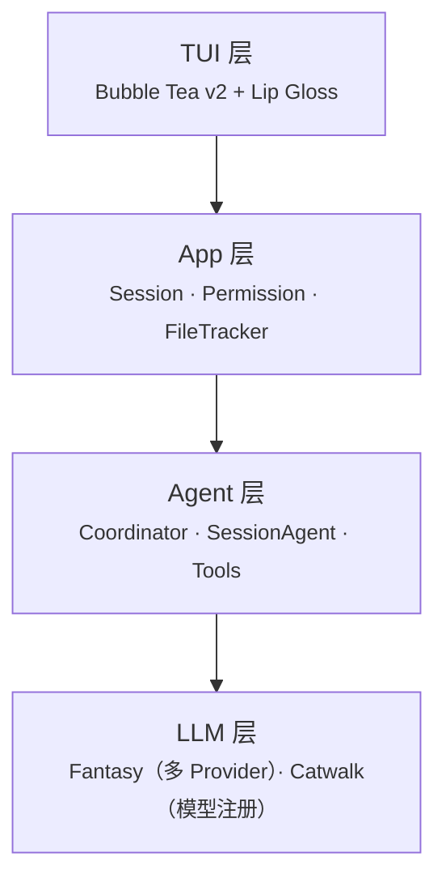

> Crush 是 Charm 团队用 Go 构建的终端 AI 编码助手，支持 14+ 个 LLM provider，运行在 8 个操作系统上。读完它的 263 个 Go 源文件后，我想聊聊它的架构设计，以及那些藏在源码里的工程决策。

## Crush 是什么

如果你用过 Claude Code 或 Codex CLI，Crush 做的是同样的事情：在终端里和 AI 对话，让它读代码、改代码、跑命令。不同的是，Claude Code 绑定 Anthropic，Codex 绑定 OpenAI，**Crush 不绑定任何厂商**——你可以用 Claude、GPT、Gemini、Deepseek，甚至本地的 Ollama，随时在对话中切换。

项目前身是 Kujtim Hoxha 于 2025 年 3 月创建的 TermAI，4 月改名 OpenCode 并获得社区关注，后因 Charm 公司 acqui-hire 引发归属权争议，最终改名 Crush。截至 2026 年 2 月：3211 个 commit，127 个版本，20,300+ stars。

## 整体架构

Crush 的代码组织在 `internal/` 下的 50+ 个 package 中。从上到下分为四层：



下面按照一个用户输入从进入到执行完毕的完整路径，逐层展开。

## LLM 层：Fantasy + Catwalk

### 为什么需要自建 LLM 抽象

Crush 不像 Claude Code 只对接一家 API。它需要同时支持 Anthropic、OpenAI、Google、Azure、Bedrock、OpenRouter 等 10+ 个 provider，每家的 API 格式、认证方式、特殊参数都不同。Charm 团队为此开发了两个独立库：

- **[Fantasy](https://github.com/charmbracelet/fantasy)**：统一的 LLM 调用接口。一个 `fantasy.Agent` 对象封装了模型选择、工具注册、流式回调
- **[Catwalk](https://github.com/charmbracelet/catwalk)**：社区维护的模型注册表。一个 JSON 文件记录所有 provider 的模型 ID、定价、上下文窗口

这种分离的好处：新模型上线时，社区在 Catwalk 的 JSON 里加一行配置，Crush 用户无需升级就能使用。

### Provider 抽象的真实代价

多 provider 听起来美好，但源码揭示了一个关键现实：**抽象必然泄漏**。

最典型的例子在 `agent.go` 的 `workaroundProviderMediaLimitations`。当 `view` 工具读取图片后，图片数据需要作为 tool result 返回给模型。但 Anthropic 的 API 支持在 tool result 中携带图片，OpenAI 和 Google 的不支持。Crush 的解决方案：**悄悄重写对话历史**——把图片从 tool result 里抽出来，伪装成紧随其后的 user message。

```go
// 对非 Anthropic provider：偷渡图片
textParts = append(textParts, "[Image loaded - see attached]")  // 替换 tool result
mediaFiles = append(mediaFiles, media)                          // 注入 user message
```

类似的 provider 专属处理散布在整个 codebase 里：

- Anthropic 需要 `interleaved-thinking` beta header 才能使用思考模式
- OpenAI 要区分 Chat Completions API 和新的 Responses API
- OpenRouter 对特定模型追加 `:exacto` 后缀
- 一个叫 `hyper` 的内部 provider 根据模型名猜测该用哪个 SDK

**教训：多 provider 支持不是写几个 adapter 就行的，而是在每个边缘情况上反复打补丁。**

## Agent 层：SessionAgent + Coordinator

### 核心循环

Crush 的 agent 层围绕两个核心类型：`Coordinator`（编排器）和 `SessionAgent`（会话 agent）。一次用户请求的完整流程：

1. `Coordinator.Run()` 刷新模型配置、准备参数
2. `SessionAgent.Run()` 检查是否忙碌（忙则入队）、复制可变状态快照、注入 MCP instructions
3. 创建 `fantasy.Agent`，调用 `agent.Stream()` 开始流式工具循环
4. 每步结果通过回调更新 UI、保存到 SQLite、检查停止条件

其中"复制可变状态快照"是一个关键设计。`tools`、`largeModel`、`systemPrompt` 都用自定义的 `csync.Value` / `csync.Slice` 包装，在 `Run` 前做原子拷贝。这样运行过程中用户通过 UI 切换模型，不会影响正在执行的请求。

### 三个停止条件

工具循环不是无限跑下去的。Crush 设置了两个 `StopWhen` 条件：

**上下文即将耗尽时自动摘要**：

```go
remaining := contextWindow - tokens
if remaining <= threshold && !disableAutoSummarize {
    shouldSummarize = true
    return true  // 停止循环
}
```

200K 窗口的模型留 20K 缓冲，小窗口模型留 20%。触发后 agent 自动生成对话摘要替换早期历史，实现"无限对话"。

**循环检测**：

```go
func hasRepeatedToolCalls(steps []fantasy.StepResult, windowSize, maxRepeats int) bool {
    // 检查最近 10 步中是否有相同的 tool call 签名出现超过 5 次
    // 签名 = SHA-256(工具名 + 输入 + 输出)
}
```

如果 agent 连续用相同的参数调同一个工具并得到相同结果，说明它卡住了。80 行代码，简洁有效。

### 消息队列

当 agent 正在处理请求时，用户可以继续输入。新消息不会丢失，而是进入 `messageQueue`。更巧妙的是，排队的消息会在下一个 `PrepareStep` 回调中被注入到当前对话中——agent 在工具循环的间隙就能看到用户的新指令，不需要等当前任务完全结束。

### 子 Agent

Crush 有两种 agent：coder（主）和 task（子）。子 agent 通过 `fantasy.NewParallelAgentTool` 创建——主 agent 可以**同时启动多个子 agent 并行工作**，每个有独立的 session 和 cost 追踪。

还有一个特殊的子 agent：`agentic_fetch`。它专门用 **small model**（而非 large model）来分析网页内容，有自己的临时目录和自动批准的权限。用 Haiku 或 GPT-4o-mini 做网页分析，成本可能差 10-20 倍——一个务实的工程决策。

## 工具层：内嵌 POSIX Shell + 20 个工具

### Bash 工具：最让我意外的设计

大多数 coding agent 执行命令的方式很直觉：`exec.Command("bash", "-c", command)` 启动子进程。Claude Code 这样做，Codex 也是（只是外面包了沙箱）。

**Crush 不是。** 它内嵌了一个 Go 实现的 POSIX Shell 解释器（[mvdan.cc/sh](https://github.com/mvdan/sh)）：

```go
func (s *Shell) execCommon(ctx context.Context, command string, ...) error {
    line, _ := syntax.NewParser().Parse(strings.NewReader(command), "")  // 解析为 AST
    runner, _ := s.newInterp(stdout, stderr)                             // 创建解释器
    return runner.Run(ctx, line)                                         // 在 Go 进程内执行
}
```

这带来三个后果：

**AST 级安全拦截**。命令不是用字符串正则匹配，而是在解释器的 ExecHandler 链中被拦截。当解释器解析完管道、变量替换、转义之后，`blockHandler` 拿到的是最终要执行的命令和参数——绕过难度远高于字符串匹配。

禁止命令有 60+ 个，分三类：网络工具（curl、wget、ssh 等 20 个）、系统管理（sudo、systemctl 等）、包管理器（apt、brew、pip 全局安装等）。同时还有子命令级过滤——`npm install` 可以，`npm install --global` 不行：

```go
shell.ArgumentsBlocker("npm", []string{"install"}, []string{"--global"}),
shell.ArgumentsBlocker("npm", []string{"install"}, []string{"-g"}),
```

**跨命令状态持久化**。每次执行后，Shell 从解释器同步工作目录和环境变量。`cd /tmp && export FOO=bar` 之后，下一条命令自动在 `/tmp` 下执行，且看得到 `$FOO`。

**跨平台一致性**。在 Windows 上自动启用 Go 实现的 coreutils（ls、cat、grep 的纯 Go 版本），让 POSIX 命令在没有 bash 的环境也能工作。这就是 Crush 能支持 8 个 OS（含 Android 和 BSD）的根本原因——它不依赖宿主系统的 shell。

### 1 分钟自动后台

Bash 工具还有一个精巧的执行模式：命令开始时是同步的，**超过 1 分钟没完成就自动升级为后台任务**，返回 job ID。用户可以用 `job_output` 查看进度、`job_kill` 终止。

对于显式后台任务，会先等 1 秒检查是否立即失败（被禁命令、语法错误），避免用户拿到一个已经挂了的 job ID。

### Edit 工具：文件时间锁

大多数 agent 的 edit 工具是"读内容 → 替换 → 写回去"。Crush 多了两层保护：

**必须先读后改**：如果 agent 没有通过 `view` 工具读过某个文件就试图编辑，直接拒绝。

**Stale read 检测**：编辑前检查文件的 `modTime` 是否比上次 `view` 的时间更新。如果用户在 agent 读取文件后手动修改了它，编辑操作会被拒绝，防止覆盖用户的手动更改。

**SQLite 版本历史**：每次编辑都把文件的前后状态存入 SQLite。不是 git 级别的 diff，而是每次 edit 操作级别的完整快照。这让回滚粒度细到单次工具调用。

### LSP 集成

`diagnostics`、`references`、`lsp_restart` 三个工具直接调用 LSP server。LSP client 使用 Charm 自己的 [powernap](https://github.com/charmbracelet/x/tree/main/powernap) 库管理，按文件类型懒初始化。

edit 和 multiedit 执行后会自动通知 LSP client 文件变更，等待诊断结果，把编译错误/警告追加到工具响应中。Agent 在下一轮就能看到"刚才的修改引入了一个类型错误"，不需要专门调 diagnostics 工具。

## Prompt 工程

### 392 行 System Prompt

Crush 的 coder prompt 模板有 392 行，用 XML 标签组织成 11 个模块（`<critical_rules>`、`<workflow>`、`<error_handling>` 等）。几个有趣的设计选择：

**极端自主化**："Don't ask questions — search, read, think, decide, act."——和 Claude Code 更偏协作的风格形成对比。

**Git 状态注入**：prompt builder 在构建时自动执行 `git branch`、`git status --short`、`git log --oneline -n 3`，注入到 system prompt。Agent 在开始对话时就知道当前分支和最近 commit。

**Context Files 通吃**：自动读取 `.cursorrules`、`CLAUDE.md`、`GEMINI.md`、`AGENTS.md` 等所有主流 agent 的项目指令文件。不要求用户为 Crush 写专门配置——直接复用已有的。

### 三层 Prompt Caching

Crush 在 Anthropic provider 上实现了精细的 cache control：

1. 最后一条 system message 加 cache 标记（system prompt 不变，只发一次）
2. 最后一个 tool 定义加 cache 标记（工具列表不变，只发一次）
3. 最近 2 条消息加 cache 标记（连续 tool loop 中对话上下文被缓存）

工具列表还按名称字母序排序——对比 Codex 曾因工具排序不稳定导致整个 prompt 缓存失效，这是一个低成本但高回报的防御措施。

## 安全模型

把上面的发现串起来，Crush 的安全策略就清晰了：

| 层次 | Crush | Codex |
|------|-------|-------|
| Shell | 内嵌 POSIX 解释器 + AST 拦截 | 真实 shell + OS 沙箱（Seatbelt/Landlock） |
| 命令过滤 | 60+ 禁止命令 + 子命令级过滤 | 沙箱内自由执行 |
| 文件写入 | Permission prompt + mod time 检查 | 沙箱内自由写 |
| 网络 | 禁止 curl/wget，专用 fetch 工具 | 沙箱限制网络 |
| 平台 | 8 个 OS | macOS + Linux |

没有 OS 级沙箱，这是 Crush 能支持 Android 和 BSD 的原因——不存在跨 8 个 OS 的统一沙箱方案。它用 **POSIX 解释器 AST 拦截 + 精细命令黑名单 + Permission 系统** 来弥补。一个明确的取舍：用安全深度换平台广度。

## 总结

读完 Crush 的源码，我认为它有一个一致的工程哲学：**在每个设计分叉点选择可移植性**。

- 内嵌 POSIX 解释器而非真实 shell → 跨 8 个 OS
- Permission prompt 而非 OS 沙箱 → 无平台依赖
- Fantasy 多 provider 抽象 → 不绑定任何厂商
- Catwalk 社区模型注册 → 新模型上线无需升级
- 通吃所有竞品的 context files → 零迁移成本

这个哲学和 Charm 团队的基因一致——他们从 2019 年就在做跨平台终端工具（Bubble Tea 30K stars、Glow 16K stars）。Crush 不是一个碰巧用 Go 写的 Claude Code 替代品，而是 Charm 生态自然延伸出的 AI 编码工具，继承了他们对终端体验和跨平台的执念。

代价也是真实的：provider 抽象在边缘情况反复泄漏，没有沙箱意味着安全依赖命令黑名单的完备性，内嵌 shell 和真实 bash 存在行为差异。但对于"我想在任何设备上用任何模型写代码"这个需求，Crush 可能是目前唯一认真在做的项目。

---

*本文基于 Crush v0.44.0（2026-02-22）的 263 个 Go 源文件分析。*
