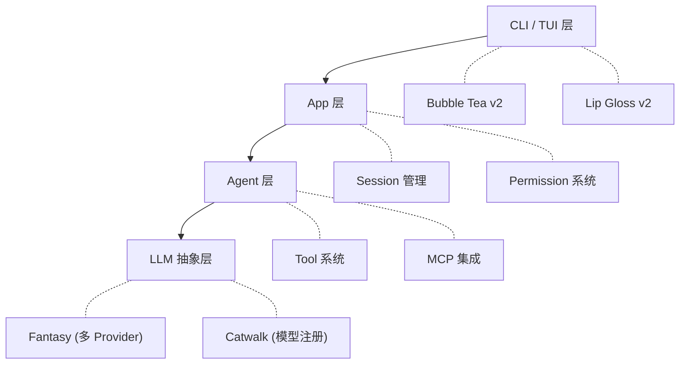

> Crush 是 Charm 团队开源的终端 AI 编码助手。3211 个 commit，127 个版本，11 个月。本文从源码层面拆解它的架构设计。

## 为什么关注 Crush

在 Claude Code、Codex、Aider 之外，Crush 是一个值得认真研究的 coding agent。原因有三：

1. **纯 Go 实现**——不是 TypeScript 或 Python，而是用 Go 构建了完整的 agent 框架
2. **Charm 生态加持**——Bubble Tea、Lip Gloss、Glamour 等知名 TUI 库的创造者亲自下场
3. **架构可见度高**——从 LLM 抽象层到工具系统到权限管理，每一层都可以在源码中追溯

## 项目背景：从 TermAI 到 Crush

Crush 的历史有些曲折。

**2025 年 3 月 21 日**，Kujtim Hoxha 提交了第一个 commit，项目名为 **TermAI**。4 月改名 **OpenCode**，Dax Raad（SST 联合创始人）加入贡献 CI 和 UX。但随后 Charm 公司雇佣了 Kujtim，将仓库迁移到 `charmbracelet` 组织下。这引发了社区争议——Dax 和 Adam 不满于贡献被边缘化，最终双方分道扬镳：

- **Charm** 将项目改名为 **Crush**，2025 年 7 月 29 日发布 v0.1.0
- **SST** 维护了独立的 [sst/opencode](https://github.com/sst/opencode) 分支

截至 2026 年 2 月，Crush 已有 **20,300+ stars**、**3211 个 commit**、**127 个版本发布**，主要贡献者：

| 贡献者 | Commits | 角色 |
|--------|---------|------|
| Kujtim Hoxha | 954 | 原始作者，现 Charm 员工 |
| Andrey Nering | 470 | Charm 核心开发者 |
| Carlos Becker | 458 | Charm 核心开发者 |
| Ayman Bagabas | 427 | Charm 核心开发者 |
| Christian Rocha | 222 | Charm CEO |

## 整体架构

Crush 的架构可以分为四层：



我们从底层往上看。

## 第一层：Fantasy — Go 的 LLM 抽象

[Fantasy](https://github.com/charmbracelet/fantasy) 是 Crush 的核心引擎，定位类似 Python 生态的 LiteLLM 或 Vercel AI SDK——一个统一的多 Provider LLM 调用接口。

### 统一的 Provider 接口

从 `coordinator.go` 的 `buildProvider` 方法可以看到，Fantasy 支持 10+ 个 Provider：

```go
switch providerCfg.Type {
case openai.Name:
    return c.buildOpenaiProvider(baseURL, apiKey, headers)
case anthropic.Name:
    return c.buildAnthropicProvider(baseURL, apiKey, headers, providerID)
case openrouter.Name:
    return c.buildOpenrouterProvider(baseURL, apiKey, headers)
case azure.Name:
    return c.buildAzureProvider(baseURL, apiKey, headers, providerCfg.ExtraParams)
case bedrock.Name:
    return c.buildBedrockProvider(headers)
case google.Name:
    return c.buildGoogleProvider(baseURL, apiKey, headers)
case "google-vertex":
    return c.buildGoogleVertexProvider(headers, providerCfg.ExtraParams)
case openaicompat.Name:
    return c.buildOpenaiCompatProvider(...)
case hyper.Name:
    return c.buildHyperProvider(baseURL, apiKey)
}
```

每个 Provider 有自己的特殊处理。例如 Anthropic 需要设置 thinking beta header：

```go
if providerCfg.Type == anthropic.Name && c.isAnthropicThinking(model) {
    headers["anthropic-beta"] = "interleaved-thinking-2025-05-14"
}
```

OpenAI 区分 Chat Completions API 和新的 Responses API：

```go
if openai.IsResponsesModel(model.CatwalkCfg.ID) {
    mergedOptions["reasoning_summary"] = "auto"
    parsed, err := openai.ParseResponsesOptions(mergedOptions)
}
```

### Catwalk：社区驱动的模型注册表

[Catwalk](https://github.com/charmbracelet/catwalk) 是一个独立的模型数据库项目，维护所有 LLM Provider 的模型信息（ID、名称、定价、上下文窗口大小等）。Crush 启动时自动从 Catwalk 加载最新的模型列表，任何人都可以通过 PR 添加新 Provider 或更新模型信息。

这种**配置与代码分离**的做法比硬编码模型列表灵活得多。新模型上线时，只需更新 Catwalk 的 JSON 配置，Crush 用户不需要升级版本就能使用。

## 第二层：Agent 核心 — SessionAgent

Crush 的 agent 层围绕 `SessionAgent` 接口构建。核心流程在 `agent.go` 的 `Run` 方法中：

```go
func (a *sessionAgent) Run(ctx context.Context, call SessionAgentCall) (*fantasy.AgentResult, error) {
    // 1. 如果 agent 忙碌，将消息放入队列
    if a.IsSessionBusy(call.SessionID) {
        existing = append(existing, call)
        a.messageQueue.Set(call.SessionID, existing)
        return nil, nil
    }

    // 2. 复制可变字段，避免并发竞争
    agentTools := a.tools.Copy()
    largeModel := a.largeModel.Get()
    systemPrompt := a.systemPrompt.Get()

    // 3. 注入 MCP Server 的 instructions
    for _, server := range mcp.GetStates() {
        if server.State == mcp.StateConnected {
            instructions.WriteString(server.Client.InitializeResult().Instructions)
        }
    }

    // 4. 为最后一个 tool 添加 Anthropic 缓存控制
    agentTools[len(agentTools)-1].SetProviderOptions(a.getCacheControlOptions())

    // 5. 创建 Fantasy Agent 并执行
    agent := fantasy.NewAgent(
        largeModel.Model,
        fantasy.WithSystemPrompt(systemPrompt),
        fantasy.WithTools(agentTools...),
    )
    // ... agent.Stream() 执行工具循环
}
```

几个值得注意的设计：

### 消息队列

当 agent 正在处理一个请求时，新的请求不会被丢弃，而是放入 `messageQueue`。处理完当前请求后，agent 会自动取出队列中的下一条消息继续处理。这对 TUI 交互很重要——用户可以在 agent 工作时继续输入。

### 并发安全

`tools`、`largeModel`、`systemPrompt` 等字段都使用自定义的 `csync.Value` / `csync.Slice` 包装，提供原子读写。在 `Run` 执行前先 `Copy()` 出一份快照，避免运行过程中被 `SetTools` 或 `SetModels` 修改。

### 自动摘要

当上下文接近模型的窗口限制时，agent 会自动触发摘要。阈值计算：

```go
const (
    largeContextWindowThreshold = 200_000
    largeContextWindowBuffer    = 20_000
    smallContextWindowRatio     = 0.2
)
```

对于 200K 上下文窗口的模型，当使用量接近 180K 时触发摘要。对于较小窗口的模型，使用 20% 的缓冲比例。

### 循环检测

`loop_detection.go` 实现了一个简洁的循环检测机制，防止 agent 陷入重复调用同一工具的死循环：

```go
const (
    loopDetectionWindowSize = 10
    loopDetectionMaxRepeats = 5
)

func hasRepeatedToolCalls(steps []fantasy.StepResult, windowSize, maxRepeats int) bool {
    window := steps[len(steps)-windowSize:]
    counts := make(map[string]int)
    for _, step := range window {
        sig := getToolInteractionSignature(step.Content)
        counts[sig]++
        if counts[sig] > maxRepeats {
            return true
        }
    }
    return false
}
```

它检查最近 10 步中是否有某个 tool call 签名（SHA-256 哈希，包含工具名、输入、输出）出现超过 5 次。如果是，说明 agent 卡住了。

## 第三层：工具系统 — 20+ 内置工具

Crush 的工具注册在 `coordinator.go` 的 `buildTools` 方法中：

```go
allTools = append(allTools,
    tools.NewBashTool(c.permissions, c.cfg.WorkingDir(), ...),
    tools.NewEditTool(c.lspManager, c.permissions, ...),
    tools.NewMultiEditTool(c.lspManager, c.permissions, ...),
    tools.NewGlobTool(c.cfg.WorkingDir()),
    tools.NewGrepTool(c.cfg.WorkingDir(), c.cfg.Tools.Grep),
    tools.NewViewTool(c.lspManager, c.permissions, ...),
    tools.NewWriteTool(c.lspManager, c.permissions, ...),
    tools.NewFetchTool(c.permissions, ...),
    tools.NewLsTool(c.permissions, ...),
    tools.NewTodosTool(c.sessions),
    tools.NewDiagnosticsTool(c.lspManager),
    tools.NewReferencesTool(c.lspManager),
    // ... 更多工具
)
```

工具列表与 Claude Code 高度相似——`bash`、`edit`、`glob`、`grep`、`view`、`write`——但有几个独特之处：

### 多文件编辑（MultiEdit）

Crush 提供了 `multiedit` 工具，允许在一次调用中对同一文件进行多处编辑。对比 Claude Code 需要多次调用 `Edit`，这可以减少 tool call 轮次。

### LSP 深度集成

`diagnostics`、`references`、`lsp_restart` 三个工具直接调用 LSP server。`lsp.Manager` 会根据文件类型懒初始化对应的 LSP client，提供类型检查错误、引用查找等功能。这比大多数 coding agent 的静态 grep 搜索更精确。

### 权限过滤

不是所有工具都对所有 agent 开放。工具列表会根据 agent 配置中的 `AllowedTools` 进行过滤：

```go
var filteredTools []fantasy.AgentTool
for _, tool := range allTools {
    if slices.Contains(agent.AllowedTools, tool.Info().Name) {
        filteredTools = append(filteredTools, tool)
    }
}
```

子 agent（task agent）默认获得比主 agent（coder agent）更少的工具。

### 工具排序

所有工具按名称字母序排序后传给 LLM。这看起来微不足道，但 Codex 项目曾因工具排序不稳定导致 prompt caching 失效——顺序不同意味着每次请求的 prompt 都不一样，缓存命中率归零。

## Bash 工具的安全设计

Bash 工具的实现值得单独看。它有一个被禁止的命令列表（从 `bash.go` 中推测），并且所有 bash 执行都需要通过 Permission 系统审批。

输出有 30000 字符的限制：

```go
const maxOutputLength = 30000
```

还支持后台任务——如果命令执行时间过长，可以把它放到后台，用 `job_output` 和 `job_kill` 工具来管理。

## 子 Agent（Agent Tool）

Crush 实现了类似 Claude Code 的 Task 子 agent 机制。`agent_tool.go` 中的 `agentTool` 方法创建了一个子 agent：

```go
func (c *coordinator) agentTool(ctx context.Context) (fantasy.AgentTool, error) {
    agent, err := c.buildAgent(ctx, prompt, agentCfg, true)  // isSubAgent = true
    return fantasy.NewParallelAgentTool(
        AgentToolName,
        string(agentToolDescription),
        func(ctx context.Context, params AgentParams, call fantasy.ToolCall) (fantasy.ToolResponse, error) {
            // 创建任务 session，执行子 agent，汇总 cost
            agentToolSessionID := c.sessions.CreateAgentToolSessionID(messageID, call.ID)
            session, _ := c.sessions.CreateTaskSession(ctx, agentToolSessionID, sessionID, "New Agent Session")
            result, _ := agent.Run(ctx, SessionAgentCall{...})
            // 将子 session 的 cost 加到父 session
            parentSession.Cost += updatedSession.Cost
            return fantasy.NewTextResponse(result.Response.Content.Text()), nil
        }), nil
}
```

注意 `fantasy.NewParallelAgentTool`——这意味着主 agent 可以同时启动多个子 agent 并行工作。子 agent 有独立的 session 和 cost 追踪，最终汇总到父 session。

## MCP 集成

Crush 通过 Go 的 `github.com/modelcontextprotocol/go-sdk/mcp` 集成了 MCP 协议。`mcp/tools.go` 中的 `RunTool` 方法处理 MCP 工具调用：

```go
func RunTool(ctx context.Context, c mcp.Session, name string, args map[string]any) (fantasy.ToolResponse, error) {
    result, err := c.CallTool(ctx, &mcp.CallToolRequest{
        Params: mcp.CallToolParams{
            Name:      name,
            Arguments: args,
        },
    })
    // 处理 text / image / audio 三种内容类型
}
```

MCP Server 可以返回文本、图片或音频内容，Crush 会根据类型做相应处理。

配置中支持三种 MCP 传输方式：`stdio`、`http`、`sse`。Agent 配置还可以通过 `AllowedMCP` 精细控制哪些 MCP server 的哪些工具可以使用。

## Permission 系统

`permission.go` 实现了一个基于 PubSub 的权限审批系统：

```go
type Service interface {
    pubsub.Subscriber[permission.Request]
    GrantPersistent(toolName string, description ...string) error
    Grant(toolName string, description ...string) error
    Deny(toolName string) error
    Request(toolName string, params ...any) (bool, error)
}
```

当工具需要执行敏感操作（如写文件、执行 bash）时，会调用 `Request`。如果用户没有预先授权，请求会通过 PubSub 推送到 TUI 层，弹出确认对话框。

支持三种粒度：
- **Persistent**：永久授权某个工具
- **Grant**：单次授权
- **Deny**：拒绝

还有 `skipRequests` 模式（类似 Claude Code 的 `--dangerously-skip-permissions`），跳过所有权限检查。

## Agent Skills 支持

Crush 是 [Agent Skills](https://agentskills.io) 规范的早期支持者之一（v0.30.0，2025 年 12 月 27 日）。Agent Skills 最初由 Anthropic 发起，现已有 30+ 个工具采纳。

`skills.go` 实现了完整的 Skill 发现和加载流程：

```go
// SKILL.md 格式：YAML frontmatter + Markdown 指令
type Skill struct {
    Name         string            `yaml:"name"`
    Description  string            `yaml:"description"`
    License      string            `yaml:"license,omitempty"`
    Instructions string            // Markdown body
    Path         string            // 所在目录
}

// 在指定路径中递归发现所有 SKILL.md
func Discover(paths []string) []*Skill { ... }

// 生成 XML 注入到 system prompt
func ToPromptXML(skills []*Skill) string { ... }
```

Skills 采用**渐进式披露**：启动时只加载 name 和 description（约 100 tokens），agent 决定激活某个 skill 时才加载完整 instructions。

## 上下文文件加载

Crush 会自动扫描项目根目录中的多种上下文文件：

```go
var defaultContextPaths = []string{
    ".github/copilot-instructions.md",
    ".cursorrules",
    ".cursor/rules/",
    "CLAUDE.md", "CLAUDE.local.md",
    "GEMINI.md", "gemini.md",
    "crush.md", "crush.local.md",
    "AGENTS.md", "agents.md",
}
```

这意味着 Crush 可以兼容几乎所有主流 coding agent 的项目指令文件。你为 Claude Code 写的 `CLAUDE.md`，Crush 同样会读取。

## TUI 架构

Crush 使用 Bubble Tea v2 构建 TUI，采用 **"smart main model, dumb components"** 模式。

中央 `UI` model 是唯一处理 Bubble Tea 消息的组件，消息路由按优先级分发：

1. Dialog（最高优先级，如权限确认）
2. Terminal（嵌入式终端）
3. Session（聊天交互）
4. Resize / PubSub / Mouse / Keyboard / Paste / Animation

所有子组件只暴露返回 `tea.Cmd` 的方法，不直接处理 `tea.Msg`。这种集中式消息路由避免了深度嵌套组件导致的状态混乱。

## System Prompt 设计

Crush 的 system prompt 非常详细，从 `coder.md.tpl` 模板生成。几个关键设计原则：

**自主性优先**：
> Don't ask questions — search, read, think, decide, act. Systematically try alternative strategies until either the task is complete or you hit a hard external limit.

**极简输出**：
> Keep output concise (default <4 lines). One-word answers when possible. No emojis ever.

**安全规则**：
> Never commit unless user explicitly says "commit". Never push to remote unless explicitly asked.

子 agent（task agent）的 prompt 更简洁：
> You are an agent for Crush. Given the user's prompt, you should use the tools available to you to answer the user's question.

这种主 agent 详细、子 agent 精简的设计和 Codex 的 codex-agent-prompt 与 codex-mini-prompt 类似。

## 与其他 Coding Agent 的对比

| | Crush | Claude Code | Codex | Aider |
|---|---|---|---|---|
| **语言** | Go | TypeScript | Rust | Python |
| **模型支持** | 14+ Provider | 仅 Anthropic | 仅 OpenAI | 100+ |
| **TUI** | Charm 风格终端 UI | 简洁终端 | 简洁终端 | 简洁终端 |
| **LSP** | 原生集成 | 内置分析 | 有限 | 无 |
| **MCP** | stdio/http/sse | stdio/sse | 支持 | 无 |
| **开源** | FSL-1.1-MIT | 闭源 | Apache-2.0 | Apache-2.0 |
| **定价** | 按 API 付费 | $20/月起 | 按 API 付费 | 按 API 付费 |
| **特色** | 中途切模型、多平台 | 深度推理 | Rust 沙箱 | Git 集成 |

Crush 最独特的优势是**模型灵活性**——你可以在对话中途切换 Provider 和模型，从 Claude 切到 GPT 再切到 Gemini。这是因为 Fantasy 的抽象层让模型切换成本极低：只需调用 `UpdateModels`，重新构建 Provider 即可。

## 工程洞察

从 Crush 的源码中可以提炼几个值得学习的模式：

**1. 抽象层的价值**

Fantasy + Catwalk 的组合实现了真正的 provider 无关性。新模型上线时，社区更新 Catwalk 的 JSON 配置即可，不需要修改 Crush 代码。这种「配置驱动」的可扩展性比在代码中硬编码模型列表高效得多。

**2. 并发安全的 Agent 状态**

使用 `csync.Value` 和 `csync.Slice` 包装所有可变状态，在 `Run` 前做快照——这是 Go 并发编程的教科书做法，避免了锁的复杂性。

**3. 工具权限分层**

不同 agent 配置不同的工具集。主 agent 有完整工具，子 agent 只有必需的工具。MCP 工具还可以按 server 和工具名做白名单过滤。这种细粒度控制在安全性和上下文效率之间找到了平衡。

**4. 循环检测的简洁实现**

10 步窗口 + 5 次重复 + SHA-256 签名，不到 80 行代码就解决了 agent 无限循环的问题。

## 总结

Crush 证明了 Go 完全可以构建一个功能完备的 coding agent。它的核心竞争力不在于单一模型的能力（那取决于 LLM provider），而在于：

- **Fantasy 让模型切换零成本**
- **Charm TUI 栈让终端体验有了审美**
- **LSP 集成让代码理解更精确**
- **Agent Skills + MCP + 上下文文件兼容让生态无缝衔接**

3211 个 commit 和 127 个版本发布的背后，是一个高产团队对 "终端 AI 编码体验" 这个命题的持续探索。

---

*本文基于 Crush v0.44.0（2026-02-22）的源码分析。*
