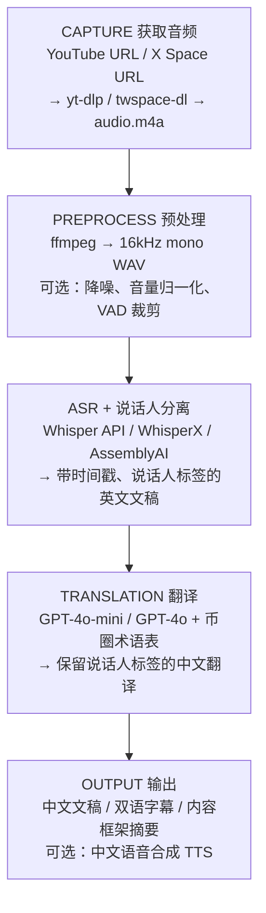
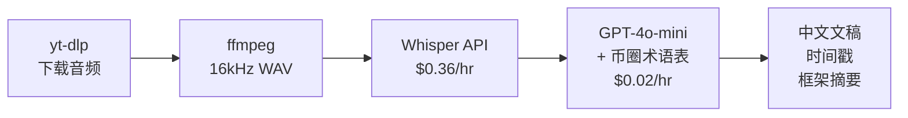

> 币圈投资者需要紧跟项目方动态，但大量 AMA、市政厅会议、X Space 都是英文内容。对于非英语母语者，听完一场 1-2 小时的英文直播费时费力。本文从技术和成本角度系统调研将 YouTube 视频和 X Space 音频翻译成中文的可行方案。

## 技术管线总览



## 音频获取方案

### YouTube 视频

| 方案 | 说明 |
|------|------|
| **yt-dlp** | `yt-dlp -x --audio-format m4a "URL"`，稳定可靠，开源免费 |

### X Space

| 方案 | 说明 | 稳定性 |
|------|------|--------|
| **yt-dlp** | `yt-dlp https://x.com/i/spaces/SPACE_ID`，需 cookies 认证 | 中（X 经常改 API） |
| **twspace-dl** | 专用工具，支持直播和录播下载 | 中 |
| **DevTools + ffmpeg** | 浏览器抓取 m3u8 地址后用 ffmpeg 下载 | 高（手动但稳定） |
| **OBS 录屏** | 录制系统音频，兜底方案 | 高 |

**实际示例：** [DeFi Development Corp. January 2026 Business Recap & AMA](https://x.com/i/spaces/1vAxRQOgDzPJl) — 一场 Solana 生态上市公司的月度回顾与社区问答，典型的项目方 X Space 格式。

下载命令：

```bash
yt-dlp -x --audio-format m4a "https://x.com/i/spaces/1vAxRQOgDzPJl"
```

**X Space 音频特点：**
- 编码：AAC，~64-128 kbps，单声道
- 所有说话人混合在一条音轨中，需后期做说话人分离
- 音质受限于手机麦克风 + 网络压缩

## 语音转文字 (ASR) 方案对比

### 云服务 API

| 服务商 | 模型 | 价格/小时 | 特点 |
|--------|------|----------|------|
| **OpenAI Whisper API** | whisper-1 | $0.36 | 稳定可靠，57+ 语言 |
| **Deepgram** | Nova-2 | $0.26 | 性价比最高 |
| **AssemblyAI** | Best | $0.25 | 内置说话人分离、摘要 |
| **AssemblyAI** | Nano | $0.12 | 低精度但更便宜 |
| **Google Cloud STT** | V1 | $0.36 | 有免费额度 (500k min) |
| **Google Cloud STT** | V2 Chirp | $0.96 | 更高精度 |
| **Azure Speech** | 批处理 | $0.50 | 批量场景适用 |
| **Azure Speech** | 实时 | $1.00 | 较贵 |
| **AWS Transcribe** | 标准 | $1.44 | 较贵 |

### 开源自部署

| 方案 | 说明 |
|------|------|
| **faster-whisper** | CTranslate2 后端，比原版快 4x，推荐生产使用 |
| **WhisperX** | Whisper + 说话人分离 + 词级时间戳，X Space 场景首选 |
| **whisper.cpp** | C++ 实现，CPU 可运行 |
| **Distil-Whisper** | 蒸馏模型，6x 加速，精度接近 |

## 翻译方案对比

假设 1 小时音频 ≈ 10,000 英文词 ≈ 50,000 字符 ≈ 13,000 tokens

### 云服务 API

| 服务商 | 1小时内容翻译成本 | 币圈术语处理 |
|--------|-----------------|------------|
| **GPT-4o-mini + 术语表** | **~$0.02** | 优秀（可自定义 prompt） |
| **GPT-4o + 术语表** | ~$0.15-0.25 | 最佳 |
| **Claude API** | ~$0.15-0.30 | 优秀 |
| **DeepL API** | ~$1.25 | 一般（不懂币圈术语） |
| **Google Translate API** | ~$1.00 | 一般 |
| **Azure Translator** | ~$0.50 | 一般 |

### 开源自部署

| 方案 | 说明 |
|------|------|
| **Qwen 2.5 (32B/72B)** | 阿里双语模型，中文能力强，币圈术语可通过 prompt 定制 |
| **Meta NLLB** | 200 语言，质量低于 LLM |
| **MarianMT** | 轻量级，质量一般 |

**关键结论：** 币圈内容必须用 LLM 翻译，传统翻译 API 无法正确处理 DeFi、MEV、staking 等专业术语。GPT-4o-mini 成本极低且效果好，是最优选择。

### 币圈术语表示例 (System Prompt)

```text
翻译时请使用以下标准术语：
- staking → 质押
- DeFi → 去中心化金融
- MEV → 最大可提取价值
- TVL → 总锁仓量
- yield farming → 流动性挖矿
- governance → 治理
- airdrop → 空投
- tokenomics → 代币经济学
- whitepaper → 白皮书
- mainnet → 主网
- testnet → 测试网
- layer 2 → 二层网络
- rollup → 汇总
- bridge → 跨链桥
- liquidity pool → 流动性池
- impermanent loss → 无常损失
- rug pull → 跑路/卷款
- FDV → 完全稀释估值
- market cap → 市值
```

## 成本分析

### 单次成本（每小时音频）

| 方案 | ASR | 翻译 | 合计 |
|------|-----|------|------|
| **A: 最低成本** | Deepgram $0.26 | GPT-4o-mini $0.02 | **$0.28** |
| **B: 推荐方案** | Whisper API $0.36 | GPT-4o-mini $0.02 | **$0.38** |
| **C: 最佳质量** | Whisper API $0.36 | GPT-4o $0.25 | **$0.61** |
| **D: 全自托管** | faster-whisper $0 | Qwen 本地 $0 | **≈$0**（需 GPU） |
| **E: 端到端平台** | Rask.ai 打包 | 打包 | **~$84** |

### 月度规模成本

```mermaid
xychart-beta
    title "月度 API 成本（美元）"
    x-axis ["10h", "50h", "100h", "500h"]
    y-axis "USD" 0 --> 320
    bar [2.8, 14, 28, 140]
    bar [3.8, 19, 38, 190]
    bar [6.1, 30.5, 61, 305]
```



| 规模 | 方案 A (最低成本) | 方案 B (推荐) | 方案 C (最佳质量) |
|------|--------|--------|--------|
| 10 小时/月 | $2.8 | $3.8 | $6.1 |
| 50 小时/月 | $14 | $19 | $30.5 |
| 100 小时/月 | $28 | $38 | $61 |
| 500 小时/月 | $140 | $190 | $305 |

### GPU 自托管成本参考

| 方案 | 月费 |
|------|------|
| 租用 A100 (RunPod/Lambda) | ~$1-2/小时 GPU 时间 |
| Mac M 系列本地跑 Whisper + Qwen | 仅电费，约 ¥50-100/月 |

## X Space 特有挑战

| 挑战 | 说明 | 应对方案 |
|------|------|---------|
| **多人说话** | 单声道混合，5-20+ 说话人 | WhisperX / AssemblyAI 做说话人分离 |
| **音质差** | 手机麦 + 蓝牙 + 64kbps 压缩 | 预处理降噪 (RNNoise)，选高容错 ASR 模型 |
| **非正式口语** | 不完整句子、打断、口头禅 | LLM 翻译可理解上下文，优于传统翻译 |
| **工具不稳定** | X 频繁改 API，下载工具会失效 | 多备选方案 (yt-dlp / twspace-dl / 手动) |
| **币圈黑话** | DeFi、MEV 等专业术语 | LLM + 自定义术语表 |
| **内容长度** | 2 小时 Space ≈ 20,000+ 词 | 分块翻译，保持上下文连贯 |

## 竞品分析

### Google NotebookLM — 最接近需求的现有产品

[NotebookLM](https://notebooklm.google/) 是 Google 推出的 AI 研究助手，已支持 80+ 语言（含中文），可直接导入 YouTube 链接进行分析。

**功能：**
- 导入 YouTube 链接 → 自动提取字幕 → AI 问答 / 摘要 / 框架整理
- Audio Overview：生成中文音频播客式总结
- Video Overview：生成带幻灯片的视频总结
- 支持手动切换输出语言为中文

**定价：**

| 计划 | 价格 | 主要限额 |
|------|------|---------|
| **免费版** | $0 | 100 笔记本，50 源/本，3 次音频概览/天，50 次对话/天 |
| **Plus** (Google One AI Premium) | $19.99/月 | 500 笔记本，300 源/本，更多配额 |
| **Ultra** | $249.99/月 | 200 音频/视频概览/天，200 深度研究/天 |

**NotebookLM vs 自建管线对比：**

| 维度 | NotebookLM | 自建管线 |
|------|-----------|---------|
| YouTube 支持 | 直接粘链接，体验好 | yt-dlp 下载，需技术操作 |
| X Space 支持 | **不支持** | yt-dlp / twspace-dl 支持 |
| 翻译质量（币圈） | 通用 AI，术语不可控 | LLM + 币圈术语表，更精准 |
| 摘要/框架整理 | 内置，体验优秀 | 需额外一步 LLM prompt |
| 批量自动化 | 不支持 | 可脚本化，支持批量 |
| 成本 | 免费版有限额，Plus $19.99/月 | ~$0.38/小时，按量付费无限额 |
| 上手门槛 | 极低，浏览器打开即用 | 需开发，有技术门槛 |
| 输出格式 | AI 摘要/对话式 | 全文逐句翻译 + 时间戳 + 字幕 |

**结论：** NotebookLM 适合个人轻度使用（偶尔看几个 YouTube 视频做摘要），但无法满足重度用户的需求（X Space、术语精准度、批量处理）。

### X Space 专用工具

| 平台 | 功能 | 价格 | 特点 |
|------|------|------|------|
| [**XspaceGPT**](https://www.twitterspacegpt.com/) | Space 转文字 + 摘要 + 思维导图 | 免费版 / Plus $9.9/月 (10 Spaces) / Pro $14.9/月 (60 Spaces) / 主播版 $49.9/月 (无限) | GPT-4 驱动，支持多语言，可下载 MP3 |
| [**Flowjin**](https://www.flowjin.com/) | Space 下载 + 转写 + 摘要 + 推文生成 | **$99 一次性买断**（终身无限） | 36+ 语言，99% 准确率，说话人标签，性价比极高 |
| [**TwSpaceTool**](https://chromewebstore.google.com/detail/twspacetool-download-tran/kafdajbhkclfphkjajojcebnmabnfiak) | Chrome 插件，一键下载 + 转写 + 摘要 | 下载永久免费，转写 120 分钟免费 | 浏览器插件，最轻量的方案 |

### YouTube 翻译 / 双语字幕工具

| 平台 | 功能 | 价格 | 特点 |
|------|------|------|------|
| [**沉浸式翻译**](https://immersivetranslate.com/) (Immersive Translate) | 网页/视频/PDF 双语翻译 | 免费版可用 / Pro $6.9/月 | 支持 YouTube/Netflix 双语字幕，Pro 版有 AI 字幕模式（无 CC 也能翻），国内用户首选 |
| [**Trancy**](https://www.trancy.org/) | YouTube/Netflix AI 双语字幕 | 免费版 / Premium 付费 | AI 转写无字幕视频（40 个/天），句子分段优化 |
| [**小牛视频翻译**](https://gitee.com/xiaoniu-video-handling/xiaoniu) | 本地视频翻译 + 字幕翻译 + YouTube 下载翻译 | 开源 | 集成 ASR + 多语言翻译，适合本地部署 |

### 视频翻译 + 配音平台

| 平台 | 功能 | 价格 | 特点 |
|------|------|------|------|
| [**Rask.ai**](https://www.rask.ai/) | 视频翻译 + 配音 + 口型同步 | $60-140/月 | 130+ 语言，语音克隆 |
| [**HeyGen**](https://www.heygen.com/) | AI 视频翻译 + 数字人 | $24-48/月 | 175+ 语言，口型同步 |
| [**Vozo.ai**](https://www.vozo.ai/) | 视频翻译 + 配音 + 口型同步 | ~$19-29/月起 | LipREAL 口型技术，110+ 语言 |
| [**Synthesia**](https://www.synthesia.io/) | AI 视频生成 + 翻译配音 | 付费 | 130+ 语言，AI 数字人 |
| [**ElevenLabs**](https://elevenlabs.io/) | 音频翻译 + 语音克隆 | 按用量付费 | 29 语言，业界最佳语音质量 |

### 音频转写平台

| 平台 | 功能 | 价格 | 特点 |
|------|------|------|------|
| [**Sonix**](https://sonix.ai/) | 音频/视频转写 + 翻译 | 按分钟付费，30 分钟免费 | 53+ 语言转写，54+ 语言翻译，5-6 分钟处理 1 小时音频 |
| [**Otter.ai**](https://otter.ai/) | 会议转写 | 免费+付费 | 实时转写，无翻译功能 |
| [**Fireflies.ai**](https://fireflies.ai/) | 会议转写 | 免费+付费 | 会议专用，无翻译功能 |

### 已停止维护

| 平台 | 功能 | 备注 |
|------|------|------|
| **videoseek.ai** | 链接导入 → 自动翻译 + 摘要 | 已停止维护 |

### 市场空白

- **没有专门针对币圈/Web3 的翻译平台**，通用平台不处理币圈术语
- X Space 工具（XspaceGPT、Flowjin）解决了转写问题，但**翻译到中文不是核心功能**
- 沉浸式翻译覆盖了 YouTube 双语字幕场景，但**不支持 X Space**
- 视频配音平台（Rask.ai、HeyGen）功能强大但**价格高、偏重配音而非文稿翻译**
- 综合来看：**"X Space + YouTube → 精准中文文稿 + 币圈术语"** 这个组合仍是空白

## 结论与建议

### 核心发现

1. **API 成本极低**：每小时内容翻译成本不到 $0.50
2. **LLM 翻译远优于传统翻译**：GPT-4o-mini 配合术语表，成本仅 $0.02/小时，效果好
3. **币圈是未被满足的细分市场**：没有稳定运营的专业平台

### 推荐技术栈



**总成本：~$0.38/小时内容，月处理 100 小时仅需 $38。**

### MVP 功能设计

1. 输入 YouTube / X Space 链接
2. 自动下载音频 → 转写 → 翻译
3. 输出带时间戳的中文文稿
4. 自动生成内容框架/摘要
5. 可选：双语对照字幕

---

*调研时间：2026-02-24*
*注：API 价格基于 2025 年数据，具体请以各服务商官网为准。*
