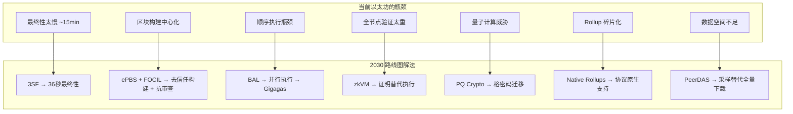
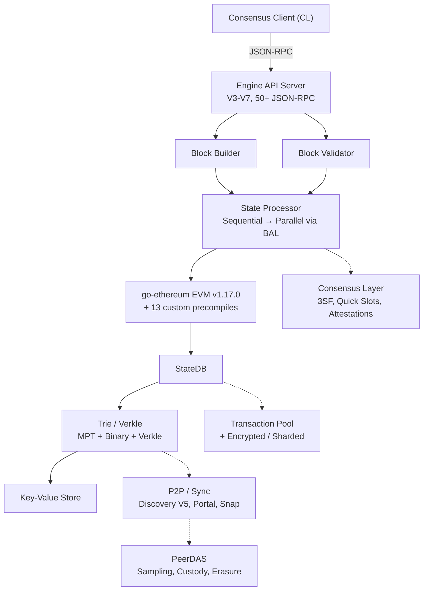

> 本文基于 [jiayaoqijia/eth2030](https://github.com/jiayaoqijia/eth2030) 仓库源码分析编写。

## 引言

2026 年 2 月 25 日，开发者 YQ [在 X 上宣布](https://x.com/yq_acc/status/2026252944639934778)：他用 Claude Code（Opus 4）在大约一周时间内，完成了一个面向以太坊 2030 路线图的实验性执行客户端 —— **ETH2030**。

数字很惊人：

| 指标 | 数据 |
|------|------|
| Go 源文件 | 1,909 个 |
| 代码行数 | ~713K |
| 包数量 | 50 个 |
| 测试数量 | 18,257 个 |
| 支持 EIP | 58+ |
| EF 状态测试 | 36,126 / 36,126（100%） |
| API 调用 | 26,798 次 |
| Token 消耗 | 27.7 亿 |
| 估算 API 成本 | ~$5,750 |

这不是一个玩具 demo。它有完整的 EVM 实现、共识层、数据可用性层、后量子密码学、zkVM 框架，甚至能连接 go-ethereum 同步主网。

这篇文章分两部分：第一部分系统讲解以太坊 2030 路线图的技术方向 —— 以太坊想解决什么问题、为什么需要这些技术；第二部分深入 ETH2030 的代码，看它如何将这些理论变成可运行的 Go 实现。

---

## 第一部分：以太坊 2030 路线图

### 从 Strawmap 说起

以太坊基金会 Protocol 团队维护了一张 [L1 Strawmap](https://strawmap.org)（路线图草案），规划了从 2026 到 2030+ 的升级路径。它不是官方承诺，而是一个"加速主义协调工具" —— 给所有客户端团队一个共同的方向参考。

路线图分三层，八个升级阶段：

| 阶段 | 大约时间 | 核心主题 |
|------|---------|---------|
| **Glamsterdam** | 2026 | ePBS、FOCIL、BAL 并行执行 |
| **Hegotá** | 2026-27 | PeerDAS、后量子密钥注册、gas repricing |
| **I\*** | 2027 | 多维 gas、加密内存池、native AA |
| **J\*** | 2027-28 | 4-slot epochs、binary tree、blob futures |
| **K\*** | 2028 | 6 秒 slot、APS、mandatory proofs |
| **L\*** | 2028-29 | endgame finality、native rollups、zkVM |
| **M\*** | 2029 | fast L1（秒级确认）、proof aggregation |
| **longer term** | 2030++ | gigagas L1、teragas L2、隐私 L1 |

三层分别是：

- **Consensus Layer (CL)** — 橙色区域：延迟、共识安全、密码学
- **Data Layer (DL)** — 绿色区域：blob 吞吐量、数据可用性
- **Execution Layer (EL)** — 蓝色区域：执行吞吐量、EVM 演进、零知识证明

最终的五个北极星目标是：

| 目标 | 含义 |
|------|------|
| **Fast L1** | 交易包含和链确认在秒级完成 |
| **Gigagas L1** | L1 每秒 1 Gigagas（~10K TPS），通过 zkEVM 和实时证明 |
| **Teragas L2** | L2 每秒 1 GB（~10M TPS），通过数据可用性采样 |
| **Post-Quantum L1** | 百年级密码学安全，基于哈希方案 |
| **Private L1** | 隐私作为一等公民，通过 L1 屏蔽转账 |

接下来逐一拆解每个核心技术方向。

### 1. 共识层：从 15 分钟到 3 个 Slot

**当前痛点：** 以太坊的 Gasper 共识需要 2 个 epoch（约 12.8 分钟）才能达到最终性。用户提交交易后，虽然 1 个 slot（12 秒）就能被包含在区块中，但要等到"这个区块绝对不会被回滚"，需要漫长的等待。对于跨链桥和 DeFi 来说，这个延迟是巨大的安全风险。

**3-Slot Finality (3SF)** 的目标是将最终性缩短到 3 个 slot（约 36 秒）。核心思路是改变投票机制：

- 当前：验证者被分成 32 个委员会，分布在一个 epoch 的 32 个 slot 中。要收集完所有委员会的投票才能确认。
- 3SF：每个 slot 都收集足够多验证者的投票。当 2/3 的质押权重对同一个区块投票后，立即确认。

这就引出了一系列配套改进：

- **Quick Slots（6 秒出块）**：将 slot 时间从 12 秒缩短到 6 秒，进一步降低延迟
- **128K Attester Cap**：限制每个 slot 的验证者数量为 128K，控制聚合签名的计算开销
- **1 ETH 最低质押**：将最低质押从 32 ETH 降至 1 ETH，增加验证者数量和去中心化程度
- **APS（Attester-Proposer Separation）**：将"打包交易"和"投票确认"的角色分开，避免利益冲突

### 2. 提议者-构建者分离：ePBS + FOCIL

**当前痛点：** 以太坊的区块构建已经高度中心化。目前 ~90% 的区块由 2-3 个构建者（如 Beaver Build、Titan Builder）通过 MEV-Boost 构建。这个系统依赖信任假设 —— 中继需要被信任不会审查交易或偷取 MEV。

**ePBS（Enshrined Proposer-Builder Separation，EIP-7732）** 将构建者-提议者分离写入协议层：

```
当前流程（MEV-Boost，协议外）：
  Builder → Relay → Proposer → 区块上链

ePBS 流程（协议内）：
  Builder 提交出价 → 协议内竞拍 → 最高价构建者获得构建权 → 区块上链
```

消除了对中继的信任依赖，但有一个新问题：**如果构建者可以自由选择包含哪些交易，他们就可以审查交易。**

**FOCIL（Fork-Choice Enforced Inclusion Lists，EIP-7805）** 解决审查问题：

- 每个 slot，一组验证者各自生成一份"包含列表" —— 他们认为应该被包含的交易
- 构建者必须包含这些列表中的交易，否则他的区块会被 fork choice 拒绝
- 这样即使构建者想审查某笔交易，验证者的包含列表会强制将其纳入

ePBS + FOCIL 组合 = **去信任的区块构建 + 抗审查保障**。

### 3. 数据可用性：PeerDAS

**当前痛点：** EIP-4844（Dencun 升级）引入了 blob 交易，但每个区块只有 ~128KB 的 blob 空间。对于 Rollup 来说远远不够 —— 理想目标是每秒 1GB 的数据吞吐量（Teragas）。

直接增大区块中的 blob 数据有个根本问题：**每个节点都要下载全部数据**。如果每个区块有 1GB，家用节点根本无法参与。

**PeerDAS（Peer Data Availability Sampling，EIP-7594）** 的解法是：**不要求每个节点下载全部数据，只要求采样一小部分。**

工作原理：

1. **纠删码编码**：将 blob 数据用 Reed-Solomon 纠删码编码，从 N 列扩展到 2N 列。只要拿到任意 N 列，就能恢复全部数据。
2. **Custody Groups**：验证者被分到不同的 custody group，每个组负责保存一部分列。
3. **随机采样**：节点随机选择几列进行采样。如果能成功获取到，就有很高的概率说明完整数据是可用的（恶意构建者要隐藏数据，必须隐藏超过 50% 的列，那么采样失败的概率极高）。

```
原始 Blob:  [C1] [C2] [C3] [C4]
             ↓ Reed-Solomon 扩展
编码后:     [C1] [C2] [C3] [C4] [C5] [C6] [C7] [C8]
             ↓ 分配给不同 custody group
Group A:    [C1] [C5]
Group B:    [C2] [C6]
Group C:    [C3] [C7]
Group D:    [C4] [C8]
             ↓ 任意取 4 列即可恢复
```

路线图后期还有：
- **Variable-size Blobs**：可变大小的 blob，适应不同 Rollup 的需求
- **Blob Streaming**：流式传输 blob 数据，降低延迟
- **Post-Quantum Blobs**：用后量子密码学保护 blob 的 KZG 承诺

### 4. 并行执行：Block Access Lists (EIP-7928)

**当前痛点：** 以太坊的 EVM 是严格顺序执行的 —— 区块中的交易必须一笔一笔按顺序执行。即使两笔交易完全不相关（一个操作 Uniswap，另一个操作 Aave），也不能并行。这是吞吐量的根本瓶颈。

Solana 通过 Sealevel 实现了并行执行，但它的方案是编译时确定依赖。以太坊选择了另一条路：

**Block Access Lists（BAL，EIP-7928）** 要求交易声明自己会访问的状态：

1. **交易声明**：每笔交易附带一个 access list，列出它会读写的账户地址和存储槽
2. **依赖分析**：区块构建者分析所有交易的 access list，构建依赖图
3. **并行调度**：没有 access list 交集的交易可以并行执行
4. **状态合并**：并行执行完成后合并 state changes

一个具体例子：

```
交易 A: 操作 Uniswap V3 的 USDC/ETH 池 → access list: [UniswapPool, USDC, WETH]
交易 B: 向某地址转 10 ETH → access list: [sender, receiver]
交易 C: 操作 Aave 借贷 → access list: [AavePool, DAI]

A 和 B 无交集 → 可并行
A 和 C 无交集 → 可并行
B 和 C 无交集 → 可并行
→ A、B、C 可以全部并行执行
```

理论上，这可以将吞吐量提升数倍，最终目标是 **Gigagas（每秒 10 亿 gas，约 10K TPS）**。

### 5. 零知识证明：zkVM + Proof Aggregation

**当前痛点：** 全节点需要重新执行每笔交易来验证区块的正确性。这意味着验证一个区块的成本和执行它一样高。随着吞吐量增加，验证成本也线性增长。

**zkVM** 的解法是：**用零知识证明替代重复执行。** 区块生产者执行交易并生成一个证明，验证者只需验证证明（毫秒级）就能确认整个区块的正确性。

路线图中的 zkVM 分三步走：

| 阶段 | 特性 | 含义 |
|------|------|------|
| **Canonical Guest** | 标准化 zkVM 的"客程序"格式 | 所有客户端团队写同一份状态转换代码 |
| **STF in zkISA** | 状态转换函数编译为 zkVM 指令集 | EVM 执行可以被证明 |
| **Canonical zkVM** | 确定官方的 zkVM 实现 | RISC-V 或自定义指令集 |

配套的证明系统：

- **Optional Proofs**（I\* 阶段）：区块可以附带证明，但不强制
- **Mandatory 3-of-5 Proofs**（K\* 阶段）：每个区块必须附带至少 3 种不同方案的证明
- **Proof Aggregation**（M\* 阶段）：多个证明聚合为一个，降低验证开销

为什么要 3-of-5？因为单一证明方案可能存在未知漏洞。要求 3 种独立方案（如 SNARK + STARK + IPA）同时通过，大幅降低系统风险。

### 6. 后量子密码学

**当前痛点：** 以太坊的签名方案（ECDSA on secp256k1、BLS12-381）基于椭圆曲线离散对数难题。量子计算机可以用 Shor 算法在多项式时间内破解。虽然大规模量子计算机可能还需要 10-20 年，但"先窃取，后解密"的威胁已经存在。

路线图的后量子迁移分三阶段：

1. **Post-Quantum Public Key Registry**（Hegotá）：验证者注册后量子公钥，为迁移做准备
2. **Post-Quantum Attestations**（L\*）：共识层的 attestation 改用后量子签名
3. **Post-Quantum L1**（M\*）：全面迁移，包括用户交易签名

候选方案：

| 算法 | 类型 | 特点 |
|------|------|------|
| ML-DSA (Dilithium) | 格密码 | NIST 标准，签名较大（~2.4KB）但速度快 |
| Falcon | 基于 NTRU 格 | 签名更紧凑（~700B）但实现复杂 |
| SPHINCS+ | 基于哈希 | 最保守，仅依赖哈希函数安全性，签名最大（~7KB） |

实际迁移中可能使用 **Hybrid 模式**：每笔交易同时带 ECDSA 和后量子签名，实现向后兼容的渐进迁移。

### 7. Native Rollups (EIP-8079)

**当前痛点：** Rollup 是以太坊扩容的核心策略，但目前的 Rollup 架构是"外挂"式的：L2 需要自己实现排序器、证明系统、跨链桥。每个 Rollup 都是一个独立系统，碎片化严重。

**Native Rollups** 将 Rollup 支持写入 L1 协议：

- **EXECUTE 预编译**：L1 合约可以直接调用一段代码在隔离的 L2 环境中执行，并获得执行结果
- **Anchor Contract**：每个 L2 在 L1 上有一个锚定合约，管理状态根和跨链消息

这意味着 L2 不再需要独立的证明系统和结算逻辑 —— L1 原生支持。Rollup 变得像部署一个智能合约一样简单。

### 小结

将这些技术方向放在一起看：



这就是 ETH2030 试图实现的全景。接下来我们进入代码。

---

## 第二部分：ETH2030 代码解析

### 整体架构

ETH2030 的架构遵循以太坊客户端的标准分层，50 个 Go 包构成一个完整的执行客户端：



一个关键设计：**双层执行架构**。ETH2030 同时维护了一套原生 EVM 和一个 go-ethereum 集成层 —— 原生实现用于研究和原型验证，go-ethereum 集成层用于真实网络同步。

### 双层 EVM：原生 + go-ethereum

#### 原生 EVM

`pkg/core/vm/` 下是一个从零实现的 EVM 解释器：

- **164+ 个操作码**，覆盖 Frontier 到 Prague 的所有指令
- **24 个预编译合约**，包括 BN254 配对、BLS12-381、BLAKE2
- **EOF 支持**（EIP-3540），容器格式、EOFCREATE
- 完整的 gas 计算表（`gas_table.go`，33KB）
- 跳转表按 fork 管理（Frontier、Istanbul、Berlin、Shanghai……）

#### go-ethereum 集成层

`pkg/geth/` 是一个仅 ~50KB 的薄适配层（8 个文件）：

| 文件 | 功能 |
|------|------|
| `processor.go` | 使用 `gethcore.ApplyMessage()` 执行交易 |
| `extensions.go` | 通过 `evm.SetPrecompiles()` 注入 13 个自定义预编译 |
| `statedb.go` | 桥接 go-ethereum 的 trie DB |
| `config.go` | ETH2030 fork 参数映射到 go-ethereum chain config |

通过引入 go-ethereum v1.17.0 作为库依赖，ETH2030 复用了 geth 经过多年实战验证的 EVM 执行引擎，同时在上层构建自己的共识、DAS、ePBS 等新特性。36,126 个 EF 状态测试通过这个集成层全部通过。

go.mod 非常干净，只有 5 个直接依赖：

```
github.com/crate-crypto/go-eth-kzg v1.5.0
github.com/ethereum/go-ethereum v1.17.0
github.com/holiman/uint256 v1.3.2
github.com/supranational/blst v0.3.16
golang.org/x/crypto v0.48.0
```

`eth2030-geth` 二进制已验证可连接 Sepolia 测试网（通过 Lighthouse 共识客户端），以 ~9K headers/sec 的速度同步。

### 共识层实现

`pkg/consensus/` 是最大的包 —— 201 个文件，2.2MB，实现了路线图中的 3SF 及相关特性。

**SSF 投票引擎**（`ssf.go`）：每个 slot 维护一个投票跟踪器。验证者的投票按 block root 聚合质押权重，当某个 root 的累计质押超过总质押的 2/3 时，该 slot 被标记为 finalized。这是 3SF 的核心逻辑。

**完整的共识模块列表：**

| 模块 | 功能 |
|------|------|
| `ssf.go` | SSF 投票引擎，2/3 质押阈值确认 |
| `quick_slots.go` | 6 秒 slot 配置 |
| `epoch_transition.go` | epoch 过渡逻辑（shuffle、奖励、惩罚） |
| `forkchoice.go` | LMD-GHOST fork 选择规则 |
| `attestation_aggregator.go` | attestation 聚合去重 |
| `committee_rotation.go` | 验证者委员会动态轮换 |
| `lethe/` | LETHE 验证者隐私协议 |

### PeerDAS 实现

`pkg/das/` 有 116 个文件（1.3MB），实现了完整的 PeerDAS 框架：

**Custody Group 分配**（`sampling.go`）：根据 node ID 和全局配置计算每个节点负责的 custody group，再由 custody group 映射到具体的列索引。

**Reed-Solomon 纠删码**（`pkg/das/erasure/`）：基于有限域上的 Lagrange 插值实现 Reed-Solomon 编码和解码。给定 N 列原始数据，编码为 2N 列；任取 N 列即可恢复。

**其他模块：**

| 模块 | 功能 |
|------|------|
| `blob_streaming.go` | 流式传输 blob 数据 |
| `custody_proofs.go` | custody 证明生成与验证 |
| `variable_blobs.go` | 可变大小 blob 支持 |
| `futures.go` | blob futures（提前预定 blob 空间） |

### ePBS + FOCIL 实现

**ePBS**（`pkg/epbs/`，26 个文件）：

实现了协议内的构建者竞拍系统。核心是 `auction.go` —— 构建者提交出价（Builder Bid），按价值排序，最高出价者获得构建权。提议者从竞拍结果中选择 payload，构建者返回完整的 Payload Envelope。

**FOCIL**（`pkg/focil/`）：

实现了 EIP-7805 的包含列表机制。验证者生成本地包含列表，区块构建时通过合规检查（compliance check）确保满足要求。

### BAL 并行执行

`pkg/bal/` 实现了 EIP-7928 的 Block Access Lists：

1. **BAL 生成**：从交易的 access list 提取读写集
2. **依赖图构建**：检测交易间的 state 交集，有交集的标记为冲突
3. **并行调度**：无冲突的交易组分配到不同 goroutine 并行执行
4. **结果合并**：并行执行后合并 state changes，验证最终状态根

### 后量子密码学

`pkg/crypto/pqc/` 实现了四种后量子签名方案：

| 算法 | 实现文件 | 参数 |
|------|---------|------|
| ML-DSA-65 | `mldsa_sign.go` | FIPS 204 |
| Dilithium3 | `dilithium_sign.go` | N=256, Q=8380417, K=6, L=5 |
| Falcon512 | `falcon_sign.go` | NTRU 格 |
| SPHINCS+ | `sphincs_sign.go` | 基于哈希 |

Dilithium-3 的实现包含了完整的格密码运算：

- 多项式环 Z_q\[X\]/(X^N+1) 上的加减乘运算
- Number Theoretic Transform（NTT）加速多项式乘法
- Fiat-Shamir with Aborts 签名流程（拒绝采样）
- 完整的 key generation → sign → verify 流程

还有一个 **Hybrid Signer** 模式：同时生成传统 ECDSA 签名和后量子签名，实现向后兼容的渐进式迁移 —— 这与路线图中的实际迁移策略一致。

### zkVM 框架

`pkg/zkvm/`（41 个文件）实现了一个面向以太坊状态验证的 zkVM 框架。

**RISC-V CPU 模拟器**（`riscv_cpu.go`）：实现了 RV32IM 指令集的完整模拟 —— 32 个通用寄存器、R/I/S/B/U/J 全类型指令解码、M 扩展（乘法/除法）、gas 计量和 witness 收集。

**Poseidon 哈希**（`poseidon.go`）：实现了 ZK-friendly 的 Poseidon 置换，包括 SBox、MDS 矩阵、half-full/partial rounds。

**STF 执行器**：将以太坊状态转换编译为 RISC-V 程序，在 zkVM 中执行并收集 witness。

**证明聚合**（`pkg/proofs/`）：实现了 3-of-5 多方案证明系统，支持 SNARK、STARK、IPA、KZG 四种证明类型的聚合。

### Native Rollups

`pkg/rollup/` 实现了 EIP-8079：

- **EXECUTE 预编译**：L1 合约调用此预编译，在隔离环境中执行 L2 状态转换
- **Anchor Contract**：L2 在 L1 上的锚定合约，管理状态根提交和跨链消息

### 其他模块

| 包 | 功能 |
|---|------|
| `pkg/trie/` | MPT + Binary Merkle Tree (EIP-7864) + SHA-256 证明 |
| `pkg/verkle/` | Verkle 树，Banderwagon 曲线 Pedersen 承诺 + IPA 证明 |
| `pkg/txpool/encrypted/` | 加密内存池（commit-reveal + 门限解密） |
| `pkg/txpool/shared/` | 分片内存池（一致性哈希） |
| `pkg/ssz/` | SSZ 编码 + merkleization + EIP-7916 ProgressiveList |
| `pkg/p2p/` | devp2p、Discovery V5、gossip、Portal network、snap sync |
| `pkg/engine/` | Engine API V3-V7，完整 payload 生命周期 |
| `pkg/rpc/` | 50+ JSON-RPC 方法，WebSocket 订阅 |

### Devnet 测试

ETH2030 通过 [Kurtosis](https://github.com/ethpandaops/ethereum-package) 进行 devnet 测试，配置了 **31 个特性测试**和 **6 个通用配置**（单客户端、多客户端、压力测试等），集成了 10 个测试工具（assertoor、dora、blobscan、prometheus 等）。

---

## 第三部分：开发模式

### Commit 时间线

从 Git 历史可以看出一个清晰的 AI 辅助开发模式：

| 日期 | 阶段 |
|------|------|
| 2/16 | 仓库创建 |
| 2/20 | 批量生成阶段 — "add 120 files across 17 packages" |
| 2/21 | 继续批量生成，LOC 从 284K 增至 305K |
| 2/22 | 接入 go-ethereum，跑通 36,126 个 EF 测试 |
| 2/23-25 | 完善密码学、devnet 配置、文档 |

### 开发统计

| 指标 | 数据 |
|------|------|
| 总 token（计费） | 27.7 亿 |
| 总吞吐量 | 60.7 亿 |
| API 调用 | 26,798 次 |
| Session 文件 | 765 个（8 主 + 757 子 agent） |
| 成本 | ~$5,750 |
| 每千行成本 | ~$8.19 |

**757 个子 agent** 这个数字值得注意 —— 说明开发者大量使用了 Claude Code 的 Task（子 agent）功能来并行生成不同模块的代码。这是一个"人类做架构设计和技术决策，AI 做批量实现"的工作流。

---

## 总结

ETH2030 展示了一种新的软件工程范式：**AI 辅助的参考实现**。

它的价值不在于取代 go-ethereum 或 Prysm，而在于：

1. **将路线图变成可执行的代码** — 65 个路线图项目，每一个都有对应的 Go 包、类型定义和测试。比任何 spec 文档都更具体。

2. **验证架构可行性** — 50 个包、所有特性整合进一个代码库，模块间的接口是可以定义清楚的。

3. **提供技术参考** — 对于想理解以太坊未来方向的开发者，读一个可编译的 Go 实现，比读 EIP 文本更直观。

4. **展示 AI 辅助开发的可能性** — $5,750、一周、一个人，产出 50 个包、713K 行代码、18K+ 测试。

无论怎么看这件事，ETH2030 都给出了一个信号：**AI 正在改变大型系统软件的原型速度。** 未来的协议讨论可能不再只是 spec 文字和伪代码，而是直接附上一个可编译、可测试的参考实现。
