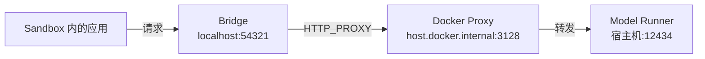
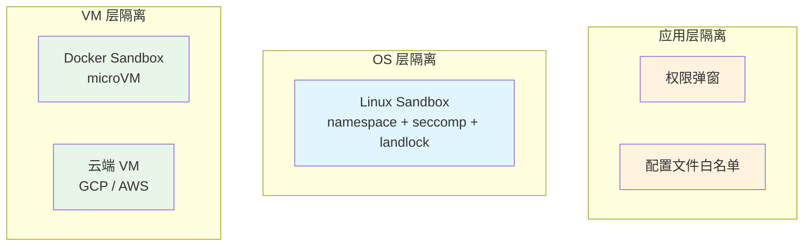

> Docker 官方最近发了一篇博客，演示如何用 Docker Sandbox + Docker Model Runner 在本地安全运行 OpenClaw。两条命令启动，不需要 API key，不上云，完全本地私有。本文拆解其中的技术原理和使用方法。

## 为什么 AI Agent 需要沙箱

Coding agent 的核心能力是**执行代码**——读文件、写文件、跑命令。这正是它强大的原因，也是它危险的原因。

一个没有隔离的 agent 可以：
- 读取 `~/.ssh/id_rsa`、`~/.aws/credentials` 等敏感文件
- 执行 `curl` 把数据发到外部服务器
- 修改 `/etc/hosts` 或安装恶意包
- 访问同一网络内的其他服务

各家 coding agent 都在用不同方式解决这个问题——Codex 用 OS 级沙箱（Linux namespace + seccomp），Claude Code 用权限确认弹窗，OpenClaw 用 `exec-approvals.json` 配置文件白名单。

Docker 的方案更直接：**不在应用层做限制，直接把整个 agent 扔进一个微型 VM**。Docker 官方博客以 OpenClaw 为例，演示了完整的流程。

## Docker Sandbox 是什么

Docker Sandbox 不是容器。它是 Docker Desktop 内置的**微型虚拟机**（microVM），提供比容器更强的隔离边界：

| | 容器 | Docker Sandbox |
|---|---|---|
| 隔离级别 | 共享内核（namespace 隔离） | 独立内核（VM 隔离） |
| 逃逸风险 | 内核漏洞可逃逸 | 需要突破 hypervisor |
| 网络 | 默认可访问宿主机网络 | 默认隔离，按需开放 |
| 文件系统 | bind mount 共享 | 独立文件系统 |

关键区别在**网络隔离**。Sandbox 默认不能访问任何外部网络，你需要显式声明允许访问哪些 host：

```bash
docker sandbox network proxy my-sandbox --allow-host localhost
```

agent 即使执行 `curl https://evil.com`，请求也会被拦截。

## 基本用法

### 创建和运行

以 Docker 博客中运行 OpenClaw 的例子：

```bash
# 拉取本地模型
docker model pull ai/gpt-oss:20B-UD-Q4_K_XL

# 创建 sandbox（基于预制的 OpenClaw 镜像）
docker sandbox create --name openclaw \
  -t olegselajev241/openclaw-dmr:latest shell .

# 配置网络（只允许访问本机的 Model Runner）
docker sandbox network proxy openclaw --allow-host localhost

# 进入 sandbox
docker sandbox run openclaw

# 在 sandbox 内启动 OpenClaw
~/start-openclaw.sh
```

OpenClaw 跑在隔离的微型 VM 里，模型推理跑在宿主机的 Docker Model Runner 上。零 API 费用，零云依赖。

当然 `docker sandbox create` 不局限于 OpenClaw，任何需要隔离运行的应用都可以用同样的方式。

### 保存和分享

配置好环境后，可以保存为镜像分享给团队：

```bash
# 保存当前 sandbox 为镜像
docker sandbox save my-agent my-agent-image:latest

# 推送到 registry
docker push yourname/my-agent:latest

# 其他人直接用
docker sandbox create --name agent -t yourname/my-agent:latest shell .
```

这很像 `docker commit`，但保存的是一个完整的微型 VM 快照，不只是文件系统层。

## 搭配 Docker Model Runner 跑本地模型

Docker Sandbox 的一个典型用法是搭配 **Docker Model Runner** 在本地跑 LLM，零 API 费用、零云依赖、完全私有。

### 启用 Model Runner

在 Docker Desktop 的 Settings → Docker Model Runner → Enable 中开启。

### 拉取和使用模型

```bash
# 拉取模型
docker model pull ai/qwen2.5:7B-Q4_K_M

# 列出所有可用模型
docker model list

# 直接对话测试
docker model run ai/qwen2.5:7B-Q4_K_M "hello"
```

Model Runner 在宿主机的 `localhost:12434` 提供 OpenAI 兼容 API，任何支持 OpenAI API 格式的工具都可以直接接入。

### Bridge 模式：解决网络隔离问题

这里有一个工程问题。Model Runner 跑在宿主机 `localhost:12434`，但 sandbox 里的 `localhost` 指的是 sandbox 自己。Docker 提供了 `host.docker.internal` 来访问宿主机——但 Node.js 默认不走 `HTTP_PROXY` 环境变量。

解决方案是一个 ~20 行的 Node.js bridge 做显式转发：



Bridge 核心代码：

```javascript
const http = require("http");
const PROXY = new URL(process.env.HTTP_PROXY);
const TARGET = "localhost:12434";

http.createServer((req, res) => {
  const proxyReq = http.request({
    hostname: PROXY.hostname,
    port: PROXY.port,
    path: "http://" + TARGET + req.url,
    method: req.method,
    headers: { ...req.headers, host: TARGET }
  }, proxyRes => {
    res.writeHead(proxyRes.statusCode, proxyRes.headers);
    proxyRes.pipe(res);
  });
  req.pipe(proxyReq);
}).listen(54321, "127.0.0.1");
```

Sandbox 内的应用把 `baseUrl` 指向 `http://127.0.0.1:54321`，请求就会经过 bridge → proxy → Model Runner，完成闭环。

这个模式在容器化场景中很常见——每当容器内进程需要访问宿主机服务，又不想暴露整个网络时，轻量 proxy bridge 是标准解法。

## API Key 注入：安全的关键设计

如果想用云端模型（Claude、GPT-4 等），Sandbox 的网络代理会**自动注入 API key**：

1. 你在**宿主机**设置 `ANTHROPIC_API_KEY` 等环境变量
2. Sandbox 的网络代理识别到请求目标是对应的 API 端点
3. 代理自动在请求头中注入 API key
4. Sandbox 内的应用**永远看不到** API key

这意味着即使 OpenClaw 被 prompt injection 诱导执行 `echo $ANTHROPIC_API_KEY`，它也拿不到任何东西。Key 只存在于宿主机的代理层。

这个设计非常巧妙——把 secret management 下沉到基础设施层，应用层完全不需要关心。

## 和其他沙箱方案的对比

| 方案 | 隔离级别 | 优点 | 缺点 |
|------|----------|------|------|
| 权限弹窗 / 白名单 | 应用层 | 零开销，灵活 | 依赖应用自律 |
| Linux Sandbox（namespace + seccomp） | OS 层 | 开销小，隔离强 | 仅 Linux，配置复杂 |
| Docker Sandbox | VM 层 | 跨平台，使用简单 | 需要 Docker Desktop |
| 云端 VM | VM 层 | 最强隔离，可远程 | 成本高，启动慢 |



隔离级别越高，"逃逸成本"越大。Docker Sandbox 在安全性和易用性之间找到了一个不错的平衡点——VM 级隔离，但用起来和容器一样简单。

## 底层技术

Docker Sandbox 的微型 VM 基于成熟的虚拟化技术栈。类似的技术已经在生产环境大规模使用：

- **AWS Lambda** 用 Firecracker microVM 隔离每个函数执行
- **Fly.io** 用 Firecracker 跑用户容器
- **Kata Containers** 在 K8s 中提供 VM 级 Pod 隔离

Docker 把这些技术包装成了 `docker sandbox create/run/save` 三个命令，大幅降低了使用门槛。

## 适用场景

Docker Sandbox 特别适合这些场景：

1. **本地跑 AI agent**——OpenClaw、Codex 等 coding agent 有代码执行能力，需要隔离
2. **测试不可信代码**——第三方库、用户提交的脚本
3. **可复现开发环境**——保存为镜像，团队共享一致环境
4. **敏感数据处理**——数据不出本地，网络完全隔离

目前它还是 Docker Desktop 的本地功能，不能在服务端直接使用。但对于在本地跑 AI agent 的开发者来说，这可能是目前**认知成本最低、隔离级别最高**的方案。

---

*参考：[Docker 官方博客 — Run AI Agents Securely in Docker Sandboxes](https://www.docker.com/blog/run-openclaw-securely-in-docker-sandboxes/)*
