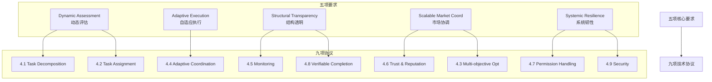

> 当 AI Agent 把任务委托给其他 Agent 或人类时，怎么确保不出乱子？这篇论文试图定义 AI 时代的"劳动合同法"——一套委托协议的标准框架。

## 一、论文要解决什么问题？

### 一个简单的场景

你让 AI Agent："帮我做一个电商网站"。

Agent 想这样分解：

```
前端 → Agent A
后端 → Agent B
数据库 → Agent C
支付 → Agent D
```

**问题来了：**

| 问题 | 现状 |
|------|------|
| Agent D 能自己选支付方案吗？ | 不知道，权力边界没定义 |
| Agent D 把支付做错了，谁负责？ | 不知道，责任链条不清晰 |
| Agent D 有能力做支付吗？ | 不知道，能力评估缺失 |
| Agent D 把任务委托给 Agent E，经过同意了吗？ | 不知道，委托链不透明 |
| 怎么知道 Agent D 完成了？ | 不知道，验证机制缺失 |

---

### 委托链的灾难

更复杂的场景：委托链。

```
你 → AI Agent A → AI Agent B → AI Agent C
                             ↓
                         出错了
```

**问题：**

1. **责任模糊** — Agent C 出错，谁负责？A？B？C？你？
2. **追溯困难** — 你能找到 Agent C 吗？知道它做了什么吗？
3. **失控** — Agent B 把任务委托给 Agent C，经过你同意了吗？
4. **信任链断裂** — A 信任 B，B 信任 C，但你根本不知道 C 是谁

---

### AI 管理人类：更隐蔽的风险

第三个场景：AI 委托给人类。

```
外卖平台 AI → 骑手

AI 决定：
- 分配订单
- 设定送达时间
- 决定奖惩
```

**已经暴露的问题：**
- AI 只优化效率，不考虑骑手福利
- 骑手面临压力、健康风险
- 没有申诉机制，没有问责

**论文指出**：当前的 AI→Human 委托"不考虑人类福利，不考虑长期社会外部性"。

---

### 现有方法的局限

| 系统 | 做了什么 | 没做什么 |
|------|----------|----------|
| **AutoGPT** | 任务分解 | 没有权力转移、没有责任追踪、没有信任机制 |
| **MetaGPT** | 角色分工 | 角色是硬编码的，不灵活，不适应变化 |
| **CrewAI** | 团队协作 | 责任边界模糊，出错了不知道谁负责 |
| **MCP/A2A** | 通信协议 | 传输工具调用，但不传输委托语义（权力、责任、信任） |

**核心差距**：人类社会有成熟的委托制度（合同、代理、信托、劳动法），但 AI 系统没有。

---

### 论文的核心问题

> **当 AI Agent 把任务委托给其他 Agent 或人类时，怎么确保：**
> 1. 任务被正确分解和分配？
> 2. 权力边界清晰？
> 3. 责任归属明确？
> 4. 出错可追溯、可恢复？
> 5. 信任建立在可靠的基础上？

**论文要做的**：定义 AI 委托的"劳动合同法"——一套标准化的委托协议。

---

## 二、委托的定义

---

## 一、委托的定义

论文给出的定义：

> Intelligent delegation is a sequence of decisions involving task allocation, that also incorporates **transfer of authority, responsibility, accountability, clear specifications regarding roles and boundaries, clarity of intent, and mechanisms for establishing trust**.

翻译：智能委托是一系列决策，涉及任务分配，同时包含权力转移、责任归属、问责机制、角色边界、意图清晰、信任建立。

**关键洞察**：委托 ≠ 分配。

```
分配：任务 → 分配给 Agent X → 完成

委托：任务 → 分解 → 分配 → 转移权力 → 建立责任 → 
      设定边界 → 建立信任 → 监督 → 验证 → 完成/失败处理
```

---

## 二、三种委托场景

论文强调，委托有三种场景：

| 场景 | 描述 | 现状 |
|------|------|------|
| **Human → AI** | 人类委托给 AI Agent | 最常见，讨论最多 |
| **AI → AI** | AI Agent 委托给 AI Agent | 未来会越来越多 |
| **AI → Human** | AI Agent 委托给人类 | "AI 指导人类劳动"，已有雏形（外卖、网约车） |

第三种场景最值得思考：当 AI 开始"管理"人类，我们准备好了吗？论文指出，当前的算法管理（外卖调度、网约车派单）已经暴露问题：**忽视人类福利、造成压力和健康风险**。

---

## 三、11 个任务特性维度

论文定义了 11 个任务特性，用于评估委托策略：

| 维度 | 问题 | 影响 |
|------|------|------|
| **Complexity** | 任务有多难？ | 决定分解粒度 |
| **Criticality** | 失败后果有多严重？ | 决定监督强度 |
| **Uncertainty** | 环境有多不确定？ | 决定适应性需求 |
| **Duration** | 任务持续多久？ | 决定监控频率 |
| **Cost** | 执行成本多少？ | 决定是否委托 |
| **Resource Requirements** | 需要什么资源？ | 决定被委托者选择 |
| **Constraints** | 有什么边界约束？ | 决定权限范围 |
| **Verifiability** | 结果容易验证吗？ | 决定信任需求 |
| **Reversibility** | 结果可以撤销吗？ | 决定风险容忍度 |
| **Contextuality** | 需要多少上下文？ | 决定隐私暴露 |
| **Subjectivity** | 成功标准主观吗？ | 决定人类介入程度 |

**关键洞察**：高可验证性任务（如代码验证）可以"无信任委托"，低可验证性任务（如开放研究）需要高信任被委托者。

---

## 四、从人类组织借鉴的 6 个概念

论文从组织行为学中借鉴了 6 个核心概念：

### 1. Principal-Agent Problem（委托代理问题）

**经典问题**：委托方和代理方的利益不一致。

**AI 时代的新复杂性**：
- 当前的 AI 可能没有"隐藏动机"
- 但存在 **reward hacking**：AI 会钻奖励函数的漏洞
- 在自治代理经济中，代理方可能代表不同的人类/组织，有未知目标

### 2. Span of Control（控制跨度）

**经典问题**：一个管理者能管多少人？

**AI 时代**：
- 一个人类专家能监督多少个 AI Agent？
- 一个 Orchestrator Agent 能协调多少个 Worker Agent？
- 答案取决于：任务复杂度、成本/性能权衡、可靠性需求

### 3. Authority Gradient（权威梯度）

**经典问题**：能力/经验差距太大会阻碍沟通，导致错误。

**AI 时代**：
- 强大的委托方可能错误假设被委托方的能力
- 被委托方可能因为 **sycophancy**（奉承倾向）而不敢质疑请求

**启示**：委托方需要准确评估被委托方的能力边界。

### 4. Zone of Indifference（冷漠区域）

**经典概念**：当权威被接受，被委托方会产生一个"冷漠区域"——在这个范围内，指令会被无思考地执行。

**AI 时代**：
- 当前 AI 的"冷漠区域"由安全过滤器和系统指令定义
- 只要不触发硬违规，模型就会执行
- **系统性风险**：委托链 A→B→C 中，冷漠区域会放大意图偏差

**论文建议**：需要设计"动态认知摩擦"——AI 应该能识别"虽然技术上安全，但上下文模糊"的请求，主动质疑或请求人类验证。

### 5. Trust Calibration（信任校准）

**核心问题**：信任程度必须与真实能力匹配。

**难点**：
- AI 模型倾向于过度自信
- 信任建立后很脆弱，一次意外错误就会瓦解
- 可解释性有助于建立信任，但不够可靠或可扩展

### 6. Transaction Cost Economies（交易成本经济）

**经典问题**：内部委托 vs 外部签约的成本对比。

**AI 时代**：
- Agent 有四个选择：
  1. 自己完成
  2. 委托给能力已知的 sub-agent
  3. 委托给已建立信任的其他 Agent
  4. 委托给新 Agent（风险高）
- 每个选择的预期成本和置信度不同

---

## 五、核心框架：五项要求 → 九项协议

论文提出了完整的框架：



---

### 4.1 Task Decomposition（任务分解）

**核心原则**：

1. **Contract-first decomposition**：只有能验证的子任务才委托
2. 递归分解：如果子任务太难验证，继续分解
3. 考虑 Human-AI 混合市场：哪些子任务需要人类介入？

**实践建议**：
- 生成多个分解方案，保留备选
- 匹配市场上有能力的被委托者
- 明确定义角色、资源边界、进度报告频率

---

### 4.2 Task Assignment（任务分配）

**两种模式**：

| 模式 | 说明 |
|------|------|
| **中央注册表** | 所有 Agent 注册技能、历史绩效、当前可用性 |
| **去中心化市场** | 委托方发布任务，Agent 竞标 |

论文倾向于**去中心化市场**——更容易扩展。

**关键机制**：
- **Smart Contract**：任务执行必须符合请求，违约自动惩罚
- **双向保护**：合同也要保护被委托方（任务取消补偿）
- **隐私条款**：敏感数据的处理规则

**两种自治级别**：
- **Atomic execution**：严格按规范执行窄范围任务
- **Open-ended delegation**：授权分解目标、追求子目标

---

### 4.3 Multi-objective Optimization（多目标优化）

委托方很少只优化一个指标。需要平衡：

- 成本
- 不确定性
- 隐私
- 质量
- 效率

**Pareto 最优**：选择不被任何其他方案主导的方案。

**关键洞察**：
- 优化是持续循环，不是一次性事件
- 监控信号实时更新对每个 Agent 的信念
- 存在"复杂度下限"：太简单的任务不值得委托（交易成本 > 任务价值）

---

### 4.4 Adaptive Coordination（自适应协调）

**静态计划不够**：高不确定性或长时任务需要动态调整。

**外部触发器**：
- 任务规格改变
- 任务取消
- 外部资源变化（API 中断、数据不可用、算力成本飙升）
- 更高优先级任务进入队列
- 安全系统检测到恶意行为

**内部触发器**：
- 被委托方性能下降
- 资源超预算
- 中间产物验证失败
- 被委托方无响应

**响应策略**：
- 可逆任务失败 → 自动重新委托
- 不可逆高关键任务失败 → 立即终止或人工升级

---

### 4.5 Monitoring（监控）

**三种监控模式**：
- Continuous（持续）
- Periodic（周期性）
- Event-triggered（事件触发）

**监控内容**：
- 性能指标
- 资源消耗
- 进展状态

---

### 4.6 Trust and Reputation（信任与声誉）

**三种信任**：
- **能力信任**：能做吗？
- **意图信任**：会按要求做吗？
- **监督信任**：会报告进展吗？

**声誉系统**：历史绩效、技能认证、可用性。

---

### 4.7 Permission Handling（权限处理）

**核心问题**：权力边界在哪？

- 被委托方能自主决策的范围？
- 哪些操作需要委托方确认？
- 能否进一步委托给第三方？

---

### 4.8 Verifiable Task Completion（可验证任务完成）

**目标**：确保任务按预期完成。

**验证机制**：
- 形式化证明
- 自动化测试
- 第三方审计
- 签名/认证

---

### 4.9 Security（安全）

**系统性风险**：
- 委托目标多样性不足 → 失败相关性高 → 级联中断
- 过度追求效率 → 缺乏冗余 → 系统脆弱
- **认知单一文化**：所有 Agent 用相同的底层模型 → 相同的偏见和盲点

---

## 六、与现有系统的对比

| 系统 | 委托支持 | 问题 |
|------|----------|------|
| **AutoGPT** | 简单子任务分配 | 无权力转移概念，无信任机制 |
| **MetaGPT** | 角色分工 | 有职责定义，但缺乏动态调整 |
| **CrewAI** | 团队协作 | 有角色和任务，但委托边界模糊 |
| **OpenAI Swarm** | Agent 切换 | 无持久委托关系，无责任追踪 |
| **MCP / A2A** | 通信协议 | 传输工具调用，但不传输委托语义 |
| **本文框架** | 五要求 + 九协议 | 理论框架，等待工程实现 |

---

## 七、实践启示

如果你在构建多 Agent 系统：

### 1. 委托前先定义边界

不要说"帮我做 X"，而是：

```
在 [约束条件] 下完成 [目标]，
成功标准是 [Y]，
预算是 [Z]，
超时则 [处理方案]。
```

### 2. 记录委托链

每个委托决策可追溯。出问题时，能快速定位环节。

### 3. 设计回退机制

被委托者失败时，委托者要知道怎么接管或重新分配。

### 4. 考虑系统性风险

不要让所有 Agent 都依赖同一个模型——认知单一文化是系统性风险的根源。

---

## 八、论文局限

诚实地讲，这篇论文是理论框架：

1. **没有附带具体实现** — 协议消息格式、数据结构未定义
2. **信任如何量化？** — "我信任你 70%"是什么意思？
3. **和 MCP/A2A 的关系？** — 这些协议传输工具调用，委托框架应该传输什么？
4. **实验验证？** — 没有仿真或实际部署验证

这些问题需要后续研究和工程实践来回答。

---

## 九、与 OpenClaw 的关系

在 [OpenClaw 架构详解](/posts/openclaw-architecture/) 中，我提到了 sub-agent 机制——如何 spawn、如何通信。那是**技术层**。

这篇论文提供的是**语义层**——委托时应该传递什么信息、建立什么约束。

两者是互补的：

```
技术层：OpenClaw sub-agent 实现
语义层：委托框架定义的权力、责任、信任
```

未来 Agentic Web 的标准协议，很可能会结合这两层。

---

## 结语

委托看似简单，实则复杂。人类社会的委托关系经过千年演化，形成了合同、代理、信托等制度。AI Agent 的委托才刚开始。

当你下次说"让另一个 Agent 做吧"时，可以问自己几个问题：

1. 任务分解了吗？验证方法定义了吗？
2. 权力边界在哪？被委托方能自主决策什么？
3. 谁负责？出错了怎么追溯？
4. 目标清楚吗？成功标准是什么？
5. 信任建立在什么基础上？能力、意图、还是监督？
6. 如果失败，怎么回退？

这些问题的答案，决定了委托能不能成功，也决定了 Agentic Web 能不能安全地扩展。

---

**论文信息**：

- 标题：Intelligent AI Delegation
- 作者：Nenad Tomašev, Matija Franklin, Simon Osindero (Google DeepMind)
- 链接：https://arxiv.org/abs/2602.11865
- 发布：2026-02-12
- 引用：约 300 篇参考文献，涵盖 AI、组织行为学、经济学、安全等领域