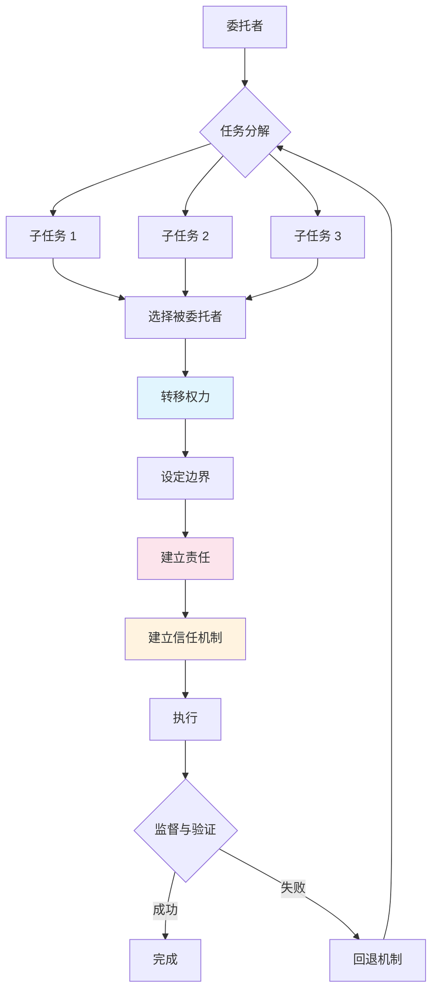
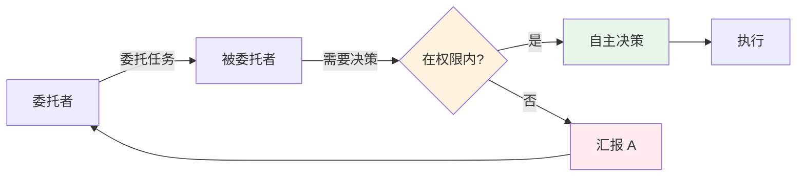
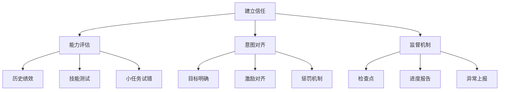
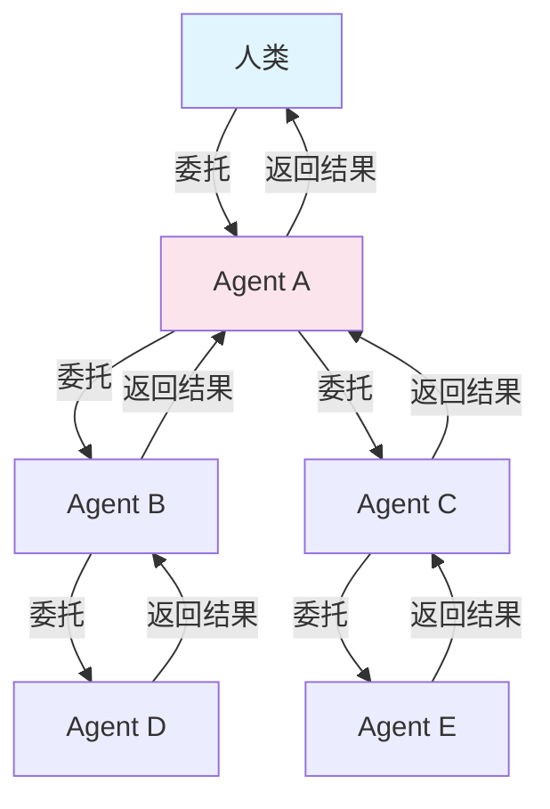

> Anthropic 的最新论文提出了一个关键问题：当 AI Agent 变得越来越强大，它们需要把任务委托给其他 Agent 或人类。但委托不等于"分配一下就行"——它涉及权力转移、责任归属、信任建立。这篇论文试图为 Agentic Web 定义一套委托协议。

## 问题背景：AI 会"外包"了，然后呢？

过去两年，AI Agent 的能力突飞猛进。从简单的问答，到能写代码、跑测试、修 bug、部署应用。但一个瓶颈越来越明显：**单个 Agent 的能力有限**。

当你让一个 Agent "帮我构建一个完整的电商系统" 时，它会面临几个问题：

1. **任务太复杂** — 需要分解成前端、后端、数据库、支付、部署等多个子任务
2. **技能不匹配** — 擅长写代码的可能不擅长 UI 设计，擅长架构的可能不擅长测试
3. **资源限制** — 上下文窗口有限、时间有限、预算有限

解决方案看似简单：**把子任务委托给其他 Agent 或人类**。但问题来了：

> 委托之后，谁来负责？权力怎么转移？出错怎么办？怎么建立信任？

这些问题不是技术细节——它们决定了 Agentic Web 能不能真正落地。

## 委托 ≠ 分配

先澄清一个概念误区。

**分配（Allocation）**：把任务 A 给 Agent X。

```
任务 → 分配给 Agent X → 执行 → 完成
```

**委托（Delegation）**：转移任务 + 转移权力 + 建立责任 + 设定边界 + 建立信任。



论文的核心贡献是提出了一个**六要素委托框架**，把模糊的"外包"变成可工程化的协议。

## 六要素框架

### 1. 任务分配（Task Allocation）

**问题**：谁做什么？

这是最基础的层面。但论文指出，任务分配不是静态的——环境会变、Agent 可用性会变、任务优先级会变。

**关键决策**：

| 维度 | 选择 |
|------|------|
| **分解粒度** | 粗粒度（一个功能模块） vs 细粒度（一个函数） |
| **分配时机** | 一次性分配 vs 动态调整 |
| **被委托者选择** | 基于能力、基于负载、基于成本 |

### 2. 权力转移（Transfer of Authority）

**问题**：被委托者有多大决策权？

这是传统任务分配忽略的维度。当 Agent A 把任务委托给 Agent B 时，A 需要决定：

- B 能自己做决定吗？还是每个决策都要汇报？
- B 能否进一步委托给 Agent C？
- 边界在哪里？



**三种权力模式**：

| 模式 | 说明 | 风险 |
|------|------|------|
| **完全授权** | 被委托者全权处理 | 失控风险 |
| **需确认** | 关键决策需委托者确认 | 效率低 |
| **边界授权** | 指定范围内自主，范围外需确认 | 需明确定义边界 |

### 3. 责任（Responsibility）

**问题**：谁对结果负责？

委托不是甩锅。委托者不能说"我让 B 做的，不关我事"。

论文强调：**委托者始终保留最终责任**。即使任务被委托出去，委托者仍需要：

- 监督执行过程
- 评估结果质量
- 承担失败后果

这和现实世界的委托一致——CEO 委托 CTO 做技术决策，但 CEO 仍对公司整体负责。

### 4. 问责（Accountability）

**问题**：出错了怎么追溯？

责任是事前的，问责是事后的。当委托链中出现错误：

```
人类 → Agent A → Agent B → Agent C
           ↓
       出错了
```

谁来负责？怎么追溯？

**需要记录的信息**：

- 委托决策的依据
- 被委托者的选择理由
- 权力转移的范围
- 监督和验证的记录

### 5. 意图清晰（Clarity of Intent）

**问题**：目标是什么？

模糊的委托是失败的根源。论文指出，委托时必须明确：

- **目标**：要达成什么结果？
- **约束**：不能做什么？
- **成功标准**：怎么判断完成了？
- **时间限制**：多久要完成？

**反面例子**：

```
❌ "帮我优化一下代码"
✅ "优化 login.ts 的启动时间，目标从 500ms 降到 200ms 以内，
   不能改变 API 接口，不能引入新依赖，明天前完成"
```

### 6. 信任机制（Trust Mechanisms）

**问题**：怎么相信被委托者能做到、会做好？

信任是委托的基础，但信任不能凭空产生。论文提出三种信任：

| 信任类型 | 问题 | 建立方式 |
|----------|------|---------|
| **能力信任** | 能做吗？ | 历史绩效、技能认证、测试任务 |
| **意图信任** | 会按要求做吗？ | 契约、监督、激励对齐 |
| **监督信任** | 会报告进展吗？ | 检查点、状态更新、异常上报 |



## 委托网络：不止是两个 Agent

论文强调，未来的 Agentic Web 不是一对一的委托，而是复杂的委托网络：



在这样的网络中，每个委托关系都需要六要素框架来约束。

**关键挑战**：

1. **循环委托**：A → B → C → A（谁在干活？）
2. **责任传递链断裂**：A 委托给 B，B 委托给 C，C 出错，A 找不到 C
3. **信任衰减**：A 信任 B，B 信任 C，但 A 不信任 C

论文建议用**协议标准化**解决这些问题——就像 HTTP 标准化了 Web 的请求响应，委托协议需要标准化 Agent 之间的委托关系。

## 与现有系统的对比

| 系统 | 委托支持 | 问题 |
|------|----------|------|
| **AutoGPT** | 简单子任务分配 | 无权力转移概念，无信任机制 |
| **MetaGPT** | 角色分工 | 有职责定义，但缺乏动态调整 |
| **CrewAI** | 团队协作 | 有角色和任务，但委托边界模糊 |
| **OpenAI Swarm** | Agent 切换 | 无持久委托关系，无责任追踪 |
| **本文框架** | 六要素完整 | 理论框架，等待实现验证 |

## 实践启示

如果你在构建多 Agent 系统，论文给出几个建议：

### 1. 委托前先定义边界

不要说"帮我做 X"，而是说"在 Y 条件下做 X，结果要满足 Z"。

### 2. 记录委托链

每个委托决策都要可追溯。出问题时，能快速定位是哪个环节出错。

### 3. 设计回退机制

被委托者失败时，委托者要知道怎么接管或重新分配。

### 4. 不要完全信任

信任是动态的。今天信任的 Agent，明天可能因为环境变化变得不可靠。

## 与 OpenClaw 的关系

在 [OpenClaw 架构详解](/posts/openclaw-architecture/) 中，我提到了 sub-agent 机制。那篇聚焦于技术实现（如何 spawn、如何通信），而这篇论文提供的是**委托的语义框架**——委托时应该传递什么信息、建立什么约束。

两者是互补的：

- **技术层**：OpenClaw 的 sub-agent 实现
- **语义层**：委托框架定义的六要素

未来 Agentic Web 的标准协议，很可能会结合这两层。

## 论文局限

诚实地讲，这篇论文是理论框架，没有附带具体实现。几个待解决的问题：

1. **六要素如何编码成协议消息？** 论文没给出具体的消息格式
2. **信任如何量化？** "我信任你 70%"是什么意思？
3. **动态调整的具体算法？** 环境变化时，如何自动重新分配？
4. **和 MCP 的关系？** MCP 传输工具调用，委托框架传输什么？

这些问题需要后续研究（或工程实践）来回答。

## 结语

委托看似简单，实则复杂。人类社会的委托关系经过千年演化，形成了合同、代理、信托等制度。AI Agent 的委托才刚开始。

这篇论文的价值在于：**把模糊的直觉变成清晰的框架**。当你下次说"让另一个 Agent 做吧"时，可以问自己六个问题：

1. 任务分解了吗？
2. 权力边界在哪？
3. 谁负责？
4. 出错怎么追溯？
5. 目标清楚吗？
6. 信任建立在什么基础上？

---

**论文信息**：

- 标题：Intelligent AI Delegation
- 作者：Nenad Tomašev, Matija Franklin, Simon Osindero
- 链接：https://arxiv.org/abs/2602.11865
- 发布：2026-02-12